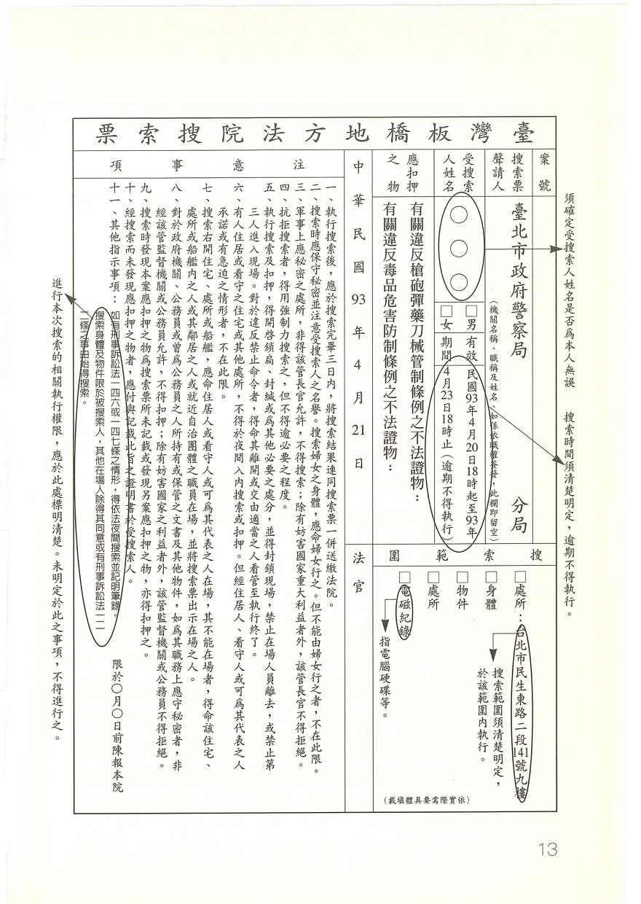

## 什麼是搜索票，有何用途？

#### 簡答

我國刑事訴訟法規定，搜索，必須要有搜索票才可以進行。但，現行法制上，有三種例外之情形，是可以不用搜索票（又稱為「無令狀搜索」）即可進行搜索的：1）同意搜索、2）附帶搜索、3）緊急搜索，這三種情形，以下會加以詳述。

在此提供一張搜索票供讀者參考：

#### 說明

實務上的搜索，執行搜索之檢警人員，或為節省時間，或為避免爭議，幾乎均以「快速」的方式提示搜索票予被搜索人，對於這種實務現況，很少被搜索人能看清楚搜索票之完整內容。因此，在現實的狀況下，有必要學習如何迅速抓到搜索票記載之內容。

筆者建議，閱讀搜索票時，應注意的重點有：1）被搜索人是誰？2）搜索票的有效期間到什麼時候？3）搜索範圍為何？

這三個重點看清楚了，就可以檢視執行搜索的人員是否逾越權限。

如果搜索票並不合法，可以阻止搜索人員進入。

#### 法律依據

* 「刑事訴訟法」第一百二十八條第一項規定：

   > 搜索，應用搜索票。

* 「刑事訴訟法」第一百二十八條第二項規定：

   > 搜索票，應記載下列事項：

   > 一、案由。

   > 二、應搜索之被告、犯罪嫌疑人或應扣押之物。但被告或犯罪嫌疑人不明時，得不予記載。

   > 三、應加搜索之處所、身體、物件或電磁紀錄。

   > 四、有效期間，逾期不得執行搜索及搜索後應將搜索票交還之意旨。

#### 延伸思考

最常見的案例，就是住家遭搜索後，搜索人員雖然有提出搜索票，但並未出示自己的身分證件。或者，搜索票僅提出「晃」一下，就收起來，受搜索人根本沒看清楚搜索票之記載，又因搜索人員態度強悍，受搜索人也不敢提出「再給我看一下搜索票」的要求。或者，受搜索人提出要求，執行人員不予理會之情形，均非少見。當然，沒有搜索票之搜索，至今仍很常見，只是，執行人員事後技巧性地要求受搜索人簽立「自願受搜索」之書據，受搜索人不知有拒絕之權利，乃予以簽立。
