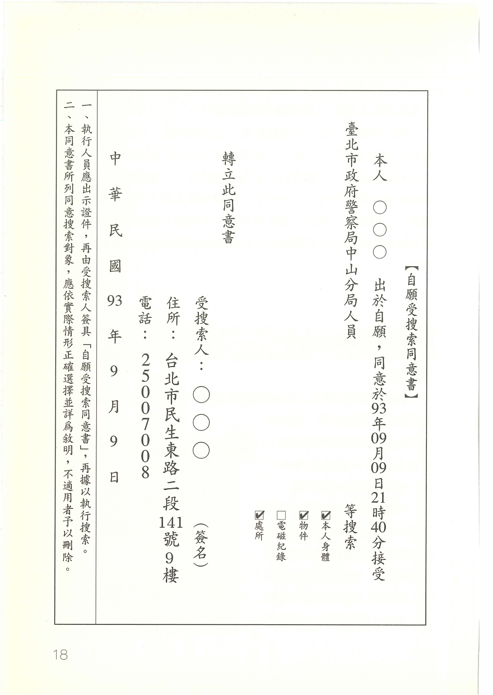

## 什麼是同意搜索？

#### 簡答

同意搜索1是指對於沒有搜索票之法官、檢警等人員，仍同意其進行搜索。同意搜索，等於是自行拋棄法律所保障之權利，但也為執法人員帶來許多方便，免除聲請搜索票之勞。

同意搜索，既然已涉及同意權人、搜索範圍等問題，當然必須在搜索前即取得受搜索人之同意，「搜索後再取得同意」的情形，已不算是同意搜索。但令人遺憾的是，國內仍有部分執法人員，仍經常於搜索後，才要求被搜索人填具「自願受搜索同意書」（以下附上範本一份），此類情形並不符合刑事訴訟法之規定，且有嚴重侵害人權之虞。

刑事訴訴法同時規定，受搜索人必須出於「自願性同意」，如不想接受搜索，也可以表示不同意。只是雖有此規定，卻未強制規定進行同意搜索的時候，執法人員有告知義務。現實情況，也少見有執行人員明確告知受搜索人「並無同意之義務」。

一般民眾對於檢警之詢問，往往因權力落差，而未能清楚考慮是否同意搜索。看到大批檢調人員到場，自然會擔心不配合會有所不利，因而予以同意。更常見的情況是，執法人員於搜索「後」，才提供「同意書」給被搜索人簽，多數的被搜索人，以為這是一定要簽的文件，因而未加詢問（或根本不敢詢問），即予以簽立。

#### 法律依據

* 「刑事訴訟法」第一百三十一條之一規定：

   > 搜索，經受搜索人出於自願性同意者，得不使用搜索票。但執行人員應出示證件，並將其同意之意旨記載於筆錄。

#### 延伸思考

拒絕同意，是否會造成搜索發動之原因？人民既然有權決定是否接受搜索，則拒絕同意之表示，即屬權利之行使，並不會因此而造成檢警單位持有「聲請搜索票」之理由。檢警單位要聲請搜索票，必須提出其必要性給法院審酌，與是否同意搜索並無關連。

另外，同意搜索後，受搜索人是可以主張撤回同意的。撤回同意，於我國刑訴法中並無明文規定，但學理上，多認為同意權人同意後有權撤回；比如林鈺雄〈搜索扣押註釋書〉、王兆鵬〈搜索扣押與刑事被告的憲法權利〉，以及美國法院之判例，均認為同意是可以撤回的。主要理由為：「同意」屬於人民基本權利之「捨棄」，未捨棄前，仍有基本權利存在，縱使經捨棄，亦可隨時回復基本權利。而撤回同意，即係人民主張回復基本權利之過程，當為法所允許。

受詐欺或脅迫所為之同意，可以在搜索程序終結前，隨時向搜索人員表示撤回同意；搜索程序終結後，則可以向法院、地檢署提出。從學理觀點，既然「同意」為基本權之捨棄，則「同意係合法取得」一事，則應由搜索人員舉證。就像公訴人對於被告提出刑求抗辯後，有義務就警訊筆錄之合法取得，負擔舉證責任；此時，搜索單位亦應舉證證明同意搜索係合法取得，而未有詐欺、脅迫之情形發生。

---

1. 何人有權同意搜索？

   區分成兩種情形：

   一、人身搜索

   若為人身搜索，同意權人當然僅限於為受搜索人自身。不過，受搜索人如果是未成年人或心神喪失之人，是否仍有同意能力？刑事訴訟法對此並未規定，但無論如何，「同意權人須明瞭搜索之涵義」，是同意搜索之基本前提。

   二、人身以外之搜索

   人身以外之搜索，則約可區分作「物件」及「處所」二種情形。對於物件之同意權人，應以物件之所有人為同意權人。而處所之同意搜索，則應以「有使用權限之人」為同意權人，例如：房東對於已出租給房客之房屋，並無同意搜索之權利；同理，旅社的櫃檯人員，對於已有房客進入住宿或休息之房間，也並無同意搜索之權利。
