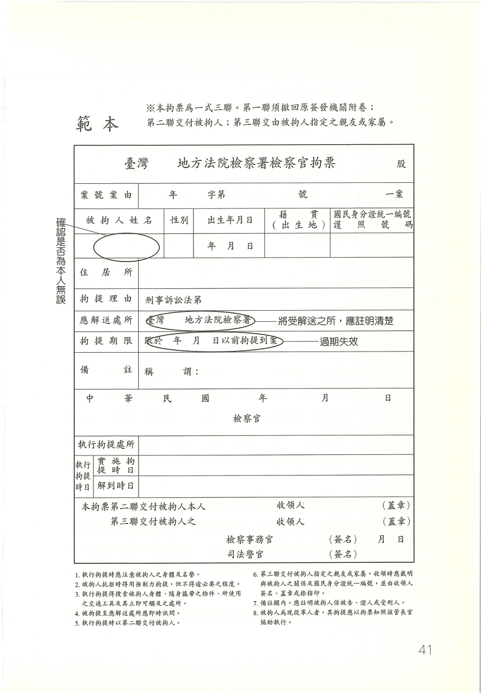

# 推薦序 人權律師帶著走

民間司改會成立至今，剛好滿十年。三年前，我們與商周的「人與法律」書系合作，出版了《正義的陰影—對台灣司法最深沈的控訴》一書，書中記錄了民間司改會十年來參與救援過的五件冤錯案：蘇炳坤案、蘇建和案、盧正案、徐自強案以及張方田案。而在這五件冤案中，共同的特徵就是都有警方刑求的紀錄。

司法警察辦案，是國家除軍事武力以外，最強的公權力行為，而這種公權力的行使，動輒侵害人權。上述五個案例，都是警方為求破案績效，刑求逼供所發生的冤案，而這些案主之所以被刑求，就是他們不知道在法律上如何自我保護！

當然，台灣的刑事訴訟制度在近年來有了非常重大的變革，已經嚴禁以非法方法取得自白，而且必須先由檢警證明並無刑求情事，這些新規定確實可以降低刑求逼供發生的可能性。然而，除了最嚴重侵犯人權的刑求之外，警方為求績效，還是常常以遊走於法律邊緣的方式辦案，而這些方式仍然相當程度侵害到人權。

民間司改會為避免這樣的事情發生，一直希望能對整個刑事程序的每一環節作有效的監督與改革，不過這樣的工作很吃重，常常力有未逮，因此開始構思這一本書，打算讓每一個小市民都能清楚明白自己的權利，進而能自我保護，這就是本書的緣起。

不過，夢想容易，要成真卻是辛苦萬分。我們自二年前就開始召集作者群的律師們，一起規劃討論，然後分工，由律師們各自就分配的範圍起稿，初稿完成後也要再彼此討論，才能定稿。大家可以想像，在這二年間，這些律師除了平日忙於自己的事務之外，還要利用餘暇撰寫本書內容，箇中辛苦，實非筆墨所能形容。然而這些律師們，都懷抱著同一夢想，那就是希望小市民們可以帶著律師們的智慧結晶自我保護，希望台灣不要再有冤案發生！

我在這邊要向這些作者群律師們至上最高的敬意，因為他們的犧牲奉獻，才有這本書的產生，也因為他們懷抱著理想，永不放棄，台灣的司法才會更進步更好！
當然，我也希望讀者們能確實運用書裡所提到觀念與方法，確實又有效的保護自己，而且能在享受這個成果之際，繼續支持台灣的司法改革運動，讓我們可以再接再厲實現我們的夢想！

<strong>
陳傳岳 民間司改會董事長
</strong>

==========

# 推薦序 三木之下，何求不得？

這本書為什麼都在教導「壞人」如何對抗執法人員？法律為何要給「壞人」這麼多權利？

只有壞人才會成為被告，這是最常見的錯誤認知。事實上，即令正直廉潔之士也常無端受刑事訴訟的波及。政治人物、公務員、商人、一般人民，有時因為遭人誣陷，有時因為案發時正巧在犯罪現場，有時因為被他人誤解，雖未犯罪仍被捲入刑事訴訟程序中。只要一被檢警列為嫌疑犯，傳喚、搜索、扣押、逮捕、訊問、羈押，一連串的刑事訴訟強制處分即加諸其身。幸運者，在檢警迅速偵查後，就能還他清白；不幸者，則必須歷經一、二、三審纏訟，在有罪與無罪判決間徘徊，嚐盡生與死的掙扎，才能證明無辜。除此之外，極權政府有時甚至高舉消滅犯罪的旗幟，利用刑事訴訟程序鏟除異己。所以西諺云﹕「刑律不善不足以害良民，刑事訴訟律不備即良民亦罹其害。」刑事訴訟法如果規定得不好，受害最深的人常是善良的百姓。與人民關係最密切的法律，莫過於刑事訴訟法。

也因為如此，刑事訴訟法許多規定常常是為了保護善良百姓，才附帶保護所謂的壞人。過去許多案例證明「三木之下，何求不得」的情形，是確實存在的，無辜人民常因為刑求、誘拐、疲勞訊問、長期羈押，竟然坦承自己從未犯過的案子，從此悲慘陷入永無休止的訴訟中。為保護無辜的被告，法律因此規定訊問被告不得出以強暴、脅迫、詐欺、疲勞訊問或不正方法，真正的目的在保護無辜的被告。其他許多法律規定，都是本此原則而賦予被告權利。

法律的目的也在貫徹憲法上之平等原則。權貴人士即令涉案，執法者常待之以禮，處處顧及其名譽隱私。市井小民稍有嫌疑，執法人員眥罵怒斥，甚至縛以示眾，任由記者拍照羞辱，即便之後法院還其清白，又有何用。有錢人可輕易同時聘請數位知名大律師為其辯護，窮人呢？因為刑事訴訟程序極為複雜，法律為了貫徹平等原則，乃要求執法人員必須尊重嫌疑犯的尊嚴與權利，如果被告無資力聘請律師，應由國家為其出資聘僱律師。這些規定背後皆有深刻意涵，絕非單純一味地保護「壞人」。

在判決確定以前，任何人都被推定無罪，應該享有最基本的尊嚴與權利。法律保護的不是壞人，而是我們社會所珍惜的文明。判斷一個國家是否文明，就看他們如何對待犯罪嫌疑人或受刑人。我們全力維護者不僅僅是壞人的權利，而是我們不要生活在暴力、野蠻、極權的社會。即令是千夫所指的壞人，執法人員用文明的方式對待之，是我們社會進步及驕傲的表徵。

我期待這本書的出版很久了。本書各撰稿人都是國內知名大律師，放下手邊賺錢的大案子，從事最基礎的法治教育工作，無私奉獻其多年訴訟所累積的知識及智慧，令人敬佩。這本書用淺顯益懂的方式及文字，解釋人民在刑事訴訟中最重要、最基本的權利，可以讓讀者知道原來臺灣已經這麼進步了，有時也可以幫助自己或親友。我認為這本書的許多內容應該放在國中小學法律教育中，使每個人都知道他應有的權利。

<strong>
王兆鵬 台灣大學法律系專任副教授
</strong>

==========

# 刑事訴訟流程圖

1. 警察職權行使

   > 警察以引誘、教唆他人犯罪的方式實施偵查，是否違法？
   
   > 警察可否任意盤查車輛或行人？
   
   > 警察實施酒測時你可否拒絕摇下車窗受檢？
   
   > 在何種情形之下，警察可以強制力對一般民眾實施管束？
   
   > 警察人員依法或違法行使職權，對於人民權益造成損害之時，人民有何種請求權？

2. 搜索

   > 什麼是搜索票？核發搜索票的程序為何？由誰進行聲請、由誰核發？
   
   > 什麼是同意搜索？什麼是附帶搜索？什麼是緊急搜索？
   
   > 搜索與臨檢如何區別？進行搜索的時間有無限制？可否中斷？
   
   > 可否抗拒搜索？搜索可否公開？關於搜索時的保密義務，有何相關規定？

3. 拘捕

   > 緘默權、要警方出示拘票
   
   > 24小時內移送法院審問
   
   > 通知親友、律師應到場陪同

4. 米蘭達原則、指認

   > 什麼是「米蘭達原則」？
   
   > 什麼是指認？

5. 偵訊

   > 緘默權、律師陪同、通譯
   
   > 全程錄音錄影、拒絕夜間偵訊
   
   > 要求調查有利證據、閱覽筆錄
   
   > 遭到刑求時該如何自保

6. 驗尿、吐氣、毛髮、指紋、照相、證據保全

   > 警察可以違背你的意思採取你的指紋、掌紋、腳印或對你照相、測量身高嗎？
   
   > 警察可以強制你作吐氣測試嗎？
   
   > 警察可否強制採取你的毛髮、唾液、聲調？
   
   > 什麼是證據保全？你可以主張什麼權利？

7. 緩起訴、簡易判決、職權不起訴、認罪協商

   > 什麼是緩起訴？當檢察官為緩起訴處分有何效果？
   
   > 何謂職權不起訴？其效果如何？檢察官何時可為職權不起訴？
   
   > 什麼是簡易判決，法院何時可為簡易判決？
   
   > 什麼是協商程序判決？被告什麼時候可以要求協商？被告對協商判決能不能上訴？

8. 羈押

   > 如果法院裁定羈押你，一次可以羈押多久時間？可不可以延長？
   
   > 法院可以用什麼理由羈押你？如果你不服法院羈押，可以主張什麼權利？
   
   > 在看守所中，你可不可以和親朋好友通信？可不可以和律師討論案情？
   
   > 看守所可以束縛你的身體嗎？在哪些情況下，你可以聲請停止羈押？

9. 審判

   > 審判程序中，被告可以主張哪些權利？
   
   > 被告對法官訊問的事項，可否均保持緘默？
   
   > 被告應如何請求法院調查證據？
   
   > 何謂共同被告？被告可否請求對質或詰問共同被告？
   
   > 何謂交叉詰問？可否不進行交叉詰問？

10. 上訴和抗告

   > 如何提起上訴？上訴的範圍如何？
   
   > 什麼是抗告救濟？

11. 執行

   > 刑事有罪判決確定後，是否就立即要去執行？
   
   > 在怎樣的情形下，執行刑罰可以易科罰金？
   
   > 有罪徒刑判決之執行通知送達後，若要延期執行，應如何聲請？
   
   > 行刑權時效？

12. 少年事件處理法

   > 少年保護事件
   
   > 保護處分
   
   > 少年刑事案件

13. 法律扶助法

   > 如何尋求法律之扶助？
   
   > 申請的資格及如何申請？

14. 身心障礙

   > 智能障礙者若受拘捕，家屬如何處理？社工員如何處理？

==========

# 前言

一般人若是刑事案件中的被告，突然遭受拘捕、偵訊，必定毫無頭緒、完全無助；若是冤屈無辜，可能連從何喊冤都不知道。

本書從拘捕、偵訊、審判到執行，一一解答說明刑事案件進行的程序；讓法律從殿堂上走下，成為日常生活中，所有人都可以親近熟習的常識。

法治社會健全的第一步，就是讓每個人都了解法律程序、深知自身權益。因為唯有程序正當之時，法律才能真正保障正義。

==========

# 警察職權行使

**本篇作者 馬在勤律師**

日常生活中，常可見警方實施臨檢或酒測，但你是否有想過警察再執行勤務時是否合法正當？又能實施到怎樣的程度？你能不能拒絕呢？

==========

## 警察以引誘、教唆他人犯罪的方式實施偵查，是否違法？

#### 簡答

實務上，警察於偵辦色情、毒品等犯罪時，常以假扮嫖客或是利用線民，誘導犯罪嫌疑人進行犯罪行為之後，予以逮補；這種情形，如果是針對「原本就具有犯罪意圖」的人來處理，不算違法。不過，若嫌疑人本身「並不具有犯罪意圖」，是受到警察之引誘才產生犯罪的意圖，進而才犯下罪行，那麼警察這種引誘的偵查手段即是違法。

警察實施「誘捕」偵查，便是對本來即有犯罪意圖的人，提供再次犯罪之機會，而利用此機會蒐證並逮補犯罪嫌疑人。例如網路援交案，提供性交易者先自己上網打廣告，警察則依其所提供之聯絡方式，假裝是召妓之嫖客，卻於見面時將其逮補，這種狀況因為嫌犯本即具有犯意，所以警察之偵查手段並不違法。然而，如果對於未有犯罪意圖之人，警察以引誘、教唆的手段，使其產生犯意而進行犯罪行為，再加以逮補，就是「陷害教唆」。例如警察偽裝嫖客上網召妓，待對方與其聯絡，相約見面後再加以逮補，因為無法確定對方原本即有犯罪意圖，故此偵查手段是違法的。當警方以釣魚之方式誘導犯罪時，証明犯罪行為之發動乃警方所引起，該犯罪行為誘發之主被動關係，是非常重要的關鍵。

#### 法律依據

* 「警察職權行使法」第三條規定：

   > 警察行使職權，不得逾越所欲達成執行目的之必要限度，且應以對人民權益侵害最少之適當方法為之。警察行使職權已達成其目的，或依當時情形，認為目的無法達成時，應依職權或因義務人、利害關係人之申請終止執行。警察行使職權，不得以引誘、教唆人民犯罪或其他違法之手段為之。

#### 延伸思考

釣魚辦案遭濫用起因於警察績效制度要求，而績效制度之目的歸納起來不外乎要求數據上呈現完美無暇。亦即某類專案績效之案件發生數目必須降低（假設以該數目當作分母），同時必須將同類專案績效案件之破獲數目升高（假設此數目為分子）；當分母越小分子越大，所得之商數就越大，績效成果則越佳。釣魚辦案便屬於追求分子數變大之過程。長期以來，警方以績效為作高指導原則，卻置民眾權益於不顧的勤務運作方式，正足以說明台灣警察體制仍屬於由上而下的威權運作方式。換句話說，台灣警察還沒有解嚴呢。以現有警察制度完全由上而下的權威領導，要撼動這種特有文化而加以改革，恐非易事。

==========

## 遇有警察行使職權之時，可否要求其證明身分？

#### 簡答

警察人員於執行勤務之時，應告知事由並穿著制服以資辨識，如未穿著者則應出示證件證明身分，如果不願出示證件，民眾可要求其出示，且於警察尚未證明身分之前，可拒絕其對自己行使職權。

以往屢有發生有人假冒警察詐騙之事，故於本法第四條明定警察應著制服或出示證件證明身分後，方得行使職權，並應告知事由，如未依此規定為之，民眾可拒絕配合執行。

刑警除應持有「警察人員服務證」[^1]外，還配有警徽，民眾如遇其臨檢、盤查，可要求出示服務證及警徽，否則可拒絕配合。

如果警察已經身著制服，為做進一步之確認，也可要求其出示證件。此外，民眾亦可詢問其服務單位電話，去電查詢是否真有此人、偵辦何事，以免遭假警察所騙。

#### 法律依據

*「警察職權行使法」第四條規定：

   > 警察行使職權時，應著制服或出示證件表明身分，並應告知事由。警察未依前項規定行使職權者，人民得拒絕之。

*「警械使用條例」第一條第二項規定：

   > 警察人員依本條例使用警械時，須依規定穿著制服，或出示足資識別之警徽或身分證件。但情況急迫時，不在此限。

#### 延伸思考

一般而言，制服員警執行職務，唯一可以辨識其特徵者為其臂章上之服務單位及編號，非常難以辨認，導致將來要進行監督或投訴時有很大困擾。民間司改會及其他改革團體（警察改革協會、台北律師公會、檢察官改革協會、台灣人權促進會）所組成之「警察改革聯盟」曾提出方案，要求警察人員制服正面必須標示足以辨別其個人特徵之名牌（記載員警姓名或數字代碼）。希望讓民眾與警察執行職務互動中能輕易辨別其特徵而加以監督。

---

[^1]: 警察人員的證件為「警察人員服務證」，服務證上除有姓名、職別、證號、徽號、發證日期、有效期限等標示外，還蓋有服務機關圓形鋼印及主官官章。至於便衣刑警，其證件和一般派出所警察或交警等稍有不同，正面還有一個刑事警察的徽章，標誌是鴿子圖樣，下方有刑事局英文「Criminal Investigation Detective」。

==========

## 警察到PUB、酒店等公眾出入場所能否查證在場所有人身分？又可否任意盤查車輛或行人？

#### 簡答

警察於PUB、酒店等公共場所，如有「警察職權行使法」第七條第一項所規定之事由存在，如發現搖頭丸或毒品、經報案於內將有犯罪－－就可以對此場所內的人士查驗身分。若無客觀之事實合理推論判斷或有具體事實足認其有犯罪或犯罪之虞，警方不可以任意實施臨檢；民眾亦可拒絕表明身分或受其限制。而盤查實施時間以該場所「實際」營業時間之內進行完成，而非以其標示之時段為準，以避免干擾人民正當營業及生活作息，於實施時並不得妨礙其營業。

另外，警察如欲盤查來往之車輛或行人，必須在理由為防止犯罪，或處理重大公共安全及社會秩序事件等，有必要者之事由為限。經該警察機關主管長官指定地點、路段後，警察方得於該特定地攔停人、車，並查驗身分；一般員警不得任意變更勤務，自行決定封鎖路面攔檢。依此而行之攔檢則僅止於查證身分，若未存在犯罪事實，於查驗身分無虞之後，警察不得對人、車進行搜索，或要求同行。實務上警察可能要求受臨檢人拿出身上口袋的東西、打開引擎蓋或行李箱予警方查看，於此要求，民眾可拒絕行使。

#### 法律依據

* 「警察職權行使法」第六條規定：

   > 警察於公共場所或合法進入之場所，得對於下列各款之人查證其身分：

   > 一、合理懷疑其有犯罪之嫌疑或有犯罪之虞者。

   > 二、有事實足認其對已發生之犯罪或即將發生之犯罪知情者。

   > 三、有事實足認為防止其本人或他人生命、身體之具體危害，有查證其身分之必要者。

   > 四、滯留於有事實足認有陰謀、預備、著手實施重大犯罪或有人犯藏匿之處所者。

   > 五、滯留於應有停 (居) 留許可之處所，而無停 (居) 留許可者。

   > 六、行經指定公共場所、路段及管制站者。

   > 前項第六款之指定，以防止犯罪，或處理重大公共安全或社會秩序事件而有必要者為限。其指定應由警察機關主管長官為之。警察進入公眾得出入之場所，應於營業時間為之，並不得任意妨礙其營業。

* 「警察職權行使法」第七條規定：

   > 警察依前條規定，為查證人民身分，得採取下列之必要措施：

   > 一、攔停人、車、船及其他交通工具。

   > 二、詢問姓名、出生年月日、出生地、國籍、住居所及身分證統一編號等。

   > 三、令出示身分證明文件。

   > 四、若有明顯事實足認其有攜帶足以自殺、自傷或傷害他人生命或身體之物者，得檢查其身體及所攜帶之物。

   > 依前項第二款、第三款之方法顯然無法查證身分時，警察得將該人民帶往勤務處所查證；帶往時非遇抗拒不得使用強制力，且其時間自攔停起，不得逾三小時，並應即向該管警察勤務指揮中心報告及通知其指定之親友或律師。

#### 延伸思考

對於警方人員於實施盤查身分之行為時，民眾可詢問其係依據「警察職權行使法」第六條哪一款作為基礎，使其知悉。當然是否符合該條款取決於警察之判斷，但民眾可以事後提出異議。此外，民眾遇到警方盤查身分時，需牢記警方之權限，僅限於要求民眾出示足以辨別確實身分之證件（如：健保卡、駕照、身分證等）；如警方提出其他要求，一律可以拒絕。但民眾千萬不要誤以為不提出證件警方便沒辦法處理，實務上常發生民眾拒絕出示證件，警方便依法強制帶回，造成肢體衝突，民眾因而另涉有妨害公務罪嫌，非常不智。

==========

## 警察實施酒測時，你可否拒絕摇下車窗受檢？

#### 簡答

警察實施酒測之要件，必須是駕駛人所駕駛之交通工具已經發生危害或經客觀合理判斷易生危害之虞，方得為之，若無上述情況民眾可拒絕警察酒測。
另外，如果駕駛人符合上述之情況，而於警察欲酒測之時拒絕摇下車窗受檢，警察可以強制力使其離車，若有事實認為其有犯罪之虞時，並得檢查交通工具。

#### 法律依據

* 「警察職權行使法」第八條規定：

   > 警察對於已發生危害或依客觀合理判斷易生危害之交通工具，得予以攔停並採行下列措施：

   > 一、要求駕駛人或乘客出示相關證件或查證其身分。

   > 二、檢查引擎、車身號碼或其他足資識別之特徵。

   > 三、要求駕駛人接受酒精濃度測試之檢定。

   > 警察因前項交通工具之駕駛人或乘客有異常舉動而合理懷疑其將有危害行為時，得強制其離車；有事實足認其有犯罪之虞者，並得檢查交通工具。

#### 延伸思考

警察依警察職權行使法第八條第一項規定，對於已經發生危害，或是依據客觀事實加以合理判斷容易產生危害之交通工具，例如發生車禍肇事或是蛇行等危險駕駛之車輛，可以要求駕駛人接受酒測、檢查引擎、車身號碼，或是要求駕駛人及乘客出示相關身分證件查證身分。駕駛人如果待在車內拒絕接受酒測，或是不肯摇下車窗，警察依本條第二項規定，可強制其離車。另外，汽車駕駛人拒絕接受酒測，依道路交通管理處罰條例第三十五條第三項規定，可處新台幣六萬元罰鍰，並當場移置保管其車輛及吊銷駕駛執照。

==========

## 在何種情形之下，警察可以強制力對一般民眾實施管束？

#### 簡答

警察為了防止危害之發生，對於易發生危害之虞者，如瘋狂、酒醉、意圖自殺、暴行、鬥毆，或其他認為必須救護或有危害公共安全之虞者，得施以限制自由之管束，以保護行為人自身或其他民眾。若非屬於上述之人，或者有其他適當方式可供選擇，例如酒醉者有其他親友看顧、意圖自殺者經勸說後已消念頭，則警察不能在對其施以管束。另外，警察依第十九條第三項得檢查受管束人之身體及所攜帶之物，若受管束人身上有傷，或是攜帶危險物品，可做進一歩之處理。

警察所為之管束，於危險或危害結束時即應立刻終止管束，管束時間最長不得超過二十四小時。於實施管束時並應即時以適當方法，通知或交由其家屬或其他關係人，或適當之機關、機構、或人員保護，並得檢查受管束人之身體及所攜帶之物品。

#### 法律依據

* 「警察職權行使法」第十九條規定：

   > 警察對於有下列情形之一者，得為管束：

   > 一、瘋狂或酒醉，非管束不能救護其生命、身體之危險，或預防他人生命、身體之危險。

   > 二、意圖自殺，非管束不能救護其生命。

   > 三、暴行或鬥毆，非管束不能預防其傷害。

   > 四、其他認為必須救護或有危害公共安全之虞，非管束不能救護或不能預防危害。

   > 警察為前項管束，應於危險或危害結束時終止管束，管束時間最長不得逾二十四小時；並應即時以適當方法通知或交由其家屬或其他關係人，或適當之機關 (構) 或人員保護。

   > 警察依第一項規定為管束時，得檢查受管束人之身體及所攜帶之物。

#### 延伸思考

本條之規定最大的特徵，是警方依據本條文執行勤務時，其目的皆出於保護的立場，避免擴大危害之情形發生。當瘋狂或酒醉、意圖自殺、暴行或鬥毆行為已獲得控制或無危害公共安全之情形，民眾即可要求警方停止其限制人身自由或扣留物品之處分。而遭扣留物品除違禁品外，則必須完好如初之歸還。

==========

## 警察人員依法或違法行使職權，對於人民權益造成損害之時，人民有何種請求權？

#### 簡答

警察於執行職務行使公權力時，因為故意、過失或是怠惰，致使人民自由或權利，國家負有賠償責任（參照「國賠法」第二條）。以該警察所屬機關為賠償義務機關，行使賠償請求權，自請求權人知有損害時起，若請求權人二年間不行使，權益便自行消滅；自損害發生時起，時間超過五年者亦同（參照「國賠法」第八、九條）。請求損害賠償時，應先以書面向賠償義務機關請求之；賠償義務機關對於前項請求，應即與請求權人協議。協議成立時，應作成協議書，該項協議書得為執行名義（參照「國賠法」第十條）。若賠償義務機關拒絕賠償，或自提出請求之日起逾三十日不開始協議，或自開始協議之日起逾六十日協議不成立時，請求權人得提起損害賠償之訴。但已依「行政訴訟法」規定，附帶請求損害賠償者，就同一原事實，不得更行起訴。

依「國賠法」請求損害賠償時，法院得依聲請為假處分，命賠償義務機關暫先支付醫療費或喪葬費（參照「國賠法」第十一條）。國家負損害賠償責任者，應以金錢為之。但以回復原狀為適當者，得依請求，回復損害發生前原狀（參照國賠法第七條）。

警察依法行使職權，因人民特別犧牲，致其生命、身體或財產遭受損失時，人民得請求補償，由本人或其代理人以書面載明相關事項，並於簽名或蓋章後，向警察機關提出請求。但人民有可歸責之事由時，法院得減免其賠償金額。前項損失補償，應以金錢為之，並以補償實際所受之特別損失為限。對於警察機關所為損失補償之決定不服者，得依法提起訴願及行政訴訟。損失補償，應於知有損失後，二年內向警察機關請求之。但自損失發生後，時間超過五年者，不得為之。

#### 法條依據

* 「警察職權行使法」第三十條規定：

   > 警察違法行使職權，有國家賠償法所定國家負賠償責任之情事者，人民得依法請求損害賠償。

* 「警察職權行使法」第三十一條規定：

   > 警察依法行使職權，因人民特別犧牲，致其生命、身體或財產遭受損失時，人民得請求補償。但人民有可歸責之事由時，法院得減免其金額。前項損失補償，應以金錢為之，並以補償實際所受之特別損失為限。對於警察機關所為損失補償之決定不服者，得依法提起訴願及行政訴訟。損失補償，應於知有損失後，二年內向警察機關請求之。但自損失發生後，經過五年者，不得為之。

#### 延伸思考

應特別注意「警察職權行使法」第三十一條中，有關人民特別犧牲時得請求補償之規定。因為這常發生於警方執行逮捕、攻堅罪犯時，不小心波及其他路人之身體或財產的情形。民眾千萬不要有基於協助警方辦案的心態不再追究，自認倒楣，自行負擔損失。如果大家都這樣，如何監督警方下次執行職務時應更小心注意呢？因此，一定要保留完整的損失證明單或照片，為自己主張權益，金錢的補償的確重要，另外是更重要的是，讓普遍民眾對警方的監督功能能夠發揮出來。

==========

# 搜索

**本篇作者 黃達元律師

法律規定警察搜索必須出示搜索票，你是否見過搜索票長什麼樣子？如何分辨搜索票是否合法？以及被搜索後應該注意些什麼權利保護？

==========

## 什麼是搜索票，有何用途？

#### 簡答

我國刑事訴訟法規定，搜索，必須要有搜索票才可以進行。但，現行法制上，有三種例外之情形，是可以不用搜索票（又稱為「無令狀搜索」）即可進行搜索的：1）同意搜索、2）附帶搜索、3）緊急搜索，這三種情形，以下會加以詳述。

在此提供一張搜索票供讀者參考：

#### 說明

實務上的搜索，執行搜索之檢警人員，或為節省時間，或為避免爭議，幾乎均以「快速」的方式提示搜索票予被搜索人，對於這種實務現況，很少被搜索人能看清楚搜索票之完整內容。因此，在現實的狀況下，有必要學習如何迅速抓到搜索票記載之內容。

筆者建議，閱讀搜索票時，應注意的重點有：1）被搜索人是誰？2）搜索票的有效期間到什麼時候？3）搜索範圍為何？

這三個重點看清楚了，就可以檢視執行搜索的人員是否逾越權限。

如果搜索票並不合法，可以阻止搜索人員進入。

#### 法律依據

* 「刑事訴訟法」第一百二十八條第一項規定：

   > 搜索，應用搜索票。

* 「刑事訴訟法」第一百二十八條第二項規定：

   > 搜索票，應記載下列事項：

   > 一、案由。

   > 二、應搜索之被告、犯罪嫌疑人或應扣押之物。但被告或犯罪嫌疑人不明時，得不予記載。

   > 三、應加搜索之處所、身體、物件或電磁紀錄。

   > 四、有效期間，逾期不得執行搜索及搜索後應將搜索票交還之意旨。

#### 延伸思考

最常見的案例，就是住家遭搜索後，搜索人員雖然有提出搜索票，但並未出示自己的身分證件。或者，搜索票僅提出「晃」一下，就收起來，受搜索人根本沒看清楚搜索票之記載，又因搜索人員態度強悍，受搜索人也不敢提出「再給我看一下搜索票」的要求。或者，受搜索人提出要求，執行人員不予理會之情形，均非少見。當然，沒有搜索票之搜索，至今仍很常見，只是，執行人員事後技巧性地要求受搜索人簽立「自願受搜索」之書據，受搜索人不知有拒絕之權利，乃予以簽立。

==========

## 搜索可否公開？關於搜索時的保密義務，有何相關規定？

#### 簡答

刑事訴訟法規定執行人員應該保守秘密，並應注意受搜索人之名譽。

搜索保密，與偵查不公開的適用範圍並不相同。搜索可能發生於偵查階段，亦可能發生於審判階段；但偵查不公開原則，僅適用於偵查程序，並不包含審判程序。兩者有所區別。

其次，搜索之保密義務，並無其他例外規定，也就是說，不論何種情形，搜索均不可以公開，只要有人公開搜索過程，都屬於違法行為，應受到「刑法」洩密罪之追訴。但偵查不公開原則，「刑事訴訟法」有規定幾種例外情形：依法令、為維護公共利益、或保護合法權益而有必要時，可以公開偵查內容。

這其中還有一個問題，若是偵查過程中的搜索行為，屬於偵查之範圍，那麼可否基於偵查不公開的例外原則，以偵查中之搜索行動將其公開？基於搜索保密義務之規定，筆者認為，當偵查與搜索兩者同時發生進行時，仍應優先適用搜索保密之規定。也就是說，對於搜索行動，不能以偵查不公開之例外，予以公開。否則，「刑事訴訟法」之保密規定，將形同具文。

#### 法律依據

* 「刑事訴訟法」第一百二十四條規定：

   > 搜索應保守秘密，並應注意受搜索人之名譽。

* 「刑事訴訟法」第一百二十四條規定：

   > 搜索應保守秘密，並應注意受搜索人之名譽。

* 「刑事訴訟法」第二百四十五條規定：

   > 偵查，不公開之。

   > 被告或犯罪嫌疑人之辯護人，得於檢察官、檢察事務官、司法警察官或司法警察訊問該被告或犯罪嫌疑人時在場，並得陳述意見。但有事實足認其在場有妨害國家機密或有湮滅、偽造、變造證據或勾串共犯或證人或妨害他人名譽之虞，或其行為不當足以影響偵查秩序者，得限制或禁止之。

   > 檢察官、檢察事務官、司法警察官、司法警察、辯護人、告訴代理人或其他於偵查程序依法執行職務之人員，除依法令或為維護公共利益或保護合法權益有必要者外，不得公開揭露偵查中因執行職務知悉之事項。

   > 偵查中訊問被告或犯罪嫌疑人時，應將訊問之日、時及處所通知辯護人。

   > 但情形急迫者，不在此限。

#### 延伸思考

搜索時可否請媒體一同進入？可否將錄影紀錄提供給媒體？受搜索人可否自行拍攝搜索之過程？

國人經常可以在電視上看到警察機關之搜索行動，或者警方的搜索錄影畫面，直接在電視新聞上播放。看慣了，一般民眾可能不覺得有何不妥。但是，倘若這類錄影內容，所搜索之對象為清白無辜的百姓人家，則該人之住家、工作場所之隱私，顯然受到嚴重侵害。或許此等情形，有讓社會大眾明瞭政府打擊犯罪之決心，但就刑訴法制而言，仍屬違法行為，只是，大家看習慣了，也許因好奇心使然，大家也喜歡看，久而久之也就積非成是了。

另外，受搜索之人，解釋上也並無權針對搜索行動進行攝影。

==========

## 搜索結束時，應注意哪些事項？

#### 簡答

搜索結束後，受搜索人應注意以下文件之填寫：

1. **「搜索／扣押[^2]筆錄」：**

   目前檢警使用之格式，搜索、扣押之筆錄，係共用一紙文件（詳見以下），受搜索人簽名前，應看清楚上面所打勾、書寫之內容，是否與實際情形相符？如不相符，應當場向製作筆錄人員表示異議。

2. **「扣押物品收據／無應扣押之物證明書」：**

   目前檢警所使用之格式，亦係兩者共用一紙文件。如搜索過程中，有扣押物品，則執行人員將會填寫一份「扣押物品目錄表」（詳見以下），上面會記載扣押之物品名稱、單位（如：包、支等計數單位名稱）、數量、所有人、持有人或保管人姓名。

   較常見的情形：屋內搜出的物品，係他人留置，而未為受搜索人所知悉，此時，應要求執行搜索人員於「扣押物品目錄表」上註明，以免貿然簽名後，卻須承擔該物品持有或保管之法律責任。

   扣押物品收據，及所附之扣押物品目錄表，均應交付一份給受搜索人收執。

   如搜索結果，並未發現應扣押之物，執行搜索人員應將前揭文件，於「經搜索未發現應扣押之物品，乃付與本證明書」選項上打勾，使這份文件轉變成「無應扣押之物證明書」，交付與受搜索人收執，以避免日後搜索人員突然主張某物係於該次搜索中所出現，避免受搜索人遭人栽贓。

3. **扣押物本身，應由扣押機關貼封條或標籤，並由該機關或公務員蓋印。**此乃避免扣押物之數量、種類日後發生爭議，維護扣押內容之真實。實務上，警方亦經常要求被搜索人於扣押物隻封條上簽名、押指印，此舉雖非刑訴法所規定之要件，但就扣押物真實內容之保障而言，仍有正面之意義。

#### 法律依據

* 「刑事訴訟法」第一百二十五條規定：

   > 經搜索而未發見應扣押之物者，應付與證明書於受搜索人。

* 「刑事訴訟法」第一百三十九條規定：

   > 扣押，應制作收據，詳記扣押物之名目，付與所有人、持有人或保管人。扣押物，應加封緘或其他標識，由扣押之機關或公務員蓋印。

   > 扣押物，應加封緘或其他標識，由扣押之機關或公務員蓋印。

#### 延伸思考

關於扣押常遇到的問題，試以以下情形舉例：中古機車行內有半數機車均有合法證明，但搜索人員為求「慎重」起見，將搜索地點之中古機車行內機車全部均予扣押，並依法製作筆錄、收據交受搜索人，且向受搜索人表示，若非贓車，檢方日後會予以發還。而後案件審理數年，始告終結，雖然法院判決並未認定該扣押機車屬贓車，但法院於判決確定前一直不願發還。等到判決確定後，受扣押之機車早因車型相對老舊，價值已然大幅滑落，如此情形，是否違反「刑事訴訟法」之規定？

此等情形於實務上並非少見，但是此等扣押情形並不符合「刑事訴訟法」有關扣押之規範目的。這部分民間司改會即提出「冤獄賠償法」來解決相關求償問題，遇此情形，政府應依冤獄賠償制度來予以賠償。

---

[^2]: 所謂扣押，是指公權力機關占有、干預人民財產權之行為。扣押的對象是人民的財產權，而非人身，故並無扣押之期限規定，但若無留存之必要，即應發還人民。執行扣押之主體為法官或檢察官，但執行上，法官或檢察官均可以命令檢察事務官、司法警察官、司法警察進行。發還後，法律並未限制再次扣押，但實務上甚少發生二次扣押之情形，主要也是因為法官、檢察官習慣等到案件全部判決確定，才准予發還扣押物）

==========

## 核發搜索票的程序為何？由誰進行聲請、由誰核發？負責該案的法官親自出馬，需否提出搜索票？

#### 簡答

搜索的發動，仍需建立於「有搜索必要性」之前提上。制度上，搜索票由法院進行事前審核，以維持審核之中立性。刑事訴訟法規定，檢察官及司法警察官（警官）有權向法院聲請搜索票（但司法警察官聲請前，需先報請檢察官許可後，才可聲請），而僅法官有權簽發搜索票，搜索票上應具有法官之簽名。雖然實務上，仍有不少搜索票僅有法官之「蓋章」而未有簽名，但此作法並不符合刑事訴訟法之規定。是否會影響搜索票之效力？仍有待日後之檢討。

#### 法律依據

* 「刑事訴訟法」第一百二十八條第三項規定：

   > 搜索票，由法官簽名。法官並得於搜索票上，對執行人員為適當之指示。

* 「刑事訴訟法」第一百二十八條之一規定：

   > 偵查中檢察官認有搜索之必要者，除第一百三十一條第二項所定情形外，應以書面記載前條第二項各款之事項，並敘述理，聲請該管法院核發搜索票。

   > 司法警察官因調查犯罪嫌疑人犯罪情形及蒐集證據，認有搜索之必要時，得依前項規定，報請檢察官許可後，向該管法院聲請核發搜索票。

   > 前二項之聲請經法院駁回者，不得聲明不服。

* 「刑事訴訟法」第一百二十八條之一第三項規定：

   > 前二項之聲請經法院駁回者，不得聲明不服。

#### 延伸思考

搜索行為，對於人民之基本權利造成重大之限制，甚至可能造成侵害。因此理論上，負責把關之法院，必須嚴格審核搜索之必要性。但是可能是因為核發搜索票之程序，並非公開程序，以致國內目前並沒有針對法院「核准搜索」之比例作出統計資料；不過的確鮮少聽聞有檢、警聲請搜索票遭法院駁回之實例。

案件進入訴訟程序後，承審法官親自出馬進行搜索之案例，頗為常見。依據現行刑事訴訟法之規定，法官親自搜索，亦應簽發搜索票。但是這種情形，顯然違背搜索票核發之由「第三人審查」的中立精神。因此現行法制下，法官親自搜索，似乎是「怎麼搜都合法」，侵害基本人權之風險因而大增。不僅如此，被告或辯護人為爭取最有利之判決，對於法官親自搜索之舉，如何敢提出異議或質疑？

此外，可能因過去的刑事訴訟法並不要求法官親自搜索時須出具搜索票，法官親自搜索，卻未提出搜索票者，亦非少見。這類情形，通常出現在現場勘驗時，因法官的「一時興起」，忽然想到被告家裡查看是否有如被告所言之裝設、動線，因而「順便」驅車到被告家裡「看看」。此時，很難想像有被告敢對拒絕法官之決定。

美國聯邦最高法院認為，法官親自搜索之行為，猶如持「空白搜索票」（General Warrant）搜索，屬違法行為。更不用說是「法官未執搜索票之搜索」，實值國內法院借鏡。

現行制度下，是否仍可能出現「空白搜索票」？就上述所舉法官親自搜索之情形，如被告及辯護人當場要求法官提出搜索票，法官仍可能回答：你要幾張？我馬上開給你。此等情形，法官所開出之搜索票，實質上仍等於是一種空白搜索票。不過，多數被告，遭遇上述情形時，基於「避免法官產生不利於己之心證」考量，甚少敢提出搜索票之相關要求，此情形頗值國內法院進行搜索前之參考。

==========

## 什麼是同意搜索？

#### 簡答

同意搜索[^3]是指對於沒有搜索票之法官、檢警等人員，仍同意其進行搜索。同意搜索，等於是自行拋棄法律所保障之權利，但也為執法人員帶來許多方便，免除聲請搜索票之勞。

同意搜索，既然已涉及同意權人、搜索範圍等問題，當然必須在搜索前即取得受搜索人之同意，「搜索後再取得同意」的情形，已不算是同意搜索。但令人遺憾的是，國內仍有部分執法人員，仍經常於搜索後，才要求被搜索人填具「自願受搜索同意書」（以下附上範本一份），此類情形並不符合刑事訴訟法之規定，且有嚴重侵害人權之虞。

刑事訴訴法同時規定，受搜索人必須出於「自願性同意」，如不想接受搜索，也可以表示不同意。只是雖有此規定，卻未強制規定進行同意搜索的時候，執法人員有告知義務。現實情況，也少見有執行人員明確告知受搜索人「並無同意之義務」。

一般民眾對於檢警之詢問，往往因權力落差，而未能清楚考慮是否同意搜索。看到大批檢調人員到場，自然會擔心不配合會有所不利，因而予以同意。更常見的情況是，執法人員於搜索「後」，才提供「同意書」給被搜索人簽，多數的被搜索人，以為這是一定要簽的文件，因而未加詢問（或根本不敢詢問），即予以簽立。

#### 法律依據

* 「刑事訴訟法」第一百三十一條之一規定：

   > 搜索，經受搜索人出於自願性同意者，得不使用搜索票。但執行人員應出示證件，並將其同意之意旨記載於筆錄。

#### 延伸思考

拒絕同意，是否會造成搜索發動之原因？人民既然有權決定是否接受搜索，則拒絕同意之表示，即屬權利之行使，並不會因此而造成檢警單位持有「聲請搜索票」之理由。檢警單位要聲請搜索票，必須提出其必要性給法院審酌，與是否同意搜索並無關連。

另外，同意搜索後，受搜索人是可以主張撤回同意的。撤回同意，於我國刑訴法中並無明文規定，但學理上，多認為同意權人同意後有權撤回；比如林鈺雄〈搜索扣押註釋書〉、王兆鵬〈搜索扣押與刑事被告的憲法權利〉，以及美國法院之判例，均認為同意是可以撤回的。主要理由為：「同意」屬於人民基本權利之「捨棄」，未捨棄前，仍有基本權利存在，縱使經捨棄，亦可隨時回復基本權利。而撤回同意，即係人民主張回復基本權利之過程，當為法所允許。

受詐欺或脅迫所為之同意，可以在搜索程序終結前，隨時向搜索人員表示撤回同意；搜索程序終結後，則可以向法院、地檢署提出。從學理觀點，既然「同意」為基本權之捨棄，則「同意係合法取得」一事，則應由搜索人員舉證。就像公訴人對於被告提出刑求抗辯後，有義務就警訊筆錄之合法取得，負擔舉證責任；此時，搜索單位亦應舉證證明同意搜索係合法取得，而未有詐欺、脅迫之情形發生。

---

[^3]: 何人有權同意搜索？

   區分成兩種情形：

   一、人身搜索

   若為人身搜索，同意權人當然僅限於為受搜索人自身。不過，受搜索人如果是未成年人或心神喪失之人，是否仍有同意能力？刑事訴訟法對此並未規定，但無論如何，「同意權人須明瞭搜索之涵義」，是同意搜索之基本前提。

   二、人身以外之搜索

   人身以外之搜索，則約可區分作「物件」及「處所」二種情形。對於物件之同意權人，應以物件之所有人為同意權人。而處所之同意搜索，則應以「有使用權限之人」為同意權人，例如：房東對於已出租給房客之房屋，並無同意搜索之權利；同理，旅社的櫃檯人員，對於已有房客進入住宿或休息之房間，也並無同意搜索之權利。

==========

## 什麼是附帶搜索？

#### 簡答  

附帶搜索，亦屬「無搜索票之搜索」之一種。檢察官、檢察事務官、司法警察官、司法警察等人，於逮捕被告、犯罪嫌疑人或執行拘提、羈押時，雖無搜索票，但仍有權對該人之身體、隨身攜帶之物件、所使用之交通工具及立即可觸及之處所進行搜索。

檢察官、檢察事務官、司法警察官、司法警察等人，才有權進行附帶搜索。縱使是在逮捕現行犯之情形，若不屬上述身分之人，亦不得進行附帶搜索。

附帶搜索所規定之情況，只有二種情形：一、逮捕被告、犯罪嫌疑人時，二、執行拘提、羈押時。因此，若非刑事案件之被告或應受逮捕之犯罪嫌疑人，並非附帶搜索之對象。

搜索範圍，僅限於以下四者：身體、隨身攜帶之物件、所使用之交通工具，以及立即可觸及之處所。比較需要詳加說明的可能是「所乘之交通工具」跟「立即可處及之處所」。

被搜索人所駕駛或騎乘之汽機車，自然為附帶搜索之範圍。如果被搜索人乃搭乘大眾交通工具（如：捷運、火車或公車，甚至飛機或船），則可以附帶搜索之對象，只能僅限於被搜索人所乘坐之位置或所使用之空間。因為如果不限縮在此，附帶搜索的範圍將無限擴張，對於其他乘客之人權實屬侵害。

至於立即可觸及之處所，是指受搜索人伸手、起身可及之處所。例如：受搜索人於飯店用餐時，其立即可觸及之處所應指其座位附近之處。上述交通工具之情形相同，主要考量亦在於避免附帶搜索之範圍無限擴大。

#### 法律依據

* 「刑事訴訟法」第一百三十條規定：

   > 檢察官、檢察事務官、司法警察官或司法警察逮捕被告、犯罪嫌疑人或執行拘提、羈押時，雖無搜索票，得逕行搜索其身體、隨身攜帶之物件、所使用之交通工具及其立即可觸及之處所。

#### 延伸思考

附帶搜索之規定，主要目的並非用於「尋找證物」，而係為使執法人員清楚被搜索人實力所能支配之物品，避免受逮捕、拘提、羈押之人湮滅、隱匿證據，或藉由身上之凶器、物品抗拒逮捕，同時，也能保護執法人員之安全。

如果受搜索人正與多位友人於KTV內飲酒狂歡，依據刑事訴訟法，對於置放於包廂內之他人隨身物品（如：公事包），執法人員並不能及於他人隨身物品而進行附帶搜索。但如此一來，就執行搜索人員之安全維護，似乎並不充足。然而，若允許對其他人之隨身物品進行搜索，的確會有侵害人權之虞。

==========

## 什麼是緊急搜索？

#### 簡答

搜索票之核發，目的在於保障人民免受非法搜索之侵害；但如果凡事均要求搜索，有時可能緩不濟急。因此，刑事訴訟法規定特定之緊急情況下，可以容許檢警在沒有搜索票之情況下，進行搜索，事後再向法院陳報，由法院對於搜索之合法性進行審酌。

現行刑事訴訟法規定以下四種情形可以進行緊急搜索：

1. 因逮捕被告、犯罪嫌疑人或執行拘提、羈押時，有事實足認被告或犯罪嫌疑人確實在內者。

2. 因追捕現行犯或逮捕脫逃人，有事實足認現行犯或脫逃人確實在內者。

3. 有明顯事實足信有人在內犯罪而情形急迫者。

4. 24小時內證據有遭偽造、變造、湮滅或隱匿之虞時，且偵查中之檢察官有相當之理由認為情況急迫時，可以進行。

前述第一項到第三項之情形，檢察官、檢查事務官、司法警察官、司法警察均可發動、進行。但第四項的情形，僅有檢察官可以發動，發動時當然亦可指揮檢察事務官、司法警察官、司法警察等執行搜索。

而緊急搜索之對象，與附帶搜索不同，僅只限於在「住宅或處所」進行緊急搜索。

另外，因為緊急搜索之發動要件，均涉及「有事實足認」或「有相當理由認為情況急迫」等要件，該要件是否構成，理論上仍有討論空間。因此，刑訴法規定，緊急搜索後三日內，執行搜索之人員仍應報告法院，由法院來判斷緊急搜索是否符合法律規定。如法院認為合法，則不予撤銷該緊急搜索。如法院認為並不符合緊急搜索之要件，則會在5日內撤銷該搜索行為，此時，受撤銷裁定之緊急搜索所扣得之物品，均不可作為證據。

#### 法律依據

*「刑事訴訟法」第一百三十一條規定：

   > 有左列情形之一者，檢察官、檢察事務官、司法警察官或司法警察，雖無搜索票，得逕行搜索住宅或其他處所：

   > 一、因逮捕被告、犯罪嫌疑人或執行拘提、羈押，有事實足認被告或犯罪嫌疑人確實在內者。

   > 二、因追躡現行犯或逮捕脫逃人，有事實足認現行犯或脫逃人確實在內者。

   > 三、有明顯事實足信為有人在內犯罪而情形急迫者。

   > 檢察官於偵查中確有相當理由認為情況急迫，非迅速搜索，二十四小時內證據有偽造、變造、湮滅或隱匿之虞者，得逕行搜索，或指揮檢察事務官、司法警察官或司法警察執行搜索，並呈報檢察長。

   > 前二項搜索，由檢察官為之者，應於實施後三日內陳報該管法院；由檢察事務官、司法警察官或司法警察為之者，應於執行後三日內報告該管檢察署檢察官及法院。法院認為不應准許者，應於五日內撤銷之。

   > 第一項、第二項之搜索執行後未呈報該管法院或經法院撤銷者，審判時法得宣告所扣得之物，不得作為證據。

* 「刑事訴訟法」第一百三十一條第三項規定：

   > 前二項搜索，由檢察官為之者，應於實施後三日內陳報該管法院；由檢察事務官、司法警察官或司法警察為之者，應於執行後三日內報告該管檢察署檢察官及法院。法院認為不應准許者，應於五日內撤銷之。

#### 延伸思考

依據緊急搜索之規定，有明顯事實足信有人在內犯罪而情形急迫者，即可進行。則警方可否依據某賓館過去曾發生之媒介色情案件，即以緊急搜索為由，入內搜索各樓層之房間？或要求各樓層房客開門、出示身分證件供查核？警方可否於每週進行一次緊急搜索？如第一次緊急搜索後並未發現犯罪情形，隔日可否基於相同理由，再進行一次緊急搜索？或者，連續五天進行緊急搜索，第五天終於發現犯罪證據？－－像以上這些情形，皆已有違緊急搜索之規範意旨，更屬濫用緊急搜索之權力。當然，警方有追緝犯罪之義務，但因緊急搜索對於人權之侵害頗大，實應謹慎實施。

==========

## 搜索與臨檢有何區別？

#### 簡答

深夜外出，經常可遇警方臨檢，或要求酒測。這類臨檢行動，與刑訴法上所規定之搜索，有時並不容易區分。但可作為區分的，是刑事訴訟法規定實施搜索之時間，以日間為原則、以夜間為例外。不過臨檢之內涵，仍然值得探究與關心。

臨檢行為，不像搜索必須以搜索票之核發為前提，所以臨檢所執行之具體行為，就不能有搜索之舉止出現，例如：不可要求駕駛打開後車廂供檢查、不可把駕駛人隨身所攜帶之物品取出檢查等等。

因現行法令之不完備，究竟「臨檢」之範圍為何，恐有待學說與實務之探究，不過一般民眾對於臨檢之進行，實際上仍可以「不可變成搜索」為標準作判斷。也就是說，只要執勤員警之要求或舉止，已屬搜索，則顯然超越臨檢之範圍，而屬不法。

#### 法律依據

* 「警察勤務條例」第11條規定：

   > 警察勤務方式如左：……。三、臨檢：於公共場所或指定處所、路段，由服勤人員擔任臨場檢查或路檢，執行取締、盤查及有關法令賦予之勤務。

#### 延伸思考

深夜時分，警察進入進入汽車旅館，逐一進入每間客房，並且均先對停放樓下之汽車進行搜索，再上樓要求房客開門接受臨檢。房客因熟睡，而未應門，警方持槍破門而入，房客始驚醒。警方可以要求房客提出身分證件嗎？可否質疑男女房客相互間之關係？或者，房客均未攜帶身分證件，警方可否將房客帶至警局？如發生以上之情形，警方之臨檢行為顯然過當。畢竟僅係臨檢，尚非搜索；倘若無事由認定受檢人有何非法之舉，警方此舉乃嚴重侵害人民之隱私權益。

大法官對於臨檢之執行，曾作出解釋：「釋字第535號」解釋文指出：

> 臨檢實施之手段：檢查、路檢、取締或盤查等不問其名稱為何，均屬對人或物之查驗、干預，影響人民行動自由、財產權及隱私權等甚鉅，應恪遵法治國家警察執勤之原則。實施臨檢之要件、程序及對違法臨檢行為之救濟，均應有法律之明確規範，方符憲法保障人民自由權利之意旨。

針對臨檢之實施，大法官解釋明確表示：

> 有關臨檢之規定，並無授權警察人員得不顧時間、地點及對象任意臨檢、取締或隨機檢查、盤查之立法本意。除法律另有規定外，警察人員執行場所之臨檢勤務，應限於已發生危害或依客觀、合理判斷易生危害之處所、交通工具或公共場所為之，其中處所為私人居住之空間者，並應受住宅相同之保障；對人實施之臨檢則須以有相當理由足認其行為已構成或即將發生危害者為限，且均應遵守比例原則，不得逾越必要程度。臨檢進行前應對在場者告以實施之事由，並出示證件表明其為執行人員之身分。臨檢應於現場實施，非經受臨檢人同意或無從確定其身分或現場為之對該受臨檢人將有不利影響或妨礙交通、安寧者，不得要求其同行至警察局、所進行盤查。其因發現違法事實，應依法定程序處理者外，身分一經查明，即應任其離去，不得稽延。

因此，臨檢之實施，不但應遵守比例原則，尚且應有「已發生危害「或「客觀合理、判斷，易發生危害」之情形為前提。

大法官解釋文作出後，對於臨檢的實施已有明確之宣示。但國內仍有部分員警進行臨檢時，不習慣先「說明實施事由」，或連證件都未出示，這些都是有待改
正之處。

另外，因臨檢之實施，實際上等於是留置受檢人，並造成人民行動自由上之限制，如過冗長，將形同逮捕，因此，臨檢之實施時間，不可有不當、不合理之拖延。

==========

## 進行搜索的時間有無限制？可否中斷？

#### 簡答

搜索之時間，刑事訴訟法之規定乃以日間搜索為原則，夜間[^4]為例外。此乃因夜間為多數人休息之時間，為減低搜索行動造成之侵擾，搜索行動原則上應於日間進行。

搜索應於搜索票所載之時間內執行，而該時間所指係「開始搜索」之時間，也就是說，如果在搜索票上所載之時間內開始搜索，持續不間斷，最後縱使超過搜索票所記載之時間，仍可算是合法之搜索。

但是有時搜索行動，會有需要調派其他人力、工具協助之情形，此時，刑訴法允許搜索行動可以「暫時中止」。此「暫時中止」與「搜索終結」不同；暫時中止後，縱使已超過搜索票上所記載之時間，仍可接續執行搜索；但搜索終結後，縱使仍在搜索票所記載之時間範圍內，基於搜索票之「一次使用原則」，已不可再行搜索，如需要再行搜索，必須重新聲請搜索票。

因為「暫時中止」與「搜索終結」二者，表面上均係停止搜索之狀態，因此，如屬暫時中止，理論上不可有不必要之拖延，否則將有違暫時中止之規定本意。

#### 法律依據

* 「刑事訴訟法」第一百四十六條規定：

   > 有人住居或看守之住宅或其他處所，不得於夜間入內搜索或扣押。但經住居人、看守人或可為其代表之人承諾或有急迫之情形者，不在此限。

   > 於夜間搜索或扣押者，應記明其事由於筆錄。

   > 日間已開始搜索或扣押者，得繼續至夜間。

   > 第一百條之三第三項之規定，於夜間搜索或扣押準用之。

* 「刑事訴訟法」第一百四十七條規定：

   > 左列處所，夜間亦得入內搜索或扣押：

   > 一、假釋人住居或使用者。

   > 二、旅店、飲食店或其他於夜間公眾可以出入之處所，仍在公開時間內者。

   > 三、常用為賭博、妨害性自主或妨害風化之行為者。

* 「刑事訴訟法」第一百五十一條規定：

   > 搜索或扣押暫時中止者，於必要時應將該處所閉鎖，並命人看守。

#### 延伸思考

對於採會員制的酒吧或俱樂部，能否於夜間進入搜索？位於風化區、正派經營而未曾有犯罪紀錄之旅館，警方仍可依據上述「刑事訴訟法」一百四十七條，於夜間進入搜索嗎？並且，該條所規定之場所，是指受搜索之處所本身常用於相關犯罪、或者只要同類場所經常發生犯罪，即可適用而進行夜間搜索？這一點頗值得探討。實務上，警方通常不以該處所有無犯罪紀錄為依據，而是依據同類型場所如經常發生犯罪，即予以引用。如此引用，對於打擊犯罪，頗為便捷；如限縮解釋該處所本身必須經常發生犯罪，則對追緝犯罪而言，恐將發生諸多困難。

---

[^4]: 搜索一般不於晚間進行，但以下情形為例外：

   一、急迫時。

   二、有人住居人、看守人或可為代表之人同意時。

   三、日間已經開始之搜索。

   四、假釋者之住居、使用處。

   五、旅店、飲食店及其他於夜間公眾可以出入之場所，仍在公開時間者。

   六、常用為賭博、妨害性自主或妨害風化行為之場所。

==========

## 關於進行搜索時的在場人，有何相關規定？

#### 簡答

搜索行動，涉及人民權利之侵害，故實施上，為避免日後有所爭執，或危害人權之虞，故刑事訴訟法賦予特定人有在場之權利。

「在場權」之規定主要功能有：

1. 見證搜索過程。

2. 被告防禦權之保護。

在場的問題，可以分成以下兩種情形，此兩種情形於搜索時均應通知各應在場人：

1. **有人住居或看守之住宅、處所：**應有住居人、看守人在場。如住居人、看守人不在，可以請鄰居或附近自治團體之職員在場。

2. **政府機關或軍事處所：**應有該管長官或代表人在場。

除以上兩種情形外，當事人也可以在場。所謂當事人，包括：被告、自訴人、公訴人（檢察官）。

至於律師，現行刑訴法規定，辯護人只有在「審判中」之搜索，才可以在場（也就是說，尚由檢方或警方偵辦中之案件，辯護人無法在場）因此，實務上最常見的偵查中搜索，縱使如何急迫，也無從委請律師到場，值得注意。

刑事訴訟法中並無規定在場人之權利，解釋上，僅為單純之在場權利，並無其他可為主張之權利。

而就當事人及辯護人而言，搜索行動有受通知之權利。也就是說，搜索原則上應通知當事人或辯護人，但如果屬於急迫之情形，仍可以不通知。

義務部分，縱使是被告身分而遭命在場，義務也是僅止於在場，並無其他配合搜索行動之義務。因此，倘若執行搜索人員要求在場之人「現場模擬」給搜索人員參考，在場人均可拒絕。此外，在場人不能對搜索行為有所妨害。

#### 法律依據

* 「刑事訴法訟」第一百四十八條規定：

   > 在有人住居或看守之住宅或其他處所內行搜索或扣押者，應命住居人、看守人或可為其代表之人在場；如無此等人在場時，得命鄰居之人或就近自治團體之職員在場。第一百四十九條規定：在政府機關、軍營、軍艦或軍事上秘密處所內行搜索或扣押者，應通知該管長官或可為其代表之人在場。

* 「刑事訴法訟」第一百五十條第一項規定：

   > 當事人及審判中之辯護人得於搜索或扣押時在場。但被告受拘禁，或認其在場於搜索或扣押有妨害者，不在此限。

* 「刑事訴法訟」第一百五十條第三項規定：

   > 行搜索或扣押之日、時及處所，應通知前二項得在場之人。但有急迫情形時，不在此限。

#### 延伸思考

搜索人員，可否限制在場人不可任意走動？不可打電話聯繫？相對地，如果受搜索之處所，雖由看守人在場，但該位看守人身上可能持有槍械、彈藥或毒品，此時，執行搜索人員可否對該看守人員要求搜索身體？有無法律依據可以引用？看守人又明確表示拒絕時，如何處理？

搜索時，除非在場人有妨害搜索之舉，否則，受搜索人之行動，不應受到限制。又因搜索屬秘密行動，為保護搜索之秘密性，受搜索人打電話之權利應該受到限制；雖然不見得必須完全禁止，但應予以限制。至於在場人身上若有槍械，搜索人員依據「刑事訴訟法」規定，似乎並沒有予以搜索之權利。不過，此時，仍可引用「警察勤務條例」之規定，以臨檢方式處理。

==========

## 可否抗拒搜索？搜索時的強制處分規定為何？

#### 簡答

「刑事訴訟法」規定，抗拒搜索者，得用強制力搜索。例如，被搜索人將鐵門鎖死，以致執行搜索人員無法進入，此時，執行人員可以強制力排除這些阻礙，以完成搜索。所謂強制力之種類，並無限制。但有幾點思考：

1. **可否封鎖現場？**

   刑訴法規定，執行搜索時可以封鎖現場，並禁止在場人員離去、禁止無在場權人進入。

2. **強制處分權行使有無限制？**

   強制處分權之行使，仍應受比例原則之限制。也就是說，施用強制力時，應注意手段之必要性、及利益衡量等因素，避免濫用強制力而造成不必要之損害。←比如會在哪些情形下，必須考量哪些原則？（例如：受搜索之屋內養有惡犬，雖然凶悍，但被關於鐵籠內，對此，執行搜索人員不可因嫌吵雜，而直接用槍托將該惡犬擊斃。又如：執行搜索人員破門進入處所後，因心煩氣躁，明知廚櫃上放有玻璃藝品，但仍用力扯開廚櫃之門把，以致昂貴之玻璃藝品全部倒下、破裂，即屬不當。）

#### 法律依據

* 「刑事訴訟法」第一百四十四條規定：

   > 因搜索及扣押得開啟鎖扃、封緘或為其他必要之處分。

   > 執行扣押或搜索時，得封鎖現場，禁止在場人員離去，或禁止前條所定之被告、犯罪嫌疑人或第三人以外之人進入該處所。

   > 對於違反前項禁止命令者，得命其離開或交由適當之人看守至執行終了。

* 「刑事訴訟法」第一百四十四條第二項規定：

   > 執行扣押或搜索時，得封鎖現場，禁止在場人員離去，或禁止前條所定之被告、犯罪嫌疑人或第三人以外之人進入該處所。」

* 「刑事訴訟法」第一百四十四條第一項規定：

   > 因搜索及扣押得開啟鎖扃、封緘或為其他必要之處分。

#### 延伸思考

執行搜索人員，可否先將在場人以手銬銬住？或命人看守以限制在場人之自由？執行搜索時，如有當地議員自行進入場所進行關心時，執行搜索人員發現後，要求該議員離去，議員心生不滿，與執行人員發生爭執後，悻悻然離去。此時，執行搜索人員，可否依據前揭規定，禁止議員離去，並將議員交給其中一位執行人員看守至執行終了？或者，受搜索時，雖經執行人員禁止在場之人離去，但仍有幾位資深員工由後門偷偷離去，此時，該離去之人有無法律責任？

依據「刑事訴訟法」規定，原則上不能限制在場人之人身自由，如直接手銬予以銬住，顯然侵害人權，亦無法律依據。此外，「刑事訴訟法」有關禁止在場人員離去之規範目的，在於防止在場人員通風報信，使其他應受搜索之人得以及時湮滅證據。因此，如前述之議員有通風報信之可能，執行搜索人員仍可以限制其離去。但是，對於前述偷偷離去之人，現行刑法、刑訴法並無處罰規定，故應無法律責任。

==========

# 拘捕

**本篇作者 尤伯祥律師**

當警方命令你前往警局協助辦案，或當你遭到警方拘捕時，手足無措又不知如何說明的情況下，該注意以下幾項權利要點，才能在第一時刻保護自己。

==========

## 遭到警調機關拘捕時，有哪些權利可以主張？

#### 簡答

遭到警察機關或調查局逮捕、拘提時，可以行使以下的權利（至於這些權利更詳細的內涵為何，會在後面的題目裡說明）：

1. 有權請求執法人員出示拘票、說明逮捕原因。也就是有不受非法逮捕拘禁的權利。
2. 保持緘默的權利。
3. 自被捕時算起，二十四小時之內，有權要求被移送至法院審問。
4. 有權要求將被捕之消息通知親友。
5. 自被捕時起，即有權要求律師到場陪同、協助。

#### 法律依據

* 我國憲法對於人身自由的保障極為重視，因而在第八條第一項規定：

   > 人民身體之自由應予保障，除現行犯之逮捕由法律另定外，非經司法或警察機關依法定程序，不得逮捕拘禁。……非依法定程序之逮捕、拘禁、審問、處罰，得拒絕之。

* 同條第二項也規定：

   > 人民因犯罪嫌疑被逮捕拘禁時，其逮捕拘禁機關應將逮捕拘禁原因，以書面告知本人及其本人指定之親友。

* 而從憲法第八條以降，「刑事訴訟法」也都有一連串關於拘提、逮捕程序的法律規定。

==========

## 請求執法人員出示拘票並說明逮捕原因之權利，如何行使？

#### 簡答

根據這項權利，除非你是通緝犯、或「刑事訴訟法」第八十八條所規定之現行犯、或同法第八十八條之一所規定之準現行犯，否則當遭到警方拘捕時，即有權要求警方出示拘票讓你閱覽，以確認這項拘捕經過法院許可。

拘票必須是法院所製作；上面所記載應受拘捕之對象必須是你本人無誤；且拘票上必須記載你被捕之理由、及應解送之處所。如果警方無法出示拘票，則你可以主張這是非法的逮捕，並有權拒絕被警方帶走。（詳見下圖）

若警方不顧你的異議，打算強行將你帶走，為了避免刺激警方使用武力導致你受傷，在此不建議你抵抗或逃跑。你可以從被補時起，除說明姓名、身份證字號及住址等個人基本資料外，對警方訊問一概保持緘默（要記住，從被捕時起，你的所有陳述，都可能成為將來在法庭上對你不利的證據）。

若你有委任律師到場，則應該立刻將警方沒有拘票這件事告訴律師，請律師幫你主張權利。若你沒有律師，則在被捕後第一次見到檢察官或法官時，向檢察官或法官申訴警方沒有拘票，並要求記在筆錄裡。

#### 法律依據

* 我國憲法第八條第一項規定：

  > 人民身體之自由應予保障，除現行犯之逮捕由法律另定外，非經司法或警察機關依法定程序，不得逮捕拘禁。……非依法定程序之逮捕、拘禁、審問、處罰，得拒絕之。

* 同條第二項規定：

  > 人民因犯罪嫌疑被逮捕拘禁時，其逮捕拘禁機關應將逮捕拘禁原因，以書面告知本人及其本人指定之親友。

* 依照上述憲法規定，我國「刑事訴訟法」第七十七條、第八十七條、第八十八條及第八十八條之一等條規定：除通緝犯、現行犯、準現行犯以及刑事訴訟法第八十八條之一所規定的緊急情況可以逕行拘捕外，政府執法人員（通常是警察）必須持有檢察官或法官所開之拘票，才可以逮捕人民。

   換言之，原則上只有通過法官或檢察官的審查並核發書面許可，政府才可以拘捕人民。參照「公民權利及政治權利國際公約」第九條第二項：「任何被逮捕的人，在被逮捕時應被告知逮捕理由，並應被迅速告知對他提出的任何指控。」之規定（聯合國制定的「保護所有遭受任何形式拘留或監禁的人之原則」第十條也有幾乎雷同的規定），可以確知當人民遭到政府拘捕時，依上述我國憲法及刑事訴訟法之規定享有請求執法人員出示拘票並說明逮捕原因之權利，乃是符合國際人權標準的解釋。

#### 延伸思考

這項權利的功用是：

1. **可以防止警方的濫權逮捕，保障人民的人身自由：**

   爲了打擊犯罪，不能不賦予政府在必要時逮捕拘禁人民之權力。所謂逮捕拘禁，乃是剝奪人身自由並將人民置於政府全然、直接的實力支配之下。說得白話些，當一個普通人被逮捕時，從上警車開始，就已處於與世隔絕而孤立無援的狀態；無論是在警車或警局裡，他的週遭全是警察，車外或警局牆外的世人看不到他，不知道他在做什麼，當然也更不知道他遭到什麼對待。沒有人看得到，也就等於沒有人監督，警察大有為所欲為的空間。因此，從上警車開始，刑事被告或犯罪嫌疑人就有被警察以刑求（例如毆打、私刑）、詐欺（例如，明明沒有目擊證人，卻騙犯罪嫌疑人說有目擊證人，所以否認也沒用，不如認罪以換取較輕量刑云云，以騙取被告認罪）、脅迫（例如威脅犯罪嫌疑人若不合作，就永遠不讓其回家）等各種非法手段逼供的危險。當警察承受著績效、破案的壓力時，這種因逮捕拘禁所造成的強弱懸殊的權力關係，很容易誘使警察濫用法律所授予的逮捕拘禁人民之權力。

   因此，逮捕拘禁可謂是刑事訴訟制度上的一種必要之惡。爲了防止警察爲求破案而濫用這種必要之惡，應依照「世界人權宣言第九條」所宣示：「任何人不容加以無理逮捕、拘禁或放逐。」之精神，解讀我國「刑事訴訟法第七十五條」：「被告經合法傳喚，無正當理由不到場者，得拘提之。」之規定，認為逮捕拘禁措施是政府偵查犯罪的最後手段，非有保全被告之必要不得使用。

   為了確保此一必要性原則的落實，避免警察的濫權，法律要求警察在發動逮捕拘提前，原則上須先經公正、中立之法院核可；同時也賦予人民權利，於遭到逮捕時請求執法人員出示法院核發之書面拘票，以查核警方之逮捕是否已事先取得法院許可，便成為法律制度上之必然設計（這就是所謂的令狀主義）。簡單說來，請求出示拘票之權利保障人民不受政府非法逮捕，此一權利之行使，並可抑制政府不依法事先聲請拘票而逕自逮捕拘禁人民，以規避法院審查之企圖。

2. **幫助被捕者判斷拘捕是否合法，並有助其防禦警方的偵訊：**

   要求警察在執行拘補時必須告知當事人拘捕原因的用意，主要在於使被拘捕者知曉他被拘捕的具體嫌疑事由、及可能觸犯的刑法罪名。

   藉由警察口頭告知給予被拘捕者的資訊，一方面可使被拘捕者得據以判斷警方的拘捕是否合法（例如，在警方未能出示拘票的場合，警方的告知內容可讓被拘捕者判斷警方能否以現行犯為由，對其合法逮捕）。以決定是否行使憲法第八條第一項所賦予之「拒絕非法逮捕拘禁」之權利；另一方面，則可使被拘捕者得據以判斷、決定在接下來的偵訊中是否要陳述？是否要認罪？是否要請律師到場協助辯護？是否及如何要求警方爲自己調查有利證據？對被拘捕者在接下來的偵訊過程中的防禦，影響非常大。

---

1. 刑事訴訟法第八十八條規定：

   > 現行犯，不問何人得逕行逮捕之。

   > 犯罪在實施中或實施後即時發覺者，為現行犯。

   > 有左列情形之一者，以現行犯論：

   > 一、被追呼為犯罪人者。

   > 二、因持有兇器、贓物或其他物件、或於身體、衣服等處露有犯罪痕跡，顯可疑為犯罪人者。

1. 刑事訴訟法第八十八條之一規定：

   > 檢察官、司法警察官或司法警察偵查犯罪，有左列情形之一而情況急迫者，得逕行拘提之：

   > 一、因現行犯之供述，且有事實足認為共犯嫌疑重大者。

   > 二、在執行或在押中之脫逃者。

   > 三、有事實足認為犯罪嫌疑重大，經被盤查而逃逸者。但所犯顯係最重本刑為一年以下有期徒刑、拘役或專科罰金之罪者，不在此限。

   > 四、所犯為死刑、無期徒刑或最輕本刑為五年以上有期徒刑之罪，嫌疑重大，有事實足認為有逃亡之虞者。

==========

## 如何行使緘默權？

#### 簡答

根據這項權利，從被捕時起，除了姓名、身份證字號及住址等個人基本資料外，你沒有義務對警方透露其他的資訊，對警方所問的在上述範圍以外的其他問題，你也有權保持沈默，拒絕回答。

#### 法律依據

* 「刑事訴訟法」第九十五條第二款規定：

   > 訊問被告應先告知左列事項：……二、得保持緘默，無須違背自己之意思而為陳述。

* 同法第一百條之二規定：

   > 本章之規定，於司法警察官或司法警察詢問犯罪嫌疑人時，準用之。

* 雖然從文字上來看，上述規定似乎僅保障了被告及犯罪嫌疑人受訊問時的緘默權，而未直接、明白提及人民遭受拘捕時的緘默權，但參照「公民權利及政治權利國際公約」第十四條第三項第七款規定：

   > 在被判定對他提出的任何刑事指控時，人人完全平等地有資格享受以下的最低限度的保證：……七、不被強迫做不利於他自己的證言或強迫承認犯罪。

   及聯合國制定的「保護所有遭受任何形式拘留或監禁的人之原則」第二十一條第一項：

   > 應禁止不當利用被拘留人或被監禁人的處境而進行逼供，或迫其以其他方式認罪，或做出不利於他人的證言。

   及同條第二項規定：

   > 審問被拘留人時不得對其施以暴力、威脅使用損害其決定能力或判斷力的審問方法

   之規定，可知保障緘默權的目的，在於防止被拘留或監禁之人在人身自由遭剝奪的巨大壓力下，被迫為不利自己或他人之供述。

   此從犯罪嫌疑人或被告從被剝奪人身自由的那一刻（亦即被拘捕時）開始，就應受到緘默權的保障。我國刑事訴訟法對緘默權的保障範圍，當然應及於拘捕時的緘默權。

#### 延伸思考

由於被拘捕的犯罪嫌疑人從上警車開始，在大多數案件，就處於與世隔絕又人單力孤的狀態，很容易遭到警察以刑求、詐欺、脅迫及其他不正方法訊問，並因而做不實的認罪或對自己不利的陳述。賦予犯罪嫌疑人保持緘默的權利，其目的正是使犯罪嫌疑人擁有得以對抗警方濫權之武器（使犯罪嫌疑人在遭到警方刑求、詐欺、脅迫或其他不正訊問時，至少擁有不開口的消極抵抗手段可以使用），使警方不能一昧將偵訊犯罪嫌疑人當成破案的手段。

另一方面，相較於受過專業偵查訓練的警察而言，犯罪嫌疑人的法律知識水準通常較差，而且也常受限於陳述能力，因而不見得能在偵訊所帶來的身心壓力下爲自己完善辯護，因此緘默權的行使，也可以避免讓這類犯罪嫌疑人因為欠缺法律知識或詞不達意而不幸蒙冤。再者，緘默權的行使，還附帶有作為犯罪嫌疑人行使其他權利後盾的效果。舉例來說，當警方不讓犯罪嫌疑人請律師到場陪同時，犯罪嫌疑人就可以藉行使緘默權來迫使警方接受其請求。所以緘默權可說是被拘捕之人最重要的權利。這個權利當然應該在人民遭到拘捕的那一刻就發揮功效，以免犯罪嫌疑人在被拘捕時不經意說的話，被警方曲解或誤解而於日後在法庭上成為對其不利的證據。

==========

## 自被捕時起二十四小時內被移送至法院審問的權利，如何行使？

#### 簡答

若你遭到逮捕，自被捕時起，警方及檢察官最多只能留置你二十四小時。超過這項法定期限，警方及檢察官就必須將你釋放；否則就必須在二十四小時期限屆滿前將你移送至法院，向法院聲請羈押你，由法院開庭審理聽取雙方說法後，決定是否要進一步羈押或者釋放你。因此，若你被捕已超過二十四小時，卻未被釋放，也未被移送法院，則你有權聲請法院提審，亦即聲請法院下令警方或檢察官將你移送至法院，由法院決定你的去留。

但要注意的是，因交通障礙或其他不可抗力事由所生不得以之遲延及在途解送時間[^5]等，經「刑事訴訟法」第九十三條之一明定之障礙事由所耗損之時間，並不計入二十四小時時限內。

#### 法律依據

* 我國憲法第八條第二項規定：

   > 人民因犯罪嫌疑被逮捕拘禁時，其逮捕拘禁機關應……至遲於二十四小時內移送該管法院審問。本人或他人亦得聲請該管法院，於二十四小時內向逮捕之機關提審。」同條第三項規定：「法院對於前項聲請，不得拒絕，並不得先令逮捕拘禁之機關查覆。逮捕拘禁之機關，對於法院之提審，不得拒絕或遲延。

   同條第四項更規定：

   > 人民遭受任何機關非法逮捕拘禁時，其本人或他人得向法院聲請追究，法院不得拒絕，並應於二十四小時內向逮捕拘禁之機關追究，依法處理。

   以上的憲法規定，可說是人民享有此一權利極為明確之依據。

* 「公民權利及政治權利國際公約」第九條第三項規定：

   > 任何因刑事指控被逮捕或拘禁的人，應被迅速帶見審判官或其他經法律授權行使司法權力的官員，並有權在合理的時間內受審判或被釋放。

   由此可知，這是普世性的人權。

* 司法院「大法官釋字第三九二號解釋」就上述規定之內涵進一步闡釋：

   > 憲法第八條第一項、第二項所規定之『審問』，係指法院審理之訊問，其無審判權者計不得為之，則此兩項所稱之『法院』，當指有審判權之法官所構成之獨認或合議之法院之謂。法院以外之逮捕拘禁機關，依上開憲法第八條第二項規定，應至遲於二十四小時內，將因犯罪嫌疑被逮捕拘禁之人民移送該管法院審問。

   > 至於憲法第八條第二項所謂『至遲於二十四小時內移送』之二十四小時，係指其客觀上確得為偵查之進行而言。本院釋字第一三0號之解釋固有其適用，其他若有符合憲法規定意旨之法定障礙事由者，自亦不應予以計入，併此指明。

   就此可知，上述憲法規定所指有權審問之法院不包括檢察官，因此所規定之二十四小時時限應由警察與檢察官共用。

#### 延伸思考

在警方根據法院核發之拘票實施拘捕的情況，這個權利保障被拘捕之人能夠盡速獲得法院審核拘捕有無錯誤（例如，是否抓錯人了？），並僅早讓法院決定是否羈押被拘捕之人，避免被拘捕之人被無限期留置在警局內訊問。此外，在警方無拘票而實施拘捕的場合（例如現行犯的逮捕），這個權利可以保障被拘捕人及早獲得法院審核拘捕是否合法。

---

[^5]: 刑事訴訟法第九十三條之一明定之障礙事由有以下幾點：

   一、因交通障礙或其他不可抗力事由所生不得已之遲滯。

   二、在途解送時間。

   三、依第一百條之三第一項規定不得為詢問者。

   四、因被告或犯罪嫌疑人身體健康突發之事由，事實上不能訊問者。

   五、被告或犯罪嫌疑人因表示選任辯護人之意思，而等候辯護人到場致未予訊問者。但等候時間不得逾四小時。其等候第三十一條第五項律師到場致未予訊問或因精神障礙或其他心智缺陷無法為完全之陳述，因等候第三十五條第三項經通知陪同在場之人到場致未予訊問者，亦同。

   六、被告或犯罪嫌疑人須由通譯傳譯，因等候其通譯到場致未予訊問者。但等候時間不得逾六小時。

   七、經檢察官命具保或責付之被告，在候保或候責付中者。但候保或候責付時間不得逾四小時。

   八、犯罪嫌疑人經法院提審之期間。

   * 所謂在途解送時間是指：將被拘提或逮捕的被告，從所在地移送到指定處所，所需經過的時間。

==========

## 將自己被捕之訊息通知親友之權利，如何行使？

#### 簡答

根據這項權利，自被捕時起，你就有權自行或要求警方人員，將你被捕之事實、被拘捕之原因及目前所在處所，通知親友。

#### 法律依據

* 我國憲法第八條第二項規定：

   > 人民因犯罪嫌疑被逮捕拘禁時，其逮捕拘禁機關應將逮捕拘禁原因，以書面告知本人及其本人指定之親友。

* 聯合國制定的「保護所有遭受任何形式拘留或監禁的人之原則」第十六條第一項規定：

   > 被拘留人或被監禁人在被逮捕後和每次變更拘禁處所後，應有權將其被逮捕、居留或監禁或轉移一事及在押處所，通知或要求主管當局通知其家屬或其所選擇的其他適當之人。

   由上述規定可知，從人民被政府拘捕時起，就有權自行或要求執法人員將其遭拘捕之事實、拘捕之原因及目前所在處所通知其親友。

#### 延伸思考

由於犯罪嫌疑人或被告從被拘捕時起就處於與外界隔絕的狀態下，因此自然有必要賦予其與親友聯繫的權利，一方面可使外界知悉其目前正在政府實力支配下，可以給予其必要的協助（例如幫他請請律師到場予以協助），另一方面也可以監督警方確實於二十四小時法定時限內將被拘捕之人移送法院審問，以免被拘捕之人形同「失蹤人口」，無限期地被警方留置訊問。

==========

## 自被捕時起獲得律師到場陪同、協助的權利，如何行使？

#### 簡答

基於這項權利，自被捕時起，你就有權獲得律師到場陪同並協助你防禦警方或檢察官的偵訊。在你或你的親友委任的律師到場前，除有關姓名等個人基本資訊之問題外，有權對警方所問任何問題保持沉默。

#### 法律依據

* 「刑事訴訟法」第二十七條第一項規定：

   > 被告得隨時選任辯護人。犯罪嫌疑人受司法警察官或司法警察調查者，亦同。

   同法第二十九條：

   > 辯護人應選任律師充之。

   第九十五條第三款：

   > 訊問被告應先告知左列事項：……三、得選任辯護人。

   及第一百條之二規定：

   > 本章之規定，於司法警察官或司法警察詢問犯罪嫌疑人時，準用之。

   等規定，已明定被告及犯罪嫌疑人有隨時選任律師惟其辯護之權利。

* 聯合國制定的「保護所有遭受任何形式拘留或監禁的人之原則」第十七條第一項：

   > 被拘留人應有權獲得法律顧問的協助。主管當局應在其被捕後即時告知其該項權利，並向其提供行使該權利的適當便利。

   及同條第二項規定：

   > 被拘留人如未自行選擇法律顧問， 則在司法利益有此需要的一切情況下，應有權獲得由司法當局或其他當局指派的法律顧問，如無充分的支付能力，則無須支付。

   由此得知獲得律師協助的權利，應自被告或犯罪嫌疑人被拘捕的那一刻起就生效。

#### 延伸思考

律師權的目的是：

1. **告知並幫助被告行使其他權利：**

   由於一般人常因欠缺法律知識而不知道自己享有前述權利（尤其是緘默權），更不知道可以受這些權利的保護，因此刑事訴訟制度爲了確保被拘捕者能知道並行使這些權利，便賦予被拘捕者從被拘捕時起，即有獲得通曉法律之律師協助之權利（至於律師如何協助被拘捕者行使權利，涉及被拘捕者在我國現制下如何與律師的溝通、諮詢及保密問題，本手冊將於偵訊時的律師權範圍詳細討論）。

   藉由律師來告知並協助被拘捕者行使這些權利，尤其是緘默權，以彌補被拘捕者相較於警察來說在法律資訊上所處的劣勢（雖然依「刑事訴訟法」第九十五條第三款之規定，警察有義務將緘默權、律師權等權利告知被拘捕者，但站在人性的角度來看，在制度設計上實在不應單單指望與被拘捕者角色對立的警察，能協助被拘捕者妥善行使這些權利）。

2. **防止警方濫權：**

   另一方面，在到場律師的目睹、監視下，警方較不至於對被拘捕者實施刑求、脅迫、詐騙等不正偵訊，也較會依法定二十四小時時限將被拘捕者移送法院審問，而律師若發現警方是濫權拘捕，也可以在第一時間就協助被拘捕者向該管法院聲請提審，或是在警方將被拘補者移送法院審問時協助被拘捕者向法院陳述此事。簡單說來，律師的在場可以防止警方的濫權。

   律師到場協助的權利，可說是在緘默權以外被拘捕者最重要之權利。鑒於有些警察極不願意律師到場「干擾」其辦案，因此會試著以各種理由（例如：找律師來沒有用，會花很多錢又幫不上忙……等）說服被拘捕者放棄找律師陪同或同意在律師到場前接受訊問。根據許多案例的經驗顯示，一旦被拘捕者給予警方這樣的同意，則隨之而來的，常是警察因為沒有律師在場而用詐欺、脅迫、疲勞訊問甚至刑求等不正手段進行偵訊，藉以非法取得被拘捕者的認罪自白或不利自己的供述，並以此作為不利被拘捕者的證據。因此，被拘捕者不宜輕易放棄其請律師到場協助的權利。一旦其已請求律師到場，不但警方不應在律師到場前對其進行偵訊，而且被拘捕者本身也可以用緘默權作為其律師權的後盾，在律師到場前，除有關姓名等個人基本資訊之問題外，有權拒答警方任何問題。

==========

## 當警察以協助、配合辦案或其他名義，口頭命令或邀請你隨他前往警察局或其他場所時，你有何種權利可以主張？

#### 簡答

你有拒絕配合的權利。配合與否，完全視你個人的意願而定，警方無權強迫你配合前往。

#### 延伸思考

1. **主動協助警方辦案，或許是一種美德，但絕非人民的法律義務：**

   現代民主法治國家的人民繳納稅金供作政府運作的經費，相對而言就有權要求政府提供等值的公共服務。保護人民生命、身體、財產及自由的安全，正是政府應該提供的最基本公共服務。為了提供這項最基本的公共服務，政府依法設置司法警察專司偵查犯罪。因此，偵查犯罪是警察的法定職責，而人民則有要求警察履行這項職責的權利，但沒有協助警察履行這項職責的義務。所謂打擊犯罪，人人有責，就道德層面而言，或許正確，但絕不能成為警方強迫人民協助或配合辦案的法律理由。

2. **警察辦案應依循刑事訴訟法所定程序為之，不應利用所謂「協助辦案」的脫法方式規避法定程序的限制：**

   警察是合法配備武裝的龐大組織，個人的實力與警方相較之下，強弱懸殊，因此當任何個人進入警方的「勢力範圍」（例如警察局或其他警方掌控場所）後，先天上就有遭到警方濫權對待的風險。我們固然願意信任警察不會濫權對待進入其「勢力範圍」之人民，但歷史告訴我們，任何制度若全靠參與者的善意來確保運作成效，則難逃注定失敗之命運，所以刑事訴訟法嚴格限制警方不能隨意自行將人民移置其實力支配、控制之下。

   依照「刑事訴訟法」的規定，原則上警方必須遵照嚴格的法律程序，有法官或檢察官簽發的拘票，或者是在現行犯或通緝犯的情形，才可以運用拘提或逮捕的手段，強制人民隨其前往警局或其他警方掌控的場所。而自拘提、逮捕開始，被拘捕之人也相對享有緘默權、律師權等權利保護。雖然「刑事訴訟法」第七十一條之一授權警方得以正式通知書通知犯罪嫌疑人到場詢問，但若經通知而無正當理由不到場，警察只可報請檢察官核發拘票，並不能逕自拘捕犯罪嫌疑人到場偵訊。因此，警察依這條規定所發的約談通知書不但沒有強制人民到場的效力，而且依照這條規定，警察只能以書面而非口頭通知人民到場接受詢問。

   所以，若警察意圖規避上述法律程序之限制（令狀及書面約談通知），而在沒有拘票或並非現行犯、通緝犯的情況，以配合辦案、協助辦案或其他名義用口頭通知人民到警局或其他警方掌控的場所，嚴格而言均於法無據，相對而言，被通知之民眾沒有配合前往的義務，當然有權拒絕。

==========

# 米蘭達原則、指認

**本篇作者 黃達元律師**

國外的電視影集中，常見警方在逮捕犯人時念了一長串話，那就是宣讀被逮捕人權利的「米蘭達警語」。而在台灣的被逮捕人，是否也享有同樣權利？

==========

## 什麼是「米蘭達原則」？

#### 簡答

「米蘭達原則」又稱為「米蘭達警語（Miranda warning）」。一九六六年，美國聯邦最高法院在米蘭達案（Miranda Case）的判決中主張，犯罪嫌疑人被偵訊前，若未經警方告知以下四事項時，則不論所犯之罪嫌輕重，犯罪嫌疑人之自白，將無證據能力可言：

1. 得保持緘默；
2. 任何之陳述內容，將被呈庭作為不利於己之證據；
3. 得選任辯護人陪同在場，或提供法律諮詢；
4. 如無資力選任辯護人，偵訊前得請求指定辯護人為其辯護。

而我國自民國八十六年十二月「刑事訴訟法」第九十五條修正公佈後，檢、警、調及法院訊問被告或犯罪嫌疑人時，大致上均會依據「刑事訴訟法」第九十五條，告知被訊問人相關事項。甚至，警方所制作之筆錄格式中，多已將此四項應告知事項印製於上，以減少漏未告知之情形發生。

#### 法律依據

* 「米蘭達原則」一詞，並未出現於我國法院判決，或我國刑事訴訟法。但實際上，我國「刑事訴訟法」於民國八十六年十二月十九日修正後之第九十五條，已明確規定訊問被告時，應先告知左列事項︰

   1. 犯罪嫌疑及所犯所有罪名。罪名經告知後，認為應變更者，應再告知。
   2. 得保持緘默，無須違背自己之意思而為陳述。
   3. 得選任辯護人。
   4. 得請求調查有利之證據。

   上述規定之意涵，與美國法之「米蘭達原則」有所類似，但仍有差異。目前我國實務運作上，如有警方、檢方或法院訊問前未為告知「刑事訴訟法」第九十五條之相關權利，法院仍認為「有證據能力[^6]」，此和米蘭達原則之意涵不符；亦即，我國目前雖已有法律條文作類似米蘭達原則之規定，但實務運作上，並未貫徹米蘭達原則之意涵。
    
#### 延伸思考

米蘭達原則經美國最高法院於一九六六年揭示後，迄今已近四十年，似乎已成為美國之憲法原則之一，以下僅就美國法院之實踐情形，作進一步之說明：

1. 偵訊人員是否須「逐字宣讀」？一九八九年聯邦最高法院認為只須讓嫌犯知悉意涵即可，偵訊人員無須對嫌犯逐字宣讀。

2. 請求辯護權利，係始於被逮捕之時，或被訊問之時？美國法院認為係「被訊問之時」。

3. 犯罪嫌疑認若主動向偵訊人員表示「已知法定權利」，是否仍須再為告知？米蘭達案之判決中，認為偵訊人員仍須再為告知。

4. 「不會因行使緘默權而遭致不利後果」一事，須否告知？美國實務判決認為不必告知。（依據美國法院之審判實務，檢方不得以被告曾行使緘默權之事實，作為不利被告之主張或認定）

5. 需不需要告知罪名？聯邦最高法院於一九八七年以判決宣示米蘭達警語，並不包括罪名之告知（此點與我國「刑事訴訟法」第九十五條規定不同。）

6. 告知對象是誰？客觀上看來，人身自由已受拘束之嫌犯。美國法院認為，若人身自由未受拘束之情況下所為之自白，縱使偵訊人員未依米蘭達原則進行告知權利之程序，該自白內容仍有證據能力（可採為證據）

7. 米蘭達原則之權利可否拋棄？美國法院認為，若經嫌犯了解米蘭達原則之權利後，仍明確表示放棄（如：表明放棄委任律師之權利），則嫌犯之自白仍有證據能力。

8. 未成年人能否拋棄米蘭達原則之權利？美國法院目前之見解仍認為可以。

9. 米蘭達原則之例外：聯邦最高法院於一九八四年創設了一項例外，法院認為，米蘭達原則之適用，僅係為了「確保被告不自證己罪」之機制。如遇急迫、危害他人或公共安全之虞之情形，可以例外排除適用。亦即，此時偵訊人員無須為米蘭達原則之告知，逕為訊問。此為目前美國法院允許排除適用米蘭達原則之一項例外。

---

[^6]: 有證據能力是指：在審判中用來證明案件事實的資料，必須要符合法律上關於證據的規定，才可以作為證據。

==========

## 什麼是指認？

#### 簡答

所謂指認是指由目擊證人或被害人確認犯罪行為人的過程。指認的方式有二：

1. **現場指認：**由偵查機關或法院當場詢問證人，以確認何人為犯罪行為人。

2. **相片指認：**由偵查機關或法院提供照片，供證人辨識照片中之人物是否為犯罪行為人。

在指認程序上，除非有證據可證明證人之指認內容明顯有錯誤，否則，判決對於證人之指認，幾乎均予以採信。由此可知，目前我國法院對於指認程序，並無明確之要求，此乃侵害人權之嚴重警訊。甚者，法院經常以「證人指證歷歷」為認定被告罪責之主要理由，故指認之程序，實應給予嚴格之規制。

#### 法律依據

目前我國「刑事訴訟法」及其他相關法令對於指認程序均無明文規定。

#### 延伸思考

1. **有無拒絕接受指認之權利？**

   我國法並無明文規定，依據現行程序，若犯罪嫌疑人似無拒絕接受指認之權利。美國法院之見解亦然。

2. **指認發生錯誤的原因：**

   1. 證人惡意所致：亦即，證人明知犯罪行為人並非被指認人，而仍項偵查機關或法院表示該人為犯罪行為人。

   2. 證人誠實所致：證人可能基於「潛意識之偏見」，而為錯誤之指認。此種情形證人自己並不知悉，他人亦難以發覺。美國學者曾試圖就同一事件，調查兩萬名目擊證人，調查結果發現，兩萬名證人所描述之行為人高度之平均值，高於真正行為人五英吋，年齡部分則多了八歲。甚至，對於頭髮顏色之描述，亦有半數以上之證人出現描述錯誤之情形。由此試驗，可知證人畢竟並非「照相機」或「攝影機」，對於所謂「親眼見到」、「親耳聽到」之內容，通常只是「相信有見到」、「相信有聽到」之結果。

3. **避免指認錯誤之方法：**

   據統計，約有高達80％之證人指認，為美國法院陪審團所採信；而我國法院對於指認之信賴程度，一般認為應更高於此比例。正因如此，如何防制指認錯誤之發生，實為保障人權之重要課題。然因目前我國法並無明確之規範，謹以美國法為借鏡：

   1. 成列指認（或稱選擇式指認）：犯罪嫌疑人與其他與本案無關之人站成一列，供證人指認，以避免「一對一指認」之暗示性。此外，成列指認仍應注意以下重點：

      * 應告知指認人「犯罪嫌疑人不一定在這群被指認人之中」。
      * 嫌犯不應在行列中特別突出。
      * 程序之進行，應由「不認識嫌犯」之警員進行，以避免警方之反應、說話之聲調、表情等影響證人之指認。
      * 證人作出指認後，警方應客觀地詢問證人確定之程度，而不應立即給予肯定或否定之反應。
      * 不可給予不必要之暗示。

   2. 被告應有權利要求委任之律師在場：美國法院認為，律師在場，方能針對指認程序之瑕疵部分，於審判中進行詰問。美國最高法院甚至認為，若偵查程序之指認未通知律師在場，則非但該指認並無證據能力，且審判程序中亦應禁止同一證人續為指認（除非檢察官能舉證證明該證人於審判中能為客觀之指認）。至於「相片指認」部分，美國法院則認為無需律師在場。

==========

# 偵訊

**本篇作者 尤伯祥律師**

刑求、夜間偵訊、筆錄記載不實、測謊都是在偵訊階段容易發生的事，在接受警方約談或偵訊的過程中，該如何尋求自保之道？

==========

## 當警方對你進行約談或偵訊時，你有哪些權利可以主張？

#### 簡答

在此先將你所享有的權利，開列清單如下（至於這些權利的內涵為何，會在後面的題目裡逐一說明）：

1. 有權要求在偵訊前先告知犯罪嫌疑及所犯所有罪名。

2. 具有緘默權。

3. 有權要求獲得律師到場陪同並協助。

4. 有權要求偵訊時全程連續錄音或錄影。

5. 有權拒絕夜間訊問。

6. 有權請求調查有利證據。

7. 有權獲得通譯協助。

8. 有權閱覽筆錄全文，並請求增、刪、變更筆錄記載。

==========

## 若遇到警方要求測謊[^7]，你有何權利可以主張？

#### 簡答

你有拒絕的權利。

#### 法律依據

1. **測謊的實施，必須有法律依據，但我國目前卻欠缺授權進行測謊的法律規定：**

由於測謊在性質上必然需要受測者的配合，才能實施，因此若強制實施測謊，必然會貶損受測者的人格尊嚴，侵犯受測者的人身自由，而且在相當程度上，是強迫其違背自己之意思而為陳述，所以若從憲法保障人權的立場而言，必須要有法律的明文授權，否則無論是警察、檢察官或法院，都無權對被告乃至於證人實施測謊。我國目前完全沒有關於測謊的法律條文，因此，雖然司法實務上使用測謊報告作為證據，早已司空見慣，但嚴格而言，測謊在我國其實於法無據。

2. **以我國目前的司法實務現狀而言，測謊對被告仍有相當的風險：**

由於對相關測謊知識的嚴重欠缺，使得法院對測謊一向只重結果，而不問過程。受測者的身心狀況是否適於接受測謊、測謊員是否受過良好專業訓練及具備豐富經驗、測謊儀器之品質是否良好及運作正常與否、測謊環境是否良好及有無不當外力干擾、有無經過測前晤談及測後晤談等標準作業程序，以上這些足以影響測謊結果正確性之因素，在我國法院實務上長期受到忽視，造成我國測謊報告的準確度一直受到普遍質疑，而對於被告而言，接受測謊也就成為相當冒險的決定。

#### 延伸思考

最高法院在近年來雖然逐漸意識到測謊所衍生的問題，但或許是礙於測謊在我國已行之有年，因此不但沒有正面禁止使用測謊，反而將測謊當作是鑑定的一種而予以就地合法。不過，無論如何，至少最高法院近年的許多判決，除了要求測謊必須嚴格遵循標準科學作業程序，以排除前述足以影響測謊正確性之因素外，更重要的是還再三強調，測謊前必須告知受測人有拒絕受測之權利，受測人經如此告知而仍同意配合，才能夠實施測謊。鑑於測謊目前在我國仍未能取得普遍之公信力，承認被告有拒絕接受測謊之權利，至少讓被告有機會自行決定是否承擔測謊所帶來之風險，在人權保障上仍然算是有一定程度的進步。

---

[^7]: 所謂測謊是指：經受測人同意配合，且在受測人身心及意識狀態正常之下，由具備技術與經驗的施測人員，透過運作正常的測謊儀器，來檢測受測人陳述的真實性。測謊結果需符合前述過程才有證據能力。

==========

## 在警局遇到警方開破案記者會或媒體（記者）採訪時，你有何權利可以主張？

#### 簡答

你不但有權拒絕配合警方開破案記者會，而且也有權拒絕讓媒體（記者）採訪、直接拍攝或藉由監視器畫面拍攝，更有權要求警方將偵訊內容保密，以免侵害你的隱私權及名譽權，進而影響你日後公平受審之權利。

#### 法律依據

1. **媒體的犯罪報導，有影響被告的名譽權及日後受公平審判權利之虞，也會涉及其他當事人的隱私權，在法律上不能沒有界線：**

   新聞媒體對偵查中犯罪事件的報導，一方面實現了廣大國民知的權利，但另一方面，對於被報導的當事人（包括犯罪嫌疑人、被害人及雙方的親屬）而言，媒體的犯罪報導無可避免地會將其隱私暴露於社會大眾的視聽之下，進而有損及其名譽之虞。而偵查中之犯罪報導更為深遠的影響，在於若允許媒體毫無節制地報導警方的偵查成果，則常會在案件起訴之前，即已形成對犯罪嫌疑人極為不利的輿論，形成輿論公審的效應，進而在起訴後使法院背負輿論要求定罪的壓力，甚或在被告進入法庭之前即已被告產生有罪的預斷，這都顯然已侵害被告受公平審判之權利，並且容易引發檢、警機關企圖藉操作媒體來預先影響審判之不良動機。更嚴重的是，縱然日後法院判決被告無罪，但因媒體之報導，被告有罪之形象早已深入人心，法院無罪之判決未必能洗清被告所受之冤屈。因此，在偵查階段的犯罪報導固然是為了滿足國民知的權利之需求，但卻影響報導所涉及當事人之隱私及名譽，而且更可能侵害犯罪嫌疑人日後受公平審判之權利，自然不能不有所節制。

2. **依據法務部制訂的行政命令，被告有權拒絕配合警方開破案記者會，有權拒絕讓媒體（記者）採訪、直接拍攝或藉由監視器畫面拍攝，更有權要求警方將偵訊內容保密：**

   法務部發布的「檢察、警察暨調查機關偵查刑事案件新聞處理注意要點」第三點規定：

   > 案件於偵查終結前，檢警調人員對於下列事項，應加保密，不得透漏或發布新聞；亦不得任被告、犯罪嫌疑人或少年犯供媒體拍攝、直接採訪或藉由監視器畫面拍攝：

   > 1. 被告或犯罪嫌疑人是否自首或自白及其內容。

   > 2. 有關傳訊、通訊監察、拘提、羈押、搜索、扣押、勘驗、現場模擬、鑑定、限制出境等，尚未實施或應繼續實施之偵查方法。

   > 3. 實施偵查之方向、進度、內容及所得心證。

   > 4. 足使被告或犯罪嫌疑人逃亡，或有湮滅、偽造、變造證據或勾串共犯或證人之虞。

   > 5. 被害人被挾持中尚未脫險，安全堪虞者。

   > 6. 偵查中之筆錄、錄音帶、錄影帶、照片、電磁紀錄或其他重要文件及物品。

   > 7. 犯罪情節攸關被告或犯罪嫌疑人、其親屬或配偶之隱私與名譽。

   > 8. 有關被害人之隱私或名譽暨性侵害案件被害人之照片、姓名或其他足以識別其身分之資訊。

   > 9. 有關少年犯之照片、姓名、居住處所、就讀學校及其案件之內容。

   > 10. 檢舉人及證人之姓名、身分資料、居住處所、電話及其供述之內容或所提出之證據。

   > 11. 其他足以影響偵查之事項。

   以上規定既然明文禁止檢警調人員透露或發布與案情有關之偵查筆錄、錄音帶、錄影帶、照片、電磁紀錄或其他重要文件及物品，也禁止檢警調人員容任媒體拍攝、直接採訪或藉由監視器畫面拍攝被告、犯罪嫌疑人或少年犯，則犯罪嫌疑人當然有權拒絕配合警方開破案記者會，有權拒絕讓媒體（記者）採訪、直接拍攝或藉由監視器畫面拍攝，更有權要求警方將偵訊內容保密。

==========

## 若警方命令你到現場進行「現場模擬」，你有什麼權利可以主張？

#### 簡答

你有拒絕的權利。

#### 法律依據

* 「刑事訴訟法」第九十五條第二項規定：

   > 被告得保持緘默，無須違背自己之意思而為陳述。

* 「刑事訴訟法」第九十八條規定：

   > 訊問被告應出以懇切之態度，不得用強暴、脅迫、利誘、詐欺、疲勞訊問或其他不正之方法。

根據我國目前的刑事偵查實務，在偵訊取得被告的自白（認罪）後，為了驗證被告所供述之犯罪過程是否合理？有無隱匿共犯？警方經常會命令被告配合隨同警方到現場表演，依照自白內容模擬犯罪過程，並往往在現場模擬同時全程錄影，之後現場模擬的錄影帶就隨案移送，成為被告罪證的一部份，而在大多數案件裡，法院也會將現場模擬的錄影帶採為認定被告犯罪之證據。然而，現場模擬實際上是被告以表演方式，利用肢體語言敘述自己犯罪的過程，實際上其本質仍屬被告的自白，仍須受到「刑事訴訟法」上關於訊問被告之規定的限制，因此在警方要求現場模擬時，依「刑事訴訟法」第九十五條之規定，應先告知被告：根據緘默權其有權拒絕現場模擬，並告知被告：若不拒絕也仍享有選任律師在場陪同之權利。在經告知上述事項而取得被告同意後，警方才可以進行現場模擬。依據「刑事訴訟法」第九十八條之規定，警方更不可以使用強暴、脅迫、利誘、詐欺或其他不正方法強迫被告進行現場模擬。

#### 延伸思考

對於警方的現場模擬錄影帶，多年來我國法院是毫不保留地照單全收，幾乎都在判決書裡採為認定被告犯罪之證據，既不問現場模擬是否出於被告自願，也不調查警方有無事先踐行前述法定的告知程序。甚至，許多被告抗辯是因為遭到警方刑求、脅迫等不正方法訊問才自白的案件，法院居然以被告在現場模擬錄影帶中行動自若、未受拘束，且還能對家屬下跪、道歉，作為認定被告沒有遭到刑求等不正方法訊問的證據。殊不知，若警方在稍早偵訊時刑求被告並因此取得自白，再緊接著將被告帶往現場模擬，在此情況下當然可以合理預期被告的表演是依警方的意志及指揮所為；豈能根據後面拍攝的錄影帶來推論之前的偵訊沒有使用刑求或不正方法？況且，現場模擬在性質上也是被告自白，已如前述，用後面的現場模擬錄影帶來證明前面的自白出於任意，等於是以第二份自白證明第一份自白的任意性，除非可以用其他獨立證據證明第二份自白出於任意，否則就等於是循環論證，毫無說服力可言。

現場模擬可能對被告人權造成的另一項嚴重侵害，是警方經常違反偵查不公開原則，事先公告周知媒體前來採訪。模擬過程經媒體大肆報導後，往往會給社會大眾造成被告有罪的刻板印象，形同媒體公審，不但有損害被告的名譽權及肖像權之虞，也侵害被告日後公平受審之權利。

==========

## 當警方對你進行偵訊時，如何行使緘默權？

#### 簡答

根據這項權利，除了姓名、身份證字號及地址等有關個人基本資料的問題外，你可以在偵訊一開始就保持沈默，拒絕回答任何警方的問題，不違背自己的意思而為陳述。也可以在偵訊中途隨時主張這項權利，來中斷偵訊。若在偵訊時你並未被捕、在押或在監執行，你還可以在行使緘默權中斷偵訊的同時要求離去，警方不得阻止。

#### 法律依據

* 「刑事訴訟法」第九十五條第二款規定：

   > 訊問被告應先告知下列事項：……二、得保持緘默，無須違背自己之意思而為陳述。

* 同法第一百條之二規定：

   > 本章之規定，於司法警察官或司法警察詢問犯罪嫌疑人時，準用之。

#### 延伸思考

除參見本手冊第三題之說明外，於此要再補充的是：依據這項權利，除姓名、住址等有關個人基本資料之問題外，從偵訊開始，你就有權拒絕回答警察所問的任何問題。即使你一開始沒有拒絕回答警方的問題，但在偵訊過程中，你仍然隨時可以藉行使這項權利來中斷偵訊。若你並非被警方合法逮捕拘禁後進行偵訊（例如你是經由警方以約談通知書約談到案），則在偵訊中途，你可以隨時行使緘默權結束偵訊並自行離去，無須得到警方同意。

==========

## 獲得律師到場陪同並協助的權利，在警方偵訊時如何行使？

#### 簡答

根據這項權利，在偵訊開始前你就有權要求委任律師到場陪同，而且在律師到場前你也有權拒絕回答警方的任何訊問。律師到場後，你有權在完全保密的情況下，與律師進行溝通、協商，諮詢法律意見。若警方不讓你與律師交談，則你可以考慮行使緘默權，拒絕回答警方的問題，直到警方讓你與律師交談為止。

#### 法律依據

* 我國「刑事訴訟法」第二十七條第一項：

   > 被告得隨時選任辯護人。犯罪嫌疑人受司法警察官或司法警察調查者，亦同。

   第二十九條：

   > 辯護人應選任律師充之。

   第九十五條第三款：

   > 訊問被告應先告知左列事項：……三。得選任辯護人。

   第一百條之二：

   > 本章之規定，於司法警察官或司法警察詢問犯罪嫌疑人時，準用之。

   等規定，可以確定我國之刑事被告在偵查階段即享有受律師協助辯護之權利。

* 依據聯合國所定之標準，刑事被告這項在偵查階段受律師協助之權利，其重要者至少應包括偵訊時有律師在場陪同應訊之權利，以及在完全保密之情況下與律師溝通、協商及諮詢之權利。這項結論可從以下這些聯合國人權文件確立：

   1. 「公民及政治權利國際公約」第十四條第三項第二款：

      > 在判定對他提出的任何刑事指控時，人人完全平等地有資格享受以下的最低限度保障：……二、有相當時間和便利準備他的辯護並與他自己選擇的律師聯絡。

   2. 「保護所有遭受任何形式拘留或監禁的人之原則」第十一條第一項後段：

      > 被拘留人應有權為自己辯護或依法由律師協助辯護。

      第十七條第一項：

      > 被拘留人應有權獲得法律顧問的協助。主管當局應在其被捕後及時告知該項權利，並向其提供行使該權利的適當便利。

      第十八條：

      > 一、被拘留人或被監禁人應有權與其法律顧問聯絡與磋商。二、應允許被拘留人或被監禁人有充分的時間和便利與其法律顧問進行磋商。三、除司法當局或其他當局為維持安全和良好秩序認為必要，並在法律或合法條例具體規定的特別情況外，不得終止或限制被拘留人或被監禁人接受其法律顧問來訪，和既不被延擱又不受檢查以及在充分保密的情況下與其法律顧問聯絡的權利。四、被拘留人或被監禁人與其法律顧問的會面，可在執法人員視線範圍內但聽力範圍外進行。五、本原則所述的被拘留人或被監禁人與其法律顧問間的聯絡，不得作為對被拘留人或被監禁人不利的證據，除非這種聯絡與繼續進行或圖謀進行的犯罪有關。

   3. 「關於律師作用的基本原則」第一條：

      > 所有的人都有權請求由其選擇的一名律師協助保護和確立其權利，並在刑事訴訟的各個階段為其辯護。

      第五條：

      > 各國政府應確保由主管當局迅速告知所有遭到逮捕和拘留，或者被指控犯有刑事罪的人，其有權得到自行選定的一名律師提供協助。

      第七條：

      > 各國政府還應確保，所有被逮捕和拘留的人，不論是否受到刑事指控，不管在何種情況下，至遲不超過自逮捕或拘留之時起的四十八小時，均應迅速得到機會與一名律師聯繫。

      第八條：

      > 所有遭逮捕、居留或監禁的人，應有充分機會、時間和便利條件，毫無遲延地，在不被竊聽、不經檢查和完全保密的情況下接受律師來訪和與律師聯繫協商。這種協商可在執法人員能看見但聽不見的範圍內進行。

      第十六條(a)項：

      > 各國政府應確保律師(a)能夠履行其所有職責而不受到恫嚇、妨礙和不適當的干涉。

      第二十二條：

      > 各國政府應確認和尊重律師及其委託人間在其專業關係內的所有聯絡及磋商均屬保密。

相較於前述聯合國人權文件的詳細規定，我國「刑事訴訟法」的規定可以說極為簡陋。除了在第二四五條第二項規定刑事被告所選任之辯護律師有權在場陪同並陳述意見外，別無其他規定。而這項規定所稱之「陳述意見」，在字義上似乎也僅限於律師單方面的意見發表。加以警方常濫用這項規定但書對律師在場活動所加之限制規定，導致在偵查實務上往往只要律師於偵訊時開口與被告交談，警方就會警告律師不得與被告說話，否則要以行為不當而足以影響偵查秩序為由，限制或禁止律師在場。

因此，在我國偵查實務上，律師目前僅確定能於偵訊時在場「觀察」被告有無遭受強暴、詐欺、脅迫、利誘或其他不正方法偵訊，至於能否與被告交談乃至於溝通並給予諮詢，則實際上形同視警方高興與否而定。換言之，在警方偵訊時，在場律師幾乎只是一部「活動攝影機」而已。這種現況與前述國際人權標準的落差有如雲泥，對花了可觀律師費，卻等於只是租了一部活動攝影機的被告來說更不公平。因此，我們認為我國刑事訴訟法對偵訊時被告所享有之律師權保障，當然應不限於在場陪同而已，還應包括在完全保密之情況下，與律師溝同、協商及諮詢之權利。畢竟，律師是法律專家，其功能主要還是在於給予被告法律意見。

#### 延伸思考

警察偵訊時律師的在場，首先可以防止警察濫權，使警察在律師的「觀察」下，比較不敢刑求或使用脅迫、詐欺、疲勞訊問等不正手段訊問。第二個功用，也是最主要的功用，乃是提供被告必要之法律知識及意見。由於大多數人不是法律專家，不瞭解自己在偵訊時有哪些權利，也不瞭解警方在偵訊時應遵守哪些規定，缺乏為自己有效辯護之法律知識及技術，因此被告必須接受法律專家的幫助。經由諮詢律師得知自己所享有之權利及警方偵訊合法與否，並決定如何陳述及請求警方調查何種對自己有利之證據。此外，由於警方偵訊時可能使用法律用語，律師的在場，不但可以輔助被告正確瞭解警方所問問題，而且也可以幫助被告正確認知警訊筆錄記載之意義。獲得律師在場陪同及諮詢之權利與緘默權，乃是被告在警方偵訊時最重要的兩項權利，二者相輔相成，互為犄角。因此，若警察拒絕被告與律師交談，則被告可以視情況考慮行使緘默權，拒絕回答警方的問題，直到警方同意被告向律師諮詢為止。若被告係警方約談到案，偵訊時並未處於被拘提或逮捕之狀態，則被告甚至可以考慮在這種情況下藉行使緘默權來中斷偵訊，然後自由離去。

==========

## 要求警方在偵訊時全程連續錄音或錄影之權利，如何行使？

#### 簡答

根據這項權利，你有權在偵訊一開始就要求全程連續錄音或錄影。在實際案例裡，曾出現警方為了規避全程錄音錄影，在偵訊室外面先偵訊完後，再進去製作筆錄並錄音或錄影之情形，也曾有在製作筆錄前先藉口「閒聊」，卻實際上進行偵訊，之後依「閒聊」結果製作筆錄時才開始錄音或錄影之情形。這些都使錄音或錄影形同演戲，進而侵害了要求偵訊時全程錄音或錄影的被告權利。因此要注意的是，不論是在到警局途中的車上、偵訊室外、偵訊室裡，都是一樣，只要警方是在問案，你就有權要求錄音或錄影。若偵訊開始的地點不可能錄音或錄影，或警方拒絕錄音或錄影，你就可以考慮行使緘默權，拒絕回答警方的問題。

#### 法律依據

* 「刑事訴訟法」第一百條之一第一項規定：

   > 訊問被告，應全程連續錄音；必要時，並應全程連續錄影。

* 同法第一百條之二規定：

   > 本章之規定，於司法警察官或司法警察詢問犯罪嫌疑人時，準用之。

#### 延伸思考

「刑事訴訟法」之所以規定警察在偵訊被告時必須全程連續錄音或錄影，主要在於希望藉由全程連續錄音或錄影，來確保被告不致於遭到警方刑求或使用脅迫、詐欺、利誘、疲勞訊問或其他不正方法進行偵訊，並使遭到刑求或上述其他不正方法偵訊的被告，日後在法庭上能藉由偵訊錄音帶或錄影帶來證明自己確實曾遭到警方的刑求或其他不正方法偵訊。

此外，若筆錄之記載與錄音或錄影之內容不符，依「刑事訴訟法」第一百條之一第二項之規定，不符的部分也不得做為證據。因此，這項請求警方在偵訊時全程連續錄音或錄影的權利，除了可以防止被告遭受警方刑求或其他不正方法之偵訊外，還可供被告證明警訊筆錄與其陳述之內容不符，並有作為被告證明其遭到警方刑求或其他不正方法偵訊之證據的功用，對被告十分重要。

在我國警方的實務上，常見警方不依規定錄音或錄影即展開偵訊，直到筆錄製作完成，然後命被告宣讀筆錄時才開始錄音，如此一來，警方在偵訊及製作筆錄時若有違法行為，就不會被錄音或錄影存證，而被告也無法證明警訊筆錄之記載與其於偵訊當時之陳述不符，這對被告當然極為不利。因此若警方不依規定全程連續錄音或錄影，或者本來有錄音或錄影，但偵訊中途中斷錄音或錄影，則在這種情形，被告可以考慮行使緘默權，拒絕回答警方的問題直到警方照規定錄音或錄影為止。

==========

## 拒絕夜間訊問之權利，如何行使？

#### 簡答

所謂夜間，依「刑事訴訟法」第一百條之三第三項的規定，是指日落後日出前。因此，若偵訊在日落前開始，至日落時尚未結束，則根據這項權利，你有權要求休息，拒絕在日落後繼續進行偵訊。警方若想在日落後繼續偵訊，則必須在告知你有拒絕夜間訊問之權利，然後經你明確表示同意後，才可以繼續進行[^8]。若你是在夜間被捕到案，則同樣有權拒絕立即接受偵訊，而可以要求警方讓你休息到日出後再開始偵訊，警方同樣也必須踐行前述的告知並取得你明示同意的程序，才可以開始夜間偵訊。

#### 法律依據

* 依「刑事訴訟法」第一百條之三第一項規定：

   > 司法警察官或司法警察詢問犯罪嫌疑人，不得於夜間行之。」

   同條第二項規定：

   > 犯罪嫌疑人請求立即詢問者，應即時為之。

   可見，警方原則上不得對被告進行間訊問，對於警方的夜間訊問，除非有在夜間經拘提或逮捕到場而為查驗其人有無錯誤，或者經檢察官或法官許可，或者情況急迫等法定例外情形，否則被告有權拒絕。

#### 延伸思考

對大多數人而言，夜間是休息的時間，在深夜進行的偵訊，通常是在被告身心俱疲的情況下進行，不但違反人道，而且被告究竟是因身心疲憊導致意志薄弱而被迫配合警方陳述，或者出於自由意志而陳述，在這種情況下也極難判斷。因此刑事訴訟法為了避免警察利用夜間對被告疲勞轟炸，原則上禁止警察進行夜間訊問，被告亦有權利拒絕接受。

---

[^8]: 刑事訴訟法第一百五十八條之二：

   違背第九十三條之一第二項，第一百條之三第一項之規定，所取得被告或犯罪嫌疑人之自白及其他不利之陳述，不得做為證據。

==========

## 請求警方調查有利證據之權利，如何行使？

#### 簡答

根據這項權利，你當然有權請求警方調查對你有利之證據。但現實中曾有被告請求警方調查證據，但警方認為被告請求調查的證據與案情無關，或者不能澄清被告的犯罪嫌疑，因而拒絕調查的案例。在被告要求調查之證據具有時效性的情形（例如：便利商店或社區監視器的錄影帶的保存期限都很短，或者證人即將被遣返或長期出國），警方若不依被告的請求調查證據，任令證據滅失，無疑將嚴重妨礙被告日後在訴訟上的舉證及防禦。因此，若你根據這項權利請求警方調查證據，最好確認偵訊筆錄已記載你這項請求，以免「死無對證」。 

#### 法律依據

* 「刑事訴訟法」第九十五條第四款規定：

   > 訊問被告應先告知左列事項……四  得請求調查有利之證據。

* 同法第一百條之二規定：

   > 本章之規定，於司法警察官或司法警察詢問犯罪嫌疑人時準用之。

   由此，被告有權請求警察調查對自己有利之證據。

#### 延伸思考

這項權利除了可以使被告除消極地辯解外，更可以積極地設法自證無罪。當對被告有利之證據性質上容易滅失時，這項權利更具有及時保全證據的效果。

==========

## 在偵訊時獲得通譯協助之權利，如何行使？

#### 簡答

根據這項權利，若你不懂警方偵訊時所使用之語言，則你有權請求警方派通譯協助你接受偵訊。偵訊必須在你能完全、充分理解警方所問問題之前提下進行，因此在獲得通譯協助前，你有權而且最好不要勉強回答警方的偵訊。

#### 法律依據

* 依「公民及政治權利國際公約」第十四條第三項第六款規定：

   > 在判定對他提出的任何刑事指控時，人人完全平等地有資格享受以下的最低限度的保證：……六、如他不懂或不會說法律上所用的語言，能免費獲得譯員的援助。

* 「保護所有遭受任何形式拘留或監禁的人之原則」第十四條規定：

   > 一個人如果不充分通曉或不能以口語使用將其逮捕、拘留或監禁的當局所用之語言，……有權在其被捕後的法律程序中，獲得譯員的免費協助。

   的規定，不通曉或不熟悉官方語言的被告，自偵查階段開始即享有請求國家提供免費通譯來協助自己辯護之權利。

* 我國「刑事訴訟法」第九十九條規定：

   > 被告為聾或啞或語言不通者，得用通譯，並得以文字訊問或命以文字陳述。

   所用文字是「得」而不是「應」，但仍應參考上述國際人權標準，認為「刑事訴訟法」第九十九條賦予被告請求提供通譯之權利。

#### 延伸思考

警方偵訊時所使用之語言，若被告不懂或難於理解，當然會嚴重妨礙被告在偵訊時為自己辯護。雖然我國的國民教育已十分普及，但高齡國民中仍有一些只懂方言或原住民母語而不通曉國語的少數族群，此外，隨著外籍新娘及外勞人數的逐年上升，我國社會中不通中文的人數更已達不容忽視的程度。對於這些語言上的弱勢族群而言，當面對警方偵訊時請求提供通譯的權利，實乃其為自己有效辯護的前提。

==========

## 請求閱覽筆錄全文，並請求增、刪或變更筆錄記載之權利，如何行使？

#### 簡答

根據這項權利，在警訊筆錄製作完成後，你有權要求警方讓你閱覽全部筆錄。經過閱覽後，若認為筆錄記載與你的陳述不符，更有權要求警方依你的意思增、刪或變更筆錄之記載。若警方拒絕讓你閱覽筆錄全文，或拒絕依你的請求增、刪或變更筆錄，則你有權拒絕在筆錄上簽名。

#### 法律根據

* 我國「刑事訴訟法」第四十一條第二項規定：

   > 筆錄應向受訊問人朗讀或令其閱覽，詢以記載有無錯誤。

   同條第三項規定：

   > 受訊問人請求將記載增、刪、變更者，應將其陳述附記於筆錄。

   同法第四十三條之一之規定，以上兩項規定在警方偵訊時也有適用。因此，根據以上法律規定，當警方製作完成筆錄後，你有權請求閱覽全部筆錄，若你認為筆錄之記載與你偵訊時所為之陳述不符，或者雖然相符，但經閱覽後覺得當時之陳述不夠清楚，恐怕日後引起誤解，則你有權請求警方依你的意思在筆錄上為增、刪、變更之記載。

#### 延伸思考

由於刑事被告之警訊筆錄，日後在法庭上可以作為對該被告不利之證據使用，因此警訊筆錄是否如實依被告之陳述記載，就常成為日後法庭攻防的關鍵問題。這個權利可以使警訊筆錄依被告的意思記載，對刑事被告而言，自然是很重要的權利，不宜放棄。實務上常見許多人因為經過長時間訊問後身體疲累，或者是因為有其他要務，或者是因為恐懼，或者因為厭惡，以致在急於離開的情況下，未加細讀筆錄，或者根本未閱覽筆錄，就草率地在筆錄上簽名。這是十分不智的作法，因為簽名表示認帳，若日後到了法庭發現警訊筆錄之記載與當時的陳述不符，則法官或檢察官必然質問：「既然筆錄的記載與你的陳述不符，那你為何簽名？」這時被告恐怕花上九牛二虎之力，也未必能說服法官或檢察官相信警訊筆錄未如實記載。因此，在警訊筆錄製作完成後，務必詳細閱讀筆錄，並確認筆錄與自己的陳述相符。

由於筆錄記載常使用法律用語，因此要是不懂筆錄記載之意思，若有請律師在場，最好請律師解釋，否則也可以要求警方解釋。雖然多數情況下警方會依被告的要求增、刪、變更筆錄之記載；但也常因警方拒絕被告增、刪、變更筆錄，反對被告施壓（如：趕快簽名就可以回去了，不簽就必須留在這裡繼續問）或爭執（如：這樣寫和你的意思沒什麼不一樣，不用改），於是被告拒絕在筆錄上簽名，雙方因而相持不下的案例。為了解決這種僵局，最高法院九十三年「台非字第七十號判決」及「警察偵查犯罪規範」第一二九條均認為，在這種情況下，若受訊問人拒絕簽名，則警方不得強迫其簽名，但日後若能證明筆錄之記載與被告當時之陳述相符，且被告當時並非被迫陳述，而陳述之內容也與事實相符，則這份筆錄還是可以當證據使用，不會因為被告沒有簽名而受影響。

==========

## 若遭到警察刑求，該怎麼辦？

#### 簡答

1. **向檢察官報告被刑求，並請求檢察官記入偵訊筆錄：**

   按照警察的作業程序，當他們取得被告的認罪（自白）後，會將被告連同筆錄移送檢察官，由檢察官進行複訊。因此，假如你因為受不了警察的刑求，而做不實在的認罪或陳述，則當你被解送到檢察官那裡複訊時，一定要向檢察官說明你遭到刑求，警察偵訊筆錄之記載並不實在。即使檢察官不相信，你也應堅持在檢察官的偵訊筆錄裡，載明你曾向檢察官表示遭到警察刑求。多數情況下，檢察官就算不相信，但還是會遵照法律的要求，將你關於遭到警方刑求的陳述記入筆錄。若檢察官竟然不願記入筆錄，則你可以再度開始行使緘默權（拒絕回答檢察官接下來的任何訊問），並且拒絕在檢察官的偵訊筆錄上簽名。

2. **在聲押庭時向法官報告被刑求，並請求記入筆錄：**

   若檢察官依你在警察局的認罪筆錄而向法院聲請羈押你（將你關進看守所），則法院依法必須開庭聽取你的答辯後，才可以決定是否准許檢察官的聲請。一般稱這個開庭為聲押庭。因此，當法院開聲押庭時，你也有機會向法官表示你遭到警察刑求。

3. **若你被刑求成傷，則應就醫驗傷；若你被收押而沒有機會就醫驗傷，則可以請看守所的法醫將你身上的傷痕作成記錄：**

   被法院裁定收押之被告，在關進看守所時，看守所的醫師依法必須為其做體檢並詢問有無傷病，並做成筆錄。因此，假如你被刑求，則身上若有因此造成之任何傷痕、痛處，都應該向做體檢的醫師報告並記入筆錄，以做為日後證明自己遭到刑求的證據使用。

4. **通知律師到場：**

會對被告刑求的警察常在得逞之後威脅被告，不准被告在檢察官或法官面前翻供，否則會一再將被告從看守所借提出來「修理」云云。但即使你被警察如此威脅，你還是應該告訴檢察官及法官你被刑求，否則在警察那裡所作的不實認罪將來就可能成為你被冤枉定罪的依據。至於警察的威脅，建議你以委任律師為偵查中辯護人的方式應付。因只要你有委任律師，依法警察或檢察官要訊問你時，就一定要通知你的律師到場，如此一來警察要「修理」你的機會就降低了。

==========

# 驗尿、吐氣、毛髮、指紋、照相、證據保全

**本篇作者 高涌誠律師**

驗尿、吐氣、毛髮、指紋、照相都是犯罪偵查的重要證據，警察取得這些證據的方法是否正當？如何妥善保全證據？這些都是證明清白與否的重要關鍵。

==========

## 警察可以違背你的意思採取你的指紋、掌紋、腳印或對你照相、測量身高嗎？

#### 簡答

如果你是經拘提或逮捕到案的犯罪嫌疑人或被告，警察原則上可以違背你的意思採取你的指紋、掌紋、腳印或對你照相、測量身高。

#### 法律依據

* 依據新修正「刑事訴訟法」第二百零五條之二的規定：

   > 檢察事務官、司法警察官或司法警察因調查犯罪情形及蒐集證據之必要，對於經拘提或逮捕到案之犯罪嫌疑人或被告，得違反犯罪嫌疑人或被告之意思，採取其指紋、掌紋、腳印，予以照相、測量身高或類似之行為；有相當理由認為採取毛髮、唾液、尿液、聲調或吐氣得作為犯罪之證據時，並得採取之。

   警察因調查犯罪情形及蒐集證據之必要，對於經拘提或逮捕到案的犯罪嫌疑人或被告，是可以違背其意思進行採取指紋、掌紋、腳印，予以照相、測量身高或類似之行為。

#### 我們的建議

1. 如果你不是被拘提或逮捕到案的，可以拒絕警察以採取指紋、掌紋、腳印，予以照相、測量身高或類似之行為，任意留存你的人身資料。

2. 如果你是被拘提或逮捕到案的，我們建議你即予以配合，避免與警察發生衝突。

3. 不過，法律固然規定警察可以強制採取上述作為，但必須是基於調查犯罪情形及蒐集證據的理由，此外，依據刑事訴訟法之精神以及警察職權行使法的規定，警察行使這項法律職權時，也要符合比例原則[^9]，不可以逾越必要程度；因此，如果你認為警察之行為有違背各該規定時，請想辦法留存證據於偵訊錄音（影）帶或筆錄中。

#### 延伸思考

在民國九十二年「刑事訴訟法」第二百零五條之二以前，警察機關對於涉有刑事案件之犯罪嫌疑人或被告，不論是否為拘提或逮捕到案，常有逕行採取指紋、
照相與測量身高之行為，並將該資料列入其犯罪資料庫或口卡資料中，以利日後戶口查察與犯罪管理；嚴格言之，警察機關的此種行為，固然可收犯罪管理之效，
但既然欠缺法律之授權，就不免有侵害人權之嫌。

事實上，警察採取指紋、掌紋、腳印或照相、測量身高等等措施，與檢查身體之勘驗處分相當，比諸刑事訴訟法所規定之搜索，應該是屬於侵害性更強之國家行為，並且牽涉到人民的隱私權與自由權，依據憲法之規定，當然應該要有法律明文規定才能為之。因此，以往警察機關在沒有法律授權之情形下，即任意對犯罪嫌疑人或被告採取指紋、照相與測量身高，應該是於法不合的。

然而，「刑事訴訟法」第二百零五條之二以後，固然賦予了警察機關對犯罪嫌疑人或被告採取指紋、照相與測量身高之法源，理論上司法警察機關從此不會再有違法情形，但是，「刑事訴訟法」第二百零五條之二係規定只有在「因調查犯罪情形及蒐集證據之必要」時，才能就拘提或逮捕到案的犯罪嫌疑人或被告進行這些個人資料之採集，而採集之後是要依據同法第二百零五條之一進行鑑定，以此觀之，「刑事訴訟法」第二百零五條之立法用意是在對已發生之刑事案件作如何進行證據調查之相關規定，而並不包括讓警察機關有藉此建立犯罪資料庫之目的在內。所以，在實務操作上，警察機關固然是繼續依其行之有年之辦案模式，一律以有「調查犯罪情形及蒐集證據之必要」為由，採取指紋、照相與測量身高等方式建立檔案，不過應該思考的是，建檔管理並不符合「刑事訴訟法」第二百零五條之立法意旨，警察機關如認為真有建檔管理之必要，應該是要另行立法取得法源才是。

---

[^9]: 所謂比例原則是指：對於所追求的目的，所採用的手段與方式，必須適當，不得過度，且損害最小。所謂「殺雞不用牛刀」，就類似這個道理。

==========

## 警察可以強制你作吐氣測試嗎？

#### 簡答

警察在有相當理由認為採取吐氣得作為犯罪證據時，原則上是可以強制採取嫌疑人之吐氣的。

#### 法律依據

* 「刑法」第一百八十五條之三規定：

   > 服用毒品、麻醉藥品、酒類或其他相類之物，不能安全駕駛動力交通工具而駕駛者，處一年以下有期徒刑、拘役或三萬元以下罰金

   由於這類行為屬於公共危險之刑事犯罪，此時依據「刑事訴訟法」第二百零五條之二的規定，警察有相當理由認為採取吐氣可作為犯罪證據時，就能對經拘提或逮捕到案的犯罪嫌疑人或被告，違背其意思採取其吐氣。

* 至於行政法規方面，依據「道路交通管理處罰條例」第三十五條之規定，警察在懷疑汽車駕駛人有酒後駕車之嫌疑時，就可以要求其作吐氣酒精濃度測試，如果駕駛人拒絕接受測試，會被處新台幣六萬元罰鍰，並當場移置保管其車輛及吊銷駕照。另外，汽車駕駛人因駕車肇事，警察也可以要求其作吐氣酒精濃度測試，如果駕駛人拒絕接受測試，不僅可以依前述方法處罰，更可以強制移由受委託醫療或檢驗機構，對駕駛人實施血液或其他檢體之採樣及測試檢定。不過嚴格來說，在行政法規方面，警察是不能強制採取汽車駕駛人之吐氣的。

#### 我們的建議

1. 法律允許警察可以要求行為人吐氣作酒精測試的要件並不嚴格，甚至在行政法規方面，更允許警察可以對於拒絕吐氣測試的肇事駕駛人強制抽血或作其他檢體之採樣測試，因此，我們建議你予以配合，避免與警方發生衝突，或遭受高額之行政罰鍰。

2. 應注意採集之程序是否合法適當及訊問筆錄是否正確。

#### 延伸思考

採集行為人的吐氣作為證據方法，比諸僅就身體外部的指紋、掌紋、腳印或照相、測量身高等資料之採集，是屬於人權侵害性較高的行為，所以「刑事訴訟法」第二百零五條之二規定警察必須在有相當理由認為採取吐氣得作為犯罪證據時，才可以對於經拘提或逮捕到案的犯罪嫌疑人或被告，違背其意思採取其吐氣。然而，吐氣與否，必由當事人自己配合，如果當事人堅不吐氣，恐怕也無採集之可能。因此，所謂違背當事人的意思強制採取吐氣，殊難以想像；倒不如比照「道路交通管理處罰條例」第三十五條第四項之規定，在當事人拒絕時，以血液或其他檢體之採集代替之。

不過，以侵入人體內採集血液或其他檢體，是極度侵害人權的行為，國外立法例多要求有法院之令狀才能實施，不應該由警察機關片面進行。我國「刑事訴訟法」第二百零五條之一，也將分泌物、排泄物、血液、毛髮或其他出自或附著身體之物之採集，列入鑑定程序之內，必須經由法院或檢察官之許可並發給許可書，才能實施。然而，在屬於行政法規之「道路交通管理處罰條例」第三十五條第四項，竟然容許警察強制移由相關單位實施，而不必先向法院聲請令狀，此一立法頗有檢討之餘地。

==========

## 警察可否強制採取你的毛髮、唾液、聲調？

#### 簡答

警察在有相當理由認為採取毛髮、唾液、聲調得作為犯罪證據時，對於經拘提或逮捕到案的犯罪嫌疑人或被告，才可以強制採取其毛髮、唾液或聲調。

#### 法律依據

* 依據「新修正刑事訴訟法」第二百零五條之二的規定，警察因調查犯罪情形及蒐集證據之必要，對於經拘提或逮捕到案的犯罪嫌疑人或被告，在有相當理由認為採取毛髮、唾液或聲調得作為犯罪證據時，可以違背當事人的意思進行採取。

* 另外，「新修正刑事訴訟法」第二百零五條之一也規定：

   > 鑑定人因鑑定之必要，得經審判長、受命法官或檢察官之許可，採取分泌物、排泄物、血液、毛髮或其他出自或附著身體之物，並得採取指紋、腳印、聲調、筆跡、照相或其他相類之行為。

#### 我們的建議

1. 法律既然也允許警察在不必取得法院或檢察官之許可書的情形下，就可以依據「刑事訴訟法」第二百零五條之二的規定採集毛髮、唾液或聲調，那我們仍然建議你予以配合，避免與警方發生衝突。

2. 應注意採集之程序是否合法適當及訊問筆錄是否正確。

#### 延伸思考

聲調、吐氣、毛髮、唾液、尿液、血液、分泌物、排洩物、DNA 或其他出自或附著身體之物之調查，是以身體本身之物理性質、狀態作為證據目的的採集、檢驗處分，與單純人體外部之搜索有別，已屬於身體健康與不可侵犯性之基本人權的侵害。外國立法例分別依其侵入性之不同，有列為勘驗程序之檢查身體處分，也有列為鑑定程序之處分，不過，無論是列為何種處分，原則上都是要由法院以令狀許可，才足以保護人權。我國新修正之「刑事訴訟法」第二百零五條之二規定警察在有相當理由認為採取毛髮、唾液、尿液、聲調或吐氣得作為犯罪之證據時，就得對經拘提或逮捕到案的犯罪嫌疑人或被告，違背其意思採取之，對於人權之保障就顯然不周；再者，相同檢體之採取，在同法第二百零五條之一之鑑定處分時，必須以許可書為之，而列為調查犯罪及蒐集證據之必要處分時，卻不必任何令狀，此種立法之疏漏，不僅對人權易有侵害，對於警察來說，也頗為困擾，應有改進之必要。

就毛髮與唾液之採集來說，一般是要作去氧核醣核酸（DNA）之鑑定，然而，我國對於性犯罪或重大暴力犯罪之被告與犯罪嫌疑人，訂有強制採樣之去氧核醣核酸採樣條例，其程序與通知、傳喚、拘提相同，最初可由警察通知採樣，無正當理由不到可由檢察官核發拘票，最後則可強制採樣；因此，在實際操作方面，警方多是在拘提或逮捕到案後，即對於犯罪嫌疑人採集口腔黏膜。於是，警察因調查犯罪之必要而須採樣時，何時應依去氧核醣核酸採樣條例採集口腔黏膜（理論上係採令狀主義），何時又應依「刑事訴訟法」第二百零五條之二採集毛髮或唾液（無需令狀），實不無混淆，最後警察就以最便宜行事之方法為之，而此也曝露法律疊床架屋之弊。

==========

## 警察可否強制採取你的尿液？

#### 簡答

警察在有相當理由認為採取尿液得作為犯罪證據時，對於經拘提或逮捕到案的犯罪嫌疑人或被告，才可以違反其意思採取尿液。

#### 法律依據

* 依據「新修正刑事訴訟法」第二百零五條之二的規定，警察因調查犯罪情形及蒐集證據之必要，對於經拘提或逮捕到案的犯罪嫌疑人或被告，在有相當理由認為採取尿液得作為犯罪證據時，可以違背當事人的意思進行採取，而同條第二百零五條之一也就分泌物、排泄物之採取，列為鑑定之必要處分，在法院或檢察官發出許可書後，可以強制採集。

* 另外，在「毒品危害防制條例」第二十五條對於曾犯施用毒品罪而付保護管束者，也有強制採驗尿液之規定。

#### 我們的建議

1. 法律也允許警察在不必取得法院或檢察官之許可書的情形下，就可以依據
「刑事訴訟法」第二百零五條之二的規定採集尿液，那我們同樣建議你予以
配合，避免與警方發生衝突。

2. 應注意採集及訊問筆錄是否為正確之記載，另外也須注意取瓶、封瓶之情
形，如有施用其他藥物之情形，也應立即提供證明，要求警察記載於筆錄。
 
#### 延伸思考

尿液之採集與毛髮、唾液等等又有不同，如果當事人同樣拒絕接受採集，強制採取毛髮、唾液較諸尿液強制採集顯然單純許多，只要身體之輕微壓制即可，而尿液採集卻需要醫學專業才可能為之。換言之，尿液之強制採集是身體侵入性極高的強制處分，殊難想像警察有操作之可能，「刑事訴訟法」第二百零五條之二未作區別，應屬立法錯誤。理論上，尿液還是應該與血液相同，完全依循鑑定程序由專業鑑定人經法院或檢察官之許可而採取，才是正途。至少，也應該如同「道路交通管理處罰條例」第三十五條第四項一般，規定警察強制移由受委託醫療或檢驗機構對其實施（應該也要法院之許可書），才足以保障人權。

採外，如同前述，尿液之採集在「刑事訴訟法」第二百零五條之一與第二百零五條之二有重覆規定，而事實上警察採取尿液最後仍是要送鑑定，所以應該是依鑑定程序即可，「刑事訴訟法」第二百零五條之二之立法顯然只是為警察職權行使找法源，而沒有深入之研究，應該予以修正。

==========

## 什麼是證據保全？你可以主張什麼權利？

#### 簡答

為避免刑事案件之證據因時間之經過被湮滅、偽造、隱匿或礙難使用，而造成當事人無法利用該證據之不利，「刑事訴訟法」第二百十九條之一以下規定得向檢察官或法院聲請證據保全，以保全能發現事實真相之證據。如果你是聲請證據保全之一方當事人，可以依據「刑事訴訟法」第二百十九條之一以下之規定行使權利；反之，如果你是因他人聲請保全證據而被搜索、扣押、羈押、鑑定、勘驗或訊問者，則應注意實施的公務員是否遵照刑事訴訟法之規定。

#### 法律依據

* 「刑事訴訟法」第二百十九條之一第一項規定：

   > 告訴人、犯罪嫌疑人、被告或辯護人於證據有湮滅、偽造、隱匿或礙難使用之虞時，偵查中得聲請檢察官為搜索、扣押、鑑定、勘驗、訊問證人或其他必要之保全處分。

* 另外，「刑事訴訟法」第二百十九條之四第一項也規定：

   > 案件於第一審法院審判中，被告或辯護人認為證據有保全之必要者，得在第一次審判期日前，聲請法院或受命法官為保全證據處分。

#### 我們的建議

1. 當你被懷疑涉及刑事犯罪時，如果有可以發現真相的證據，但不在你的掌握之中，而有滅失的可能，就應該聲請檢察官或法院保全證據，例如監視器錄影帶、電話通聯記錄等等會被翻洗或有保存期限之證據，或是證人即將出境或病重，都可以聲請保全。

2. 如果是他人聲請保全證據，而對你實施搜索、扣押、鑑定、勘驗、訊問或其他處分時，依據「刑事訴訟法」第二百十九條之八之規定，各該處分都要依據刑事訴訟法之相關規定，例如搜索要由法院核發搜索票、鑑定要有許可書等等，而且實施時不能逾越必要程度，並應注意維護當事人之權利。

3. 如果你認為實施保全證據之措施有違法者，可以依「刑事訴訟法」第四百零四條或第四百十六條之規定提起抗告或準抗告。

#### 延伸思考

控辯雙方的武器平等是現代刑事訴訟制度非常重要之一項原則，而我國公訴人在目前刑事訴訟法之下，仍擁有被告與辯護人所不能及之偵查權力，從而，刑事訴訟法之證據保全制度對於相對弱勢之辯方而言，可能更為重要，也是一項平衡武器的重要立法。不過，理想上應該是賦予辯護人也有部分偵查權力，才是真正落實武器平等之道吧！

==========

# 緩起訴、簡易判決、職權不起訴、認罪協商

**本篇作者 陳建宏律師**

當你被起訴後，是否一定會遭到判刑？如何進行認罪協商？如果你所犯為輕罪且深具悔意，誰有權能做其他處分裁量？

==========

## 什麼是緩起訴？當檢察官為緩起訴處分有何效果？

#### 簡答

緩起訴制度，又有學者稱「裁量不起訴」。緩起訴的意思是：被告所犯的罪，是除了死刑、無期徒刑、最輕本刑三年以上有期徒刑以外之罪，檢察官基於被告之品性、犯罪之輕重、犯罪後之態度等；以及基於刑事政策，考量不科以刑罰是否較易使被告復歸社會之公共利益後，認為暫不對犯罪嫌疑人進行追訴，這就是緩起訴處分。處分時間為一年以上三年以下。

如於緩起訴期間內未遭撤銷緩起訴者，依「刑事訴訟法」第二百六十條規定，對被告所犯此同一犯罪事實，不得再行起訴。

#### 法律依據

* 「刑事訴訟法」第二百五十三條之一第一項規定：

   > 被告所犯為死刑、無期徒刑或最輕本刑三年以上有期徒刑以外之罪，檢察官參酌刑法第五十七條所列事項及公共利益之維護，認以緩起訴為適當者，得定一年以上三年以下之緩起訴期間為緩起訴處分，其期間自緩起訴處分確定之日起算。

#### 延伸思考

緩起訴與緩刑二者在性質上有些類似，均為一定期間未再犯罪，即可免除刑罰之追訴。二者之區別在於，緩起訴根本未經起訴，當然沒有經法院判刑宣告，所以不會有前科。但緩刑是已由檢察官偵結起訴，故在緩刑期間經過後，判刑宣告雖然失其效力，但罪行仍然存在，仍會有前科之記錄。

==========

## 如果與檢察官協商不成，被告在協商過程中說的話，會不會在法院審理時被當作認罪或對被告不利的證據？

#### 簡答

被告於無法確定自己可以獲判無罪之情形下，為求獲得減刑的恩賜，固然得於檢察官面前認罪，而進行協商程序。事後如何被告反悔，聲請進行原訴訟程序時，協商程序中於檢察官面前因認罪所說不利於己的話，法院不得在本案採為對告不利的證據。

「刑事訴訴法」第四百五十五條之七之立法理由認為：為了確保在認罪協商期間能有充分之討論空間，若法院未為協商判決時，被告或其代理人、辯護人於協商過程中所作之陳述，在本案或其他案件中，均不得採為不利之證據，用來對抗被告或其他共犯，以保被告或其他共犯權益，並示公允。

#### 法律依據

* 「刑事訴訴法」第四百五十五條之七規定：

   > 法院未為協商判決者，被告或其代理人、辯護人在協商過程中之陳述，不得於本案或其他案件採為對被告或其他共犯不利之證據。

==========

## 被告如何才能請求檢察官向法院聲請協商？

#### 簡答

當檢察官對被告提起公訴或聲請簡易判決後，倘被告認為自己獲判無罪之機會不大，需向檢察官就被起訴之犯罪事實為「認罪」，被告始能請求檢察官向法院聲請協商。

被告請求檢察官聲請協商，如果向檢察官認罪，只能就檢察官所起訴的犯罪事實來行使；換言之，被告不能要求檢察官變更檢方的起訴犯罪事實，才同意認罪。

#### 法律依據

* 「刑事訴訟法」第四百十五條之二第一項規定：

   > 除所犯為死刑、無期徒刑、最輕本刑三年以上有期徒刑之罪或高等法院管轄第一審案件者外，案件經檢察官提起公訴或聲請簡易判決處刑，於第一審言詞辯論終結前或簡易判決處刑前，檢察官得於徵詢被害人之意見後，逕行或依被告或其代理人、辯護人之請求，經法院同意，就下列事項於審判外進行協商，經當事人雙方合意且被告認罪者，由檢察官聲請法院改依協商程序而為判決：

   > 一、被告願受科刑之範圍或願意接受緩刑之宣告。

   > 二、被告向被害人道歉。

   > 三、被告支付相當數額之賠償金。

   > 四、被告向公庫支付一定金額，並得由該管檢察署依規定提撥一定比率補助相關公益團體或地方自治團體。

==========

## 被告如果同意協商，法院或檢察官是不是就不幫被告選任律師或公設辯護人？

#### 簡答

因被告不懂法律，通常不懂為自己的權利作主張，如果協商後，被告表示願受之科刑範圍逾有期徒刑六個月，又未受緩刑之宣告，而未選任辯護人時，這時法院應該為被告指定一位公設辯護人或律師為被告辯護。

「刑事訴訴法」第四百五十五條之五第一項之立法理由認為，為使被告能有足夠之能力或立於較平等之地位與檢察官進行協商，有加強被告辯護依賴權的必要。引用本條第一項明定協商之案件，被告表示所願受科之刑逾有期徒刑六月者，且未受緩刑宣告，應由辯護人協助進行協商；並規定被告未選任辯護人時，法院應指定公設辯護人或律師協助協商，以確實保障被告之權益。

至於被告表示所願受科之刑未逾有期徒刑六月、或被告受緩刑宣告者，可以不經公設辯護人或律師之協助，進行協商。以節約辯護資源之使用。

#### 法律依據

* 「刑事訴訴法」第四百五十五條之五第一項規定：

   > 協商之案件，被告表示所願受科之刑逾有期徒刑六月，且未受緩刑宣告，其未選任辯護人者，法院應指定公設辯護人或律師為辯護人，協助進行協商。

==========

## 被告對協商判決能不能上訴？

#### 簡答

因協商判決，是法院依據被告與檢察官協商結果，被告願受科刑之刑度範圍內為判決，因此刑事訴訟法限定被告不得就協商判決提起上訴。但若有「刑事訴訟法」第四百五十五條之十第一項規定之情形時，仍可以提出上訴。

「刑事訴訟法」第四百五十五條之十之立法理由認為，法院所為之協商判決，以不得上訴為原則。惟為兼顧裁判之正確、顧及當事人之訴訟權益，如有修正條文第四百五十五條之四第一項第一款、第二款、第四款、第六款、第七款所定情形之一，或協商判決違反同條第二項之規定者，仍可提起上訴。

#### 法律依據

* 「刑事訴訟法」第四百五十五條之十規定：

   > 依本編所為之科刑判決，不得上訴。但有第四百五十五條之四第一項第一款、第二款、第四款、第六款、第七款所定情形之一，或協商判決違反同條第二項之規定者，不在此限。

* 「刑事訴訟法」第四百五十五條之四規定：

   > 有下列情形之一者，法院不得為協商判決：

   > 一、有前條第二項之撤銷合意或撤回協商聲請者。

   > 二、被告協商之意思非出於自由意志者。

   > 三、被告所犯之罪非第四百五十五條之二第一項所定得以聲請協商判決者。

   > 四、被告有其他較重之裁判上一罪之犯罪事實者。

   > 五、法院認應諭知免刑或免訴、不受理者。

==========

## 緩起訴期間被告違反檢察官命其遵守的事項，會有什麼結果？

#### 簡答

若有以下三種情形，檢察官均得撤銷緩起訴處分，對該案續行偵查及起訴：

1. 於檢察官所宣布的緩起訴期間，違反檢察官命其遵守的事項。

2. 緩起訴前，故意犯下其他罪行，而受有期徒刑以上之宣告。

3. 緩起訴期間犯下他罪，遭檢察官提起公訴。

#### 法律依據

* 刑事訴訟法第二百五十三條之三規定：

   > 被告於緩起訴期間內，有左列情形之一者，檢察官得依職權或依告訴人之聲請撤銷原處分，繼續偵查或起訴：

   > 一、於期間內故意更犯有期徒刑以上刑之罪，經檢察官提起公訴者。

   > 二、緩起訴前，因故意犯他罪，而在緩起訴期間內受有期徒刑以上刑之宣告者。

   > 三、違背第二百五十三條之二第一項各款之應遵守或履行事項者。

   > 檢察官撤銷緩起訴之處分時，被告已履行之部分，不得請求返還或賠償。

==========

## 什麼是職權不起訴？其效果如何？檢察官何時可為職權不起訴？

#### 簡答

檢察官對於輕微犯罪的情形，除一定條件下能為緩起訴的處分外；檢察官若認為不加以起訴較為適當時，可依「刑事訴訟法」第二百五十三條之規定，作出職權不起訴[^10]。

所謂職權不起訴，基於「微罪不舉」而來。依「刑事訴訟法」第二百五十三條規定，只要是刑事訴訟法第三百七十六條所列罪名之案件，如：普通竊盜罪、侵占、背信、贓物或其他最重本刑在三年以下有期徒刑之罪，承辦檢察官於終結偵查案件後，雖認為有足夠之犯罪嫌疑（亦即有犯罪證據）起訴犯罪嫌疑人，但因考量「刑法」第五十七條所列之犯罪情節及犯罪後態度等事項後，認為以不起訴為適當，檢察官可依職權裁量決定，不對犯罪嫌疑人提出追訴而言。因此被告不會有任何刑責。

#### 法律依據

* 「刑事訴訟法」第二百五十三條規定：

   > 第三百七十六條所規定之案件，檢察官參酌刑法第五十七條所列事項，認為以不起訴為適當者，得為不起訴之處分。

#### 延伸思考

「職權不起訴」與「緩起訴」及「緩刑」相較，對於犯罪行為人之寬典更為優惠。因為職權不起訴，是直接不予起訴，但「緩起訴」及「緩刑」皆有訂定不得再犯罪的猶豫期限，並不會於此期間就直接不起訴。故實務上會針對犯案情節之不同，而給予不同之適用。

舉例言之，報載有些公務員以國民旅遊卡「假消費、真詐財」，檢察官即對承認犯罪且繳回犯罪所得、五年內無前科者，予以職權不起訴，至於同上情形但五年內有前科者則予以緩起訴；至於否認犯罪，但犯罪情節輕微，則向法院聲請簡易判決，不承認犯罪且犯罪情節嚴重，以通常程序起訴並具體求刑。

---

[^10]: 檢察官可能會因下列情形，考慮是否作出職權不起訴：

   一、特定行為人身份（如學生）且無犯罪紀錄；

   二、行為人係出於一時氣憤；

   三、行為人已表達歉意並向警方自首，犯罪後態度良好；

   四、行為人已將物品歸還被害人，並無使被害人發生損害；

   五、本案犯罪情節輕微等。

==========

## 什麼是簡易判決，法院何時可為簡易判決？

#### 簡答

所謂簡易判決處刑制度，乃在被告自己承認犯罪，或法院認為依現存之證據可認定被告犯罪，而被告所犯為一定之輕罪，法院可以宣告緩刑、易科罰金之有期徒刑、或拘役之情況下，此時可由檢察官聲請或法官職權作出簡易判決處刑。

簡易判決是目前減輕訴訟負擔的方法之一，通常在犯罪事證較無爭議之案件（如被告在偵查程序中自白或其他現存之證據，已足認被告犯罪者），且可以直接判處緩刑或得易科罰金之情形下，經由檢察官向法院聲請，法院直接依簡易程序為被告有罪之判決。其優點是訴訟程序相當簡短，缺點是被告權利較不受保障。

#### 法律依據

* 「刑事訴訟法」第四百四十九條第一項規定：

   > 第一審法院依被告在偵查中之自白或其他現存之證據，已足認定其犯罪者，得因檢察官之聲請，不經通常審判程序，逕以簡易判決處刑。但有必要時，應於處刑前訊問被告。前項案件檢察官依通常程序起訴。

* 「刑事訴訟法」第四百四十九條第三項規定：

   > 依前二項規定所科之刑以宣告緩刑、得易科罰金之有期徒刑及拘役或罰金為限。

==========

## 簡易判決之程序如何進行？被告受法院簡易判決後可否上訴？

#### 簡答

法院在接受簡易判決處刑之聲請後，通常不會傳喚被告到庭進行辯論，即直接作出有罪之簡易判決。但此時法院之判決，僅能以宣告緩刑或六個月以下得易科罰金之有期徒刑或拘役為限，不得科處使被告必須入監執行之徒刑，程序較為簡便。 

除被告於檢察官面前自白表示願受簡易判決處刑之情況外，原則上，簡易判決均得上訴至第二審。

#### 法律依據

* 「刑事訴訟法」第四百五十五條之一第一項規定：

   > 對於簡易判決有不服者，得上訴於管轄之第二審地方法院合議庭。

* 「刑事訴訟法」第四百五十五條之一第二項規定：

   > 依第四百五十一條之一之請求所為之科刑判決，不得上訴。

#### 延伸思考

因法院不經傳喚被告即可直接簡易判決處刑，在告訴乃論罪之情形，如果雙方和解，被害人有意撤回告訴之情況下，可能因法院不開庭而直接判決，造成被害人沒有機會撤回告訴。故被告於接獲檢察官之簡易判決聲請書時，如已與被害人和解，應立即向法院通知已經和解並聲請開庭，法院即會開庭審理，使被害人有機會向法院撤回告訴，如此被告將免除受法院之判刑而留下前科紀錄。

==========

## 什麼是協商程序判決？被告可以要求依照協商程序判決嗎？被告什麼時候可以要求協商？

#### 簡答

若訴訟程序進行中，檢察官經法院同意後，與被告進行協議：被告須在檢察官面前坦承犯罪，檢察官則依據與被告達成共識之刑度範圍內，向法院聲請，而法院依據檢察官的聲請，所為之判決，叫作協商程序判決。

原則上，協商程序判決，是由檢察官向法院聲請，被告只能向檢察官請求。依現行「刑事訴訟法」規定，在檢察官對被告起訴或聲請簡易判決處刑後，在第一審言詞辯論終結或簡易判決處刑前，被告得向檢察官要求協商。

「刑事訴訟法」第四百五十五條之二之立法理由認為：審判中之案件，認罪協商得於法院判決前為之。為確保法院裁判之客觀性及公正性，並兼顧被害人權益之維護，若案件經檢察官提起公訴或聲請簡易判決處刑，於第一審言詞辯論終結前或簡易判決處刑前，檢察官得於徵詢被害人之意見後，逕行或依被告或其代理人、辯護人之請求，經法院同意，就下列各款事項，於審判外進行協商：

1. 被告願受科刑之範圍或願意接受緩刑之宣告。

2. 被告向被害人道歉。

3. 被告支付相當數額之賠償金。

4. 被告向公庫或指定之公益團體、地方自治團體支付一定之金額。

倘若檢察官與被告雙方達成合意，且被告認罪者，檢察官即得聲請法院改依協商程序而為判決，爰於第一項予以規定。

#### 法律依據

* 「刑事訴訟法」第四百五十五條之二規定：

   > 所犯為死刑、死刑、無期徒刑、最輕本刑三年以上有期徒刑之罪或高等法院管轄第一審案件者外，案件經檢察官提起公訴或聲請簡易判決處刑，於第一審言詞辯論終結前或簡易判決處刑前，檢察官得於徵詢被害人之意見後，逕行或依被告或其代理人、辯護人之請求，經法院同意，就下列事項於審判外進行協商，經當事人雙方合意且被告認罪者，由檢察官聲請法院改依協商程序而為判決：

   > 一、被告願受科刑之範圍或願意接受緩刑之宣告。

   > 二、被告向被害人道歉。

   > 三、被告支付相當數額之賠償金。

   > 四、被告向公庫或指定之公益團體、地方自治團體支付一定之金額。

   > 檢察官就前項第二款、第三款事項與被告協商，應得被害人之同意。第一項之協商期間不得逾三十日。

==========

## 法院可不可以不訊問被告、不向被告為權利告知，就逕依協商結果作成判決嗎？

#### 簡答

因被告通常不懂法律，為避免強勢之檢察官主導協商，導致不公平情況產生，法院於接受檢察官聲請後十日內，會訊問被告並告知被告所認之罪名、法定刑，以及喪失的權利等，以便確認被告是否出於自願與檢察官進行協商，經確認無誤後，法院才能作成協商判決。

「刑事訴訟法」第四百五十五條之三第一項之立法理由認為，為確保協商程序之正當性，法院應於受理檢察官所提協商聲請後十日內，訊問被告，而法院除告以第九十五條之事項外，並應向被告告知其所認罪名、法定刑度及因適用協商程序審理所喪失之權利，如：1、受法院依通常程序公開審判之權利；2、與證人對質詰問之權利；3、保持緘默之權利；4、法院如依協商合意而為判決時，除有修正條文草案第四百五十五條之四第一項第一款、第二款、第四款、第六款、第七款所定情形之一，不得上訴，於確認被告係自願放棄前述權利後，始得作成協商判決，爰於本條第一項規定之。

#### 法律依據

* 「刑事訴訟法」第四百五十五條之三第一項規定：

   > 法院應於接受前條之聲請後十日內，訊問被告並告以所認罪名、法定刑及所喪失之權利。

==========

## 被告可不可以事後後悔，撤銷協商之合意？什麼時候被告可以毀約？

#### 簡答

被告與檢察官協商後，如認為不妥，在法院向被告確認其是否認罪前，被告均得撤銷協商之合意，請求法院依原來之訴訟程序進行。

「刑事訴訟法」第四百五十五條之三第二項之立法理由認為，協商為被告放棄依通常程序審判等多項權利，如被告於前項訊問及告知程序終結前，以言詞或書狀撤銷協商之合意，要求法院回復通常或簡式審判程序或仍依簡易判決處刑，依憲法保障人民訴訟權之基本精神，應予准許。又檢察官如在協商過程中，與被告有所協議，但事後發現被告違反協議之內容時，亦應准許檢察官於前項訊問及告知程序終結前，以言詞或撤回書向法院撤回協商之聲請，始為允當。

#### 法律依據

* 「刑事訴訟法」第四百五十五條之三第二項規定：

   > 被告得於前項程序終結前，隨時撤銷協商之合意。被告違反與檢察官協議之內容時，檢察官亦得於前項程序終結前，撤回協商程序之聲請。

==========

## 檢察官可以就法律規定以外的事項與被告協商嗎？

#### 簡答

「刑事訴訟法」第四百十五條之二第一項雖規定四款事項，但僅是限定被告與檢察官進行協商的目的，並非限定被告與檢察官協商的範圍，因此檢察官當然可以就法律規定以外的事項與被告進行協商。

#### 法律依據

* 「刑事訴訟法」第四百十五條之二第一項規定：

   > 除所犯為死刑、死刑、無期徒刑、最輕本刑三年以上有期徒刑之罪或高等法院管轄第一審案件者外，案件經檢察官提起公訴或聲請簡易判決處刑，於第一審言詞辯論終結前或簡易判決處刑前，檢察官得於徵詢被害人之意見後，逕行或依被告或其代理人、辯護人之請求，經法院同意，就下列事項於審判外進行協商，經當事人雙方合意且被告認罪者，由檢察官聲請法院改依協商程序而為判決：

   > 一、被告願受科刑之範圍或願意接受緩刑之宣告。

   > 二、被告向被害人道歉。

   > 三、被告支付相當數額之賠償金。

   > 四、被告向公庫或指定之公益團體、地方自治團體支付一定之金額。

==========

# 羈押

**本篇作者 周怡君律師**

在還未定罪之前，什麼原因能將一個人關起來？誰有權裁定羈押？又可以關多久呢？在看守所中你真的是與世隔絕不能對外聯繫嗎？

==========

## 如果法院裁定羈押你，一次可以羈押[^11]多久時間？可不可以延長？

#### 簡答

依據「刑事訴訟法」第一百零八條第一項規定，法院裁定羈押的期間，偵查中不得逾二月，審判中不得逾三月。法院如果認為有繼續羈押之必要，得於期間未滿前，以裁定延長羈押。法院得裁定延長羈押的次數與每次延長期間如下：

1. 偵查中得延長羈押一次，期間不得逾二月。

2. 最重本刑為十年以下有期徒刑之案件，第一、二審得延長羈押三次，第三審得延長羈押一次，每次延長均不得逾二月。最重本刑為超過十年有期徒刑之案件，延長羈押不受次數限制。

3. 發回更審的案件，延長羈押的次數應更新計算。

另據「法院辦理刑事訴訟案件」應行注意事項第五十七條規定，案件經上訴者，被告羈押期間如已逾原審判決之刑期，除檢察官為被告之不利益而上訴外，應即釋放被告，不得命具保、責付或限制住居。

依照上述說明，偵查中羈押期間最長為四個月。審判程序中，除案件經上訴而被告羈押期間已逾原審判決之刑期，應即釋放被告者外；如果被告所犯之罪是最重本刑十年以下有期徒刑，則被告總共可被羈押二十幾個月以上之久；如果被告涉嫌的罪是最重本刑逾十年有期徒刑，或是案件經發回者，且檢察官為被告之不利益而上訴，則羈押期間可能無限制被延長。

此種規定對人權侵害至鉅，法官在適用本條項決定羈押期間及延長羈押期間時，應受比例原則之限制，不得濫用法律規定，給予過長之羈押期間，或無限制延長羈押期間。

#### 法律依據

* 「刑事訴訟法」第一百零八條第一項規定：

   > 羈押被告，偵查中不得逾二月，審判中不得逾三月。但有繼續羈押之必要者，得於期間未滿前，經法院依第一百零一條或第一百零一條之一之規定訊問被告後，以裁定延長之。在偵查中延長羈押期間，應由檢察官附具體理由，至遲於期間屆滿之五日前聲請法院裁定。

* 「刑事訴訟法」第一百零八條第五項規定：

   > 延長羈押期間，偵查中不得逾二月，以延長一次為限。審判中每次不得逾二月，如最重本刑為十年以下有期徒刑以下之刑者，第一審、第二審以三次為限，第三審以一次為限。

* 「刑事訴訟法」第一百零八條第六項規定：

   > 案件經發回者，其延長羈押期間之次數，應更新計算。

#### 延伸思考

羈押之決定權在法院，法院以外之機關並無逕行決定之權。舊「刑事訴訟法」將偵查階段之羈押決定權賦與檢察機關，是屬於違憲的規定，直到1995年大法官作成釋字第392號解釋，認定該規定牴觸憲法，立法院才在1997年12月修法，解決違憲問題。

羈押之目的在於確保被告在刑事程序中始終在場，以及刑事偵查機關及審判機關得依法從事犯罪事實之調查與認定，所以羈押期間之酌定，應在達成上述目的之範圍內為之。「法院辦理刑事訴訟案件應行注意事項」第七十七條即規定：「實施拘捕、羈押、搜索、扣押等強制處分時，不得超過必要之程度，關於被告之身體及名譽，固須顧及，即社會之公益亦應注意，其為社會注目或涉外之案件，尤宜慎重處理」，即係要求法院在決定羈押時，應符合比例原則，不得不當羈押被告，侵害被告之人權。

---

[^11]: 所謂羈押是指：於刑事訴訟過程中，在一定期間內對被告的行動自由加以限制，以保全證據與確保訴訟進行及刑罰之執行。

==========

## 法院可以用什麼理由羈押你？

#### 簡答

法院如果認為你的犯罪嫌疑重大，並認為有下列理由時，必要時可以羈押你：

1. 有逃亡或有事實足認有逃亡之虞者。

2. 有事實足認為有湮滅、偽造、變造證據或勾串共犯或證人之虞者。

3. 所犯為死刑、無期徒刑或最輕本刑為五年以上有期徒刑之罪者。

如果你被指所犯的罪是放火罪、準放火罪、強制性交罪、強制猥褻罪、加重強制猥褻罪、乘機性交猥褻罪、與幼年男女性交或猥褻罪、傷害罪（但須告訴乃論，而未經告訴或其告訴已經撤回或已逾告訴期間者，不在此限）、妨害自由罪、強制罪、恐嚇危害安全罪、竊盜罪、搶奪罪、常業詐欺罪、恐嚇取財罪，嫌疑重大，有事實足認為有反覆實施同一犯罪之虞，而有羈押之必要者，法官也可能羈押你。

羈押的原因可分為一般性羈押之原因（「刑事訴訟法」第一百零一條）及預防性羈押之原因（「刑事訴訟法」第一百零一條之一）。

一般性羈押之原因包括有逃亡或逃亡之虞、有湮滅、偽造、變造證據或勾串共犯或證人之虞或特定之重罪。如果你經過合法傳喚而避不到案，反而積極接洽離境事宜，就有可能被認定為有逃亡之虞，而有羈押原因。如果你只是緘默或否認涉案，並不構成羈押之原因。

預防性羈押之原因是只要法院認為你嫌疑重大，有再犯之虞，而且你所涉犯的罪為「刑事訴訟法」第一百零一條之一規定之特定之罪，就構成預防性羈押之原因，得予以羈押。預防性羈押原因違反刑事訴訟無罪推定之原則，因此備受學者批評，認為應立法修改預防性羈押的規定。 

#### 法律依據

* 「刑事訴訟法」第一百零一條規定：

   > 被告經法官訊問後，認為犯罪嫌疑重大，而有左列情形之一，非予羈押，顯難進行追訴、審判或執行者，得羈押之︰

   > 一、逃亡或有事實足認為有逃亡之虞者。

   > 二、有事實足認為有湮滅、偽造、變造證據或勾串共犯或證人之虞者。

   > 三、所犯為死刑、無期徒刑或最輕本刑為五年以上有期徒刑之罪者。

   > 法官為前項之訊問時，檢察官得到場陳述聲請羈押之理由及提出必要之證據。

   > 第一項各款所依據之事實，應告知被告及其辯護人，並記載於筆錄。

* 「刑事訴訟法」第一百零一條之一規定：

   > 被告經法官訊問後，認為犯左列各款之罪，其嫌疑重大，有事實足認為有反覆實施同一犯罪之虞，而有羈押之必要者，得羈押之：

   > 一、「刑法」第一百七十四條第一項、第二項、第四項、第一百七十五條第一項、第二項之放火罪、第一百七十六條之準放火罪。

   > 二、「刑法」第二百二十一條之強制性交罪、第二百二十四條之強制猥褻罪、第二百二十四條之一之加重強制猥褻罪、第二百二十五條之乘機性交猥褻罪、第二百二十七條之與幼年男女性交或猥褻罪、第二百七十七條第一項之傷害罪。但其須告訴乃論，而未經告訴或其告訴已經撤回或已逾告訴期間者，不在此限。

   > 三、刑法第三百零二條之妨害自由罪。

   > 四、刑法第三百零四條之強制罪、第三百零五條之恐嚇危害安全罪。

   > 五、刑法第三百二十一條、第三百二十二條之竊盜罪。

   > 六、刑法第三百二十五條至第三百二十七條之搶奪罪。

   > 七、刑法第三百四十條之常業詐欺罪。

   > 八、刑法第三百四十六條之恐嚇取財罪。

   > 前條第二項、第三項之規定，於前項情形準用之。

   > 被告經法官訊問後，雖有第一百零一條第一項或第一百零一條之一第一項各款所定情形之一而無羈押之必要者，得逕命具保、責付或限制住居。其有第一百十四條各款所定情形之一者，非有不能具保、責付或限制住居之情形，不得羈押。

#### 延伸思考

原則上法官只能在你具有法定的羈押原因、且你的犯罪嫌疑重大、且有羈押必要性，法官才能用羈押的手段拘束你的人身自由。所謂羈押必要性，也就是羈押的決定必需符合比例原則，如果採取干預權利較輕微的手段（如具保、責付或限制住居等）也能達成同樣的效果，法官必需選擇較輕微之其他手段，不得隨便羈押。

「刑事訴訟法」列特定之重罪為一般性羈押之原因，只要被告所涉犯之罪為死刑、無期徒刑或最輕本刑為五年以上有期徒刑之罪，即可單獨構成羈押原因，而不問被告是否有逃亡或逃亡之危險，或湮滅、偽造、變造證據或勾串共犯或證人之危險。學者批評此種立法有違法治國刑事程序之基本原則，尤其是無罪推定與比例原則，而建議限縮本款之運用，認為即使被告所涉犯者為上述重罪，如果被告沒有逃亡、逃亡危險或使案情晦案的危險，法院仍然不可以羈押被告[^12]。

在告訴乃論之罪，若被害人無告訴之意思，法院可否羈押被告？羈押是最嚴厲的刑事強制處分，所付出之社會成本亦最高。在預防性羈押的情形，「刑事訴訟法」第一百零一條之一第一項第二款明文宣示，就第二款所規定之罪，如為未經告訴之告訴乃論案件，不得為預防性羈押。至於同條其他條款所規定之罪，及在一般性羈押之情形，則無明文規定，若被害人無告訴之意思，應不得羈押，以避免不必要社會成本。若法官不能及時知道誰是被害人，學者認為比較妥適的作法，應是先短暫留置嫌疑犯，檢察官應在短暫留置期間內積極發現被害人並詢問其有無提起告訴之意思，若無法發現被害人或告訴人無提起告訴之積極意思表示，應即釋放犯嫌疑犯，不得羈押，以免增加社會成本，並避免侵害嫌疑犯之人權[^13]。

---

[^12]: 參見林鈺雄著，刑事訴訟法上冊（2003年9月3日版），頁311。

[^13]: 王兆鵬著，當事人進行主義之刑事訴訟（元照出版，2002年10月），頁51~55。

==========

## 如果你不服法院羈押，你可以主張什麼權利？

#### 簡答

對於法院羈押你的決定，你可以依照個案不同狀況聲請撤銷羈押、停止羈押，或提起抗告以為救濟。需注意者為刑事訴訟法所規定的抗告期間為收到裁定之日起五日內，而通常在決定羈押的情形，法院不會另外給裁定書，你如果不服法院羈押你的決定，應該在法官口頭喻知羈押之日起，五日內提起抗告。

#### 法律依據

* 「刑事訴訟法」第四百零六條規定：

   > 抗告期間，除有特別規定外，為五日，自送達裁定後起算。但裁定經宣示者，宣示後送達前之抗告，亦有效力。

==========

## 在看守所中，你可不可以和親朋好友通信？親朋好友可不可以送你物品？可不可以找律師？可不可和律師討論案情？

#### 簡答

在看守所中，你可以和親朋好友通信，親朋好友也可以送你物品。同時在押所中找律師是你的權利，你也有權和法院指定或你所選任的律師會面、互通書信，也可以和律師討論案情，但是押所監視及檢閱的權利。實務上法官常依「刑事訴訟法」第一百零五條第二項規定禁止接見或扣押信件、物品，也就是所謂的「收押禁見」。法院如果要命你「收押禁見」，必須你接見、通信及受授物件有足致脫逃或湮滅、偽造、變造證據或勾串共犯或證人之虞時，始得為之，而且法院不能限制你與律師會面討論案情等正當防禦的權利。

羈押法及羈押法施行細則對於被告接見、通信及受授物品的權利，仍設有許多細部規定及限制（例如：律師接見被告，應在午前九時起至午後四時止為之，律師與被告間收受財物應經押所長官許可等），同時押所人員也被賦與限制被告接見及通信、受授物品之權利。

如果你在押所受到不當處遇，或檢察官、法官限制你接見、通信及受授物件之處分違法或不當，應該如何救濟？依照「羈押法」第六條規定，刑事被告對於看守所之處遇有不當者，得申訴於法官、檢察官或視察人員。法官、檢察官或視察人員接受前項申訴，應即報告法院院長或檢察長，至於報告以後應如何處理？依照2001年修正後之「刑事訴訟法」第四百零四條規定，對於關於羈押之裁定及依「刑事訴訟法」第一百零五條第三項、第四項所為之禁止接見及通信、受授物品，或扣押書信、物品之裁定得提起抗告；同時依照「刑事訴訟法」第四百十六條規定，對於審判長、受命法官、受託法官或檢察官所為關於羈押之處分及第一百零五條第三項、第四項所為之禁止接見及通信、受授物品，或扣押書信、物品之處分有不服者，受處分人得自為處分之日起五日內（其為送達者，自送達後起算五日內），聲請所屬法院撤銷或變更之。

#### 法律依據

* 「刑事訴訟法」第二十七條規定： 

   > 被告得隨時選任辯護人。犯罪嫌疑人受司法警察官或司法警察調查者，亦同。

   > 被告或犯罪嫌疑人之法定代理人、配偶、直系或三親等內旁系血親或家長、家屬，得獨立為被告或犯罪嫌疑人選任辯護人。

   > 被告或犯罪嫌疑人因智能障礙無法為完全之陳述者，應通知前項之人得為被告或犯罪嫌疑人選任辯護人。但不能通知者，不在此限。被告得隨時選任辯護人。犯罪嫌疑人受司法警察官或司法警察調查者，亦同。

   > 被告或犯罪嫌疑人之法定代理人、配偶、直系或三親等內旁系血親或家長、家屬，得獨立為被告或犯罪嫌疑人選任辯護人。

   > 被告或犯罪嫌疑人因智能障礙無法為完全之陳述者，應通知前項之人得為被告或犯罪嫌疑人選任辯護人。但不能通知者，不在此限。

* 「刑事訴訟法」第三十四條規定：

   > 辯護人得接見犯罪嫌疑人及羈押之被告，並互通書信。但有事實足認其有湮滅、偽造、變造證據或勾串共犯或證人之虞者，得限制之。

* 「刑事訴訟法」第一百零五條規定：

   > 管束羈押之被告，應以維持羈押之目的及押所之秩序所必要者為限。

   > 被告得自備飲食及日用必需物品，並與外人接見、通信、受授書籍及其他物件。但押所得監視或檢閱之。

   > 法院認被告為前項之接見、通信及受授物件有足致其脫逃或湮滅、偽造、變造證據或勾串共犯或證人之虞者，得依檢察官之聲請或依職權命禁止或扣押之。但檢察官或押所遇有急迫情形時，得先為必要之處分，並應即時陳報法院核准。

   > 依前項所為之禁止或扣押，其對象、範圍及期間等，偵查中由檢察官；審判中由審判長或受命法官指定並指揮看守所為之。但不得限制被告正當防禦之權利。

* 有關請求接見之程序及應遵守之規定，請另參照「羈押法」第二十三條至第二十七條以及「羈押法施行細則」第七十二條至第八十七條之規定。

#### 延伸思考

被告與外人接見、通信、受授書籍及其他物件是法律所保障的權利，其中又以通信、接見權利最為重要。刑事訴訟法雖然賦予押所監視、檢閱之權限，但押所為監視、檢閱之行為時應符合比例原則，不得過度干涉被告通信、接見權利。還有，法院應僅在被告有脫逃或湮滅、偽造、變造證據或勾串共犯或證人之虞時，才能命禁止接見、通信或扣押被告受授之物件。

現行「羈押法施行細則」對於被告與其律師及外人接見的權利加諸許多限制，例如：律師接見被告時，其談話內容，應該要與被告的訴訟事項有關；接見時必須使用國語；請求接見者，僅得攜帶被告未滿五歲之子女……等等，似乎過於限制被告接見權利。受律師協助的權利為被告最重要的基本人權之一，我國「刑事訴訟法」第八十八條之一明文規定，檢察官、司法警察官或司法警察拘提犯罪嫌疑人時，應即告知本人及其家屬得選任辯護人到場，法院亦應告知被告，若其貧窮無資力，得聲請指定公設辯護人，偵查中無貲力之被告，亦有權聲請指定公設辯護人。除此之外，「法律扶助法」第四條明文規定，國家負有推展法律扶助事務及提供必要資金之責任；各級法院、檢察署、律師公會及律師負有協助實施法律扶助事務之義務。因此，法院及檢察官對於被羈押之無貲力之被告，亦應主動協助其取得法律扶助。

==========

## 看守所可以束縛你的身體嗎？

#### 簡答

依據「刑事訴訟法」第一百零五條第一項及第五項規定，看守所僅能在有事實足認為被告有暴行或逃亡、自殺之虞時，才可以束縛被告的身體。束縛身體之處分，以有急迫情形者為限，由押所長官行之，並應即時陳報法院核准。

管束羈押之被告，亦屬執行羈押之相關處分，如果你在押所受到不當束縛身體之處遇，依照「羈押法」第六條規定，你可以將看守所對你所實施的不當處遇，向法官、檢察官或視察人員申訴。法官、檢察官或視察人員接受前項申訴，應即報告法院院長或檢察長。至於報告以後，如對於審判長、受命法官、受託法官或檢察官所為之處分有不服者，應如何救濟？刑事訴訟法似無明文規定，建議受處分人自為處分之日起五日內（其為送達者，自送達後起算五日內），準用抗告或準抗告程序，聲請所屬法院撤銷或變更之（「刑事訴訟法」第四百零四條及第四百十六條）。

#### 法律依據

* 「刑事訴訟法」第一百零五條第一項及第五項規定：

   > 管束羈押之被告，應以維持羈押之目的及押所之秩序所必要者為限。

   > 被告非有事實足認為有暴行或逃亡、自殺之虞者，不得束縛其身體。

   > 束縛身體之處分，以有急迫情形者為限，由押所長官行之，並應即時陳報法院核准。

* 「羈押法」第五條規定：  

   > 看守所對於刑事被告，為達羈押之目的及維持秩序之必要時，得限制其行動，及施以生活輔導。

   > 被告非有事實足認有暴行、逃亡或自殺之虞者，不得施用戒具束縛其身體，或收容於鎮靜室。

   > 戒具以腳鐐、手梏、聯鎖、捕繩為限，並不得超過必要之程度。

* 「羈押法」第五之一條規定：

   > 施用戒具，非有看守所所長之命令不得為之。但情形急迫者，得先使用，立即報告看守所所長。

   > 對被告使用戒具後，應即時陳報該管法院或檢察官核准。

* 「羈押法」第六條規定：

   > 刑事被告對於看守所之處遇有不當者，得申訴於法官、檢察官或視察人員。

   > 法官、檢察官或視察人員接受前項申訴，應即報告法院院長或檢察長。

#### 延伸思考

「羈押法施行細則」賦與押所人員施用戒具、警棍或槍械極大的決定權，例如：「羈押法施行細則」第十九條規定，看守所不得以施用戒具作為懲罰被告之方法，但有法定原因須施用戒具時，則適用下列規定：

> 一、施用戒具應隨時檢查被告之表現，無施用必要者，應即解除。二、施用戒具屆滿一星期，如認為仍有繼續施用之必要者，應列舉事實報請看守所長官核准繼續使用。三、施用戒具由課（股）員以上人員監督執行。醫師認為不宜施用者，應停止執行。四、對同一被告非經看守所所長之特准，不得同時施用二以上之戒具。五、施用戒具，應注意被告身體之健康，不得反梏或手腳連梏。六、腳鐐及聯鎖之重量以二公斤為限，如有必要，得加至三公斤，但少年各以一公斤為限，如有必要，得加至二公斤；手梏不得超過半公斤。

依照上開規定，施用戒具後解除戒具之前提要件似為：被告之表現是否符合看守所之要求，以及醫師是否認為不宜施用戒具，此與刑事訴訟法所規定「被告非有事實足認為有暴行或逃亡、自殺之虞者，不得束縛其身體。束縛身體之處分，以有急迫情形者為限，由押所長官行之，並應即時陳報法院核准」，似有不合。

再者，「羈押法施行細則」第二十一條規定，看守所管理人員使用警棍或槍械，適用下列規定：

> 一、使用警棍或槍械，應事先警告，但情況急迫者，不在此限。使用警棍或槍械之原因已消滅者，應即停止使用。二、使用警棍或槍械，應注意勿傷及其他之人，使用後應將經過情形報告看守所長官，並函報監督機關。

依照該條規定，看守所管理人員似得隨時在警告被告後使用警棍或槍械，且僅須事後報告看守所長官及監督機關即可，此種規定是否有被濫用之虞，亦宜全面檢討。

==========

## 在哪些情況下，你可以聲請停止羈押？

#### 簡答

依照「刑事訴訟法」第一百一十條規定，你及你的輔佐人或辯護人，得隨時具保，向法院聲請停止羈押。檢察官也可以在偵查中聲請法院命你具保停止羈押。具保人辦妥保證（即書面保證或繳納保證金），或受責付人辦妥責付手續後，法院應即把你釋放。

聲請具保停止羈押是你的權利，原則上你可以隨時聲請具保停止羈押。具保停止羈押之聲請不以書面為必要，也可以用言詞提出。法院若認為你無羈押之必要或以不羈押為適當時，得命具保停止羈押；法院亦得不命具保，而將你責付於得為輔佐人之人或管區域內其他適當之人，或不命具保而限制你的住居，停止羈押。除此之外，如果你所犯為最重本刑三年以下有期徒刑、拘役或專科罰金之罪（但累犯、常業犯、有犯罪之習慣、假釋中更犯罪或依「刑事訴訟法」第一百零一條之一第一項以有累犯之虞羈押者，不在此限）、懷胎五月以上或生產後二月未滿，或現罹疾病，非保外治療顯難痊癒，法院不得駁回你具保停止羈押之聲請。

#### 法律依據

* 「刑事訴訟法」第一百一十條規定：

   > 被告及得為其輔佐人之人或辯護人，得隨時具保，向法院聲請停止羈押。

   > 檢察官於偵查中得聲請法院命被告具保停止羈押。

   > 前二項具保停止羈押之審查，準用第一百零七條第三項之規定。

   > 偵查中法院為具保停止羈押之決定時，除有第一百十四條及本條第二項之情形者外，應徵詢檢察官之意見。

* 「刑事訴訟法」一百十一條規定：

   > 許可停止羈押之聲請者，應命提出保證書，並指定相當之保證金額。

   > 保證書以該管區域內殷實之人所具者為限，並應記載保證金額及依法繳納之事由。指定之保證金額，如聲請人願繳納或許由第三人繳納者，免提出保證書。

   > 繳納保證金，得許以有價證券代之。許可停止羈押之聲請者，得限制被告之住居。

* 「刑事訴訟法」一百十四條規定：

   > 羈押之被告，有左列情形之一者，如經具保聲請停止羈押，不得駁回︰

   > 一、所犯最重本刑為三年以下有期徒刑、拘役或專科罰金之罪者。但累犯、常業犯、有犯罪之習慣、假釋中更犯罪或依第一百零一條之一第一項羈押者，不在此限。

   > 二、懷胎五月以上或生產後二月未滿者。

   > 三、現罹疾病，非保外治療顯難痊癒者。

#### 延伸思考

准許具保暫時停止羈押，能把符合法定具保條件之被告，自羈押之狀態中予以釋放，以保障被告之防禦自由。具保停止羈押應視為無罪推定制度下，被告的權利之一，不得隨便剝奪[^14]。在實務上，法院及檢察官可以以被告有湮滅、偽造、變造證據或勾串共犯或證人之虞，或有事實足認為被告有反覆實施同一犯罪的疑慮，不准具保停止羈押。不過，從無罪推論之法理言，上述作為其實已形同推定被告為有罪，學者對此多所批評，認為與刑事訴訟法之無罪推定之理念不合[^15]，應該修改法律，以保障被告人權。

---

[^14]: 黃朝義著，犯罪偵查論（2004年3月版）第163頁。

[^15]: 黃朝義著，無罪推定，論刑事訴訟程序之運作（2002年10月版），第23~25頁。黃朝義著，刑事訴訟法【制度篇】（2002年8月版），第117、118頁。

==========

## 檢察官、法院下令繳交的保證金，在什麼情況下可以退還？

#### 簡答

法院或檢察機關在你或具保人的具保責任免除或經准予退保時，即應將保證金退還給你或具保人。

具保責任何時可以免除？依據「刑事訴訟法」第一百十九條第一項規定，具保責任在法院撤銷羈押、再執行羈押時，或你受不起訴處分或因裁判而致羈押之效力消滅時免除。

同時依「刑事訴訟法」第一百十九條第二項規定，如果被告有預備逃匿之情形，具保證書或繳納保證金之第三人若在得以防止被告逃匿之際，報告法院、檢察官或司法警察官而聲請退保，法院或檢察官得准該具保之第三人退保。

免除具保之責任或經退保者，法院應該將保證書註銷、或將尚未沒入之保證金發還。

原則上被告或具保人於具保責任免除時或獲准退保時，得請求發還保證金。但是如果判決確定後是被告必須服刑的案件，必須在被告到案執行後，法院才會通知發還保證金。法院或檢察官為保證金發還單位，依照個案狀況，可由被告本身或原保證人聲請發還，或由法院、檢察署主動發還。[^16]。

#### 法律依據

* 「刑事訴訟法」第一百十九條規定：

   > 撤銷羈押、再執行羈押、受不起訴處分或因裁判而致羈押之效力消滅者，免除具保之責任。

   > 具保證書或繳納保證金之第三人，將被告預備逃匿情形，於得以防止之際報告法院、檢察官或司法警察官而聲請退保者，法院或檢察官得准其退保。但另有規定者，依其規定。

   > 免除具保之責任或經退保者，應將保證書註銷或將末沒入之保證金發還。

   > 前三項規定，於受責付者準用之。

#### 延伸思考

原則上法院應該在裁判確定時，被告到案執行後，將保證金退還。但是被告若在法院審理時，發生經傳喚、拘提無故未到案，而由法院發通緝書通緝在案的狀況，法院得依「刑事訴訟法」第一百十八條第一、二項，第九十三條第三項但書、第一百二十一條第一項等規定，裁定依法沒入保證金，嗣後裁判確定時，保證金不會退還給被告或其他具保之第三人。但是法院為裁定沒入前，應該先通知具保人限期命將被告送案，在通知無效果時，才能作成沒入的裁定。

除此之外，案件經駁回上訴確定後，被告未到案執行，經法院合法通知具保人帶同被告到案執行而履行其保證人之責任，而具保人並未陳明被告有何行蹤不明、或有事實足認其有預備逃匿情事，則具保人之責任不能免除，具保人若請求發還已繳納之保證金，法院會認為無理由，而予以駁回。

---

[^16]: 發還方式分為二種：

   1. 不經劃撥方式發還：由原保證人或代理人具領，或由法院、檢察署通知後領取。

   2. 以劃撥方式發還：由原保證人提出聲請，或由法院、檢察署主動通知。

   * 發還請參照司法院網站便民服務及訴訟須知網頁有關具保責付之說明。

==========

# 審判

**本篇作者 黃仕翰律師**

現實審判是否真的像影集中的法庭攻防那麼精采戲劇性？律師辯護、質問證人、交互詰問這些審判程序如何進行？

==========

## 進行刑事審判程序，被告有哪些權利可以主張？

#### 簡答

審判程序中之被告，依法具有下列權利：

1. 有權選任律師為辯護人閱覽卷宗或證物。

   這是為了兼顧被告訴訟上防禦的權利，及保全證物、卷宗，所以依法被告需透過律師行使此項權利，代為閱覽卷宗及證物。

2. 有權要求增、刪及變更審判程序中筆錄內容。

   因法院開庭審判時，無論是被告自己陳述或回答法官、檢察官、辯護人的問題，都會被書記官以電腦打字方式記錄，若書記官所記錄的文字，並非本身所想要表達之意思，被告當然有權利要求更改記錄內容。

3. 無需違背己意而陳述，有保持緘默的權利。

   被告面臨法官詢問事項，除了不需違反自己意願而陳述外，亦可以保持沈默，拒絕回答所詢問之問題。

4. 有權請求法院調查證據及表示意見。

   被告不僅可以請求法院主動調查有利於自己的事實及證據，就現有之證據，亦得提出自己的意見。

5. 依法行使質問、詰問及辯論等權利。

   被告可請求法院給予自己對本案中之證人、鑑定人，直接進行詢問、回答之機會。

#### 法律依據

* 「刑事訴訟法」第二十七條規定：

   > 被告得隨時選任辯護人。犯罪嫌疑人受司法警察官或司法警察調查者，亦同。

* 同法第三十三條規定：

   > 辯護人於審判中得檢閱卷宗及證物並得抄錄或攝影。

* 同法第四十一條規定：

   > 訊問被告，自訴人、證人、鑑定人及通譯，應當場制作筆錄……前項筆錄應向受訊問人朗讀或令其閱覽，詢以記載有無錯誤。受訊問人請求將記載增、刪、變更者，應將其陳述附記於筆錄。筆錄應命受訊問人緊接其記載之末行簽名、蓋章或按指印。

* 同法第四十四條規定：

   > 審判期日應由書記官製作審判筆錄……受訊問人就前項筆錄中關於陳述之部分，得請求朗讀或交其閱覽，如請求將記載增、刪、變更者，應附記其陳述。

* 同法第九十五條規定：

   > 訊問被告應先告知左列事項：一、犯罪嫌疑及所犯所有罪名。罪名經告知後，認為應變更者，應再告知。

* 同法第一百五十六條規定：

   > 被告之自白，非出於強暴、脅迫、利誘、詐欺、疲勞訊問、違法羈押或其他不正之方法，且與事實相符者，得為證據。……被告未經自白，又無證據，不得僅因其拒絕陳述或保持緘默，而推斷其罪行。

* 同法第一百六十三條規定：

   > 當事人、代理人、辯護人或輔佐人得聲請調查證據，並得於調查證據時，訊問證人、鑑定人或被告。審判長除認為有不當者外，不得禁止之。

   另可參考第一百六十三之一條「聲請調查證據」之規定；及一百六十三之二條「聲請調查證據之駁回」之規定。

* 同法第九十六條規定：

   > 訊問被告，應與以辯明犯罪嫌疑之機會……其陳述有利之事實者，應命其指出證明之方法。

* 第九十七條規定：

   > 對於被告之請求對質，除顯無必要者外，不得拒絕。

* 同法二百八十八條之一規定：

   > 審判長每調查一證據畢，應詢問當事人有無意見。審判長應告知被告得提出有利之證據。

* 二百八十八條之二規定：

   > 法院應予當事人、代理人、辯護人或輔佐人，以辯論證據證明力之適當機會。

* 第二百八十九條規定：

   > 調查證據完畢後，應命依下列次序就事實及法律分別辯論之……已辯論者，得再為辯論，審判長亦得命再行辯論。

==========

## 何謂共同被告？被告可否請求對質或詰問共同被告？

#### 簡答

所謂「共同被告」指的是就同一刑事程序中，與被告同樣被列為被告之人。被告可聲請對質或詰問共同被告。

我國實務上就共同被告之證人地位及其陳述應如何評價，一直是仍待解決之問題，此不僅牽涉到犯罪事實究竟應如何認定外，共同被告本身亦常與自己有利害衝突、推卸責任及嫁禍之情形發生。

#### 法律依據

* 「刑事訴訟法」第九十七條第一項、第二項規定：

   > 被告有數人時，應分別訊問之；其未經訊問者，不得在場。但因發見真實之必要，得命其對質。被告亦得請求對質。

   > 對於被告之請求對質，除顯無必要者外，不得拒絕。

* 同法第一百八十條規定：

   > 證人有下列情形之一者，得拒絕證言：

   > 一、現為或曾為被告或自訴人之配偶、直系血親、三親等內之旁系血親、親等內之姻親或家長、家屬者。

   > 二、與被告或自訴人訂有婚約者。

   > 三、現為或曾為被告或自訴人之法定代理人或現由或曾由被告或自訴人為其法定代理人者。

   > 對於共同被告或自訴人中一人或數人有前項關係，而就僅關於他共同被告或他共同自訴人之事項為證人者，不得拒絕證言。

* 同法第一百八十一條規定：

   > 證人恐因陳述致自己或與其有前條第一項關係之人受刑事追訴或處罰者，得拒絕證言。

* 同法第二百八十七條之一第一項規定：

   > 法院認為適當時，得依職權或當事人或辯護人之聲請，以裁定將共同被告之調查證據或辯論程序分離或合併。

   同條第2項規定：

   > 前項情形，因共同被告之利害相反，而有保護被告權利之必要者，應分離調查證據或辯論。

* 依同法第二百八十七條之二規定：

   > 法院就被告本人之案件調查共同被告時，該共同被告准用有關人證之規定。

#### 延伸思考

1. 「刑事訴訟法」雖於2003年修正時，就共同被告之陳述究竟應如何加以評價，除增列明文承認法院就被告自己之犯罪事實進行調查時，其他共同被告所為之陳述或地位，應比照證據方法中人證之規定，另創設「共同被告之分離審判制度」，使同一刑事程序或犯罪事實之多名被告，法院除應分別訊問外，並得依職權或聲請裁定分離或合併調查證據或辯論程序。

2. 日前社會喧騰一時的徐自強涉嫌擄人勒贖被判死刑案件，先後不僅歷經四次非常上訴，業經司法院大法官會議釋字582號解釋，宣告最高法院有關「共同被告不利己之自白，可互為補強證據的判例違憲，應不再援用。」後，由最高檢察署檢察總長聲請向最高法院提起非常上訴後，最高法院於今年5月間將全案發回，目前已由台灣高等法院審理中。明令被告對於共同被告之對質詰問權仍應受到保障，自此共同被告之證詞，仍應受適用證人之調查方法已無疑義。然前述所謂共同被告之「分離或合併」程序操作上應如何為之，才可保障權衡被告之對質詰問權，證人之拒絕證言權、共同被告之緘默權等，尚待實務上累積案例充實之。 
==========

## 何謂交互詰問？可否不進行交互詰問？

#### 簡答

交互詰問，係指基本上依照「直接詢問（即主詰問）」→反對詢問（即反詰問）→覆問（即覆主詰問）→覆反問（即覆反詰問）→審判長訊問」之固定次序進行，並由聲請者先行詢問的一種直接問答過程[^17]。

法律無強制進行此種程序之規定[^18]，故被告可以向法院表示不欲進行交互詰問之意思。

#### 法律依據

* 「刑事訴訟法」第一百六十六條第一項規定：

   > 當事人、代理人、辯護人及輔佐人聲請傳喚之證人、鑑定人，於審判長為人別訊問後，由當事人、代理人或辯護人直接詰問之。被告如無辯護人，而不欲行詰問時，審判長仍應予詢問證人、鑑定人之適當機會。

* 同條第二項規定：

   > 前項證人或鑑定人之詰問，依下列次序：

   > 一、先由聲請傳喚之當事人、代理人或辯護人為主詰問。

   > 二、次由他造之當事人、代理人或辯護人為反詰問。

   > 三、再由聲請傳喚之當事人、代理人或辯護人為覆主詰問。

   > 四、再次由他造之當事人、代理人或辯護人為覆反詰問。

#### 延伸思考

在我國「刑事訴訟法」修正前，被告無選任辯護人時，若欲對證人行使詰問權，係以91年2月4日公布之「刑事審判實施詢問及詰問參考要點」為法律依據，依該要點第七點第一項規定：「當事人、代理人、辯護人或輔佐人聲請傳喚之證人、鑑定人，於法院、審判長或受命法官為人別或其他必要之訊問後，由當事人及辯護人直接詰問之，**被告如無辯護人時，得聲請法院、審判長或受命法官詰問之**。」自修正後，新法將以往被告如無辯護人時，行使詰問權需由法院行使之限制刪除，一方面除配合交互詰問制度之引進外，另方面亦要求法院應賦予被告行使詰問證人權利之機會，將詰問權回歸於身為刑事程序主體之被告。

我國刑事訴訟制度雖基於發現真實之目的，引進英美法國家盛行已久之交互詰問制度，然就目前現行法以觀，並無卷證不併送等制度作為配合，因此我國現行交互詰問制度，雖有程序外觀，但其內容顯然僅為技術性規定，實質意義仍嫌不足。

又被告既為審判程序之參加者，其本具有直接詢問證人之權利，自不應實行交互詰問制度，而剝奪被告原有之權利。依此，被告除有發言不當或其他不合理之情形外，法院應予被告得以詢問證人之權利。

---

[^17]: 參見林鈺雄著，刑事訴訟法下冊（2004年9月4日版），頁188。

[^18]: 我國現行刑事訴訟制度中，設有誘導、不當詰問之限制及禁止與聲明異議等程序進行之規定，因此，若被告對於交互詰問之相關規定不甚熟悉時，建議可向法院表明不欲進行之意思。此時原則上法院會依職權訊問證人，並會給與被告詢問證人之機會。

==========

## 被告可否拒卻法院所選任之鑑定人或通譯？應如何為之？

#### 簡答

可以，以書狀或當庭聲請之方式釋明拒卻原因及理由，向法院聲請之。

刑事案件之審理，常需要專業人士協助判斷案件事實，如偽造文書之案件中，常需要做筆跡鑑定，毒品案件中需要對扣押物做化驗、另外像指紋、死亡原因等等均需要專業人士做鑑定，以做為法官判案之參考依據。而通譯者，乃被告不闇國語時，得聲請法院選任，庭訊時則由通譯代為翻譯說明，因此鑑定人之報告與通譯之翻譯內容，對於判決結果均影響甚大。準此，為避免鑑定人或通譯不當影響判決，故「刑事訴訟法」特別規定，如鑑定人或通譯具「刑事訴訟法」第十七、十八條規定之情形，被告得聲請拒卻。

#### 法律依據

* 「刑事訴訟法」第十七條規定：

   > 推事於該管案件有左列情形之一者，應自行迴避，不得執行職務：

   > 一、推事為被害人者。

   > 二、推事現為或曾為被告或被害人之配偶、八親等內之血親、五親等內之姻親或家長、家屬者。

   > 三、推事與被告或被害人訂有婚約者。

   > 四、推事現為或曾為被告或被害人之法定代理人者。

   > 五、推事曾為被告之代理人、辯護人、輔佐人或曾為自訴人、附帶民事訴訟當事人之代理人、輔佐人者。

   > 六、推事曾為告訴人、告發人、證人或鑑定人者。

   > 七、推事曾執行檢察官或司法警察官之職務者。

   > 八、推事曾參與前審之裁判者。

* 同法第十八條規定：

   > 當事人遇有左列情形之一者，得聲請推事迴避：

   > 一、推事有前條情形而不自行迴避者。

   > 二、推事有前條以外情形，足認其執行職務有偏頗之虞者。

* 「刑事訴訟法」第二百條第一項前段規定：

   > 當事人得依聲請法官迴避之原因，拒卻鑑定人。

   同法同條第二規定：

   > 鑑定人以就鑑定事項為陳述或報告後，不得拒卻。但拒卻之原因發生在後或知悉在後者，不在此限。

* 同法第二百零一條第一項規定：

   > 拒卻鑑定人，應將拒卻之原因及前條第二項但書之事釋明之。

* 同法第二百一十一條規定：

   > 本節之規定，於通譯準用之。

==========

## 審判程序可否在被告未到庭時進行？

#### 簡答

除有特殊情形外，原則上不可以在被告未到庭時進行審判程序。

依「刑事訴訟法」規定，除許用代理人之輕罪案件，及無須被告到庭陳述即可進行之少許情形外，原則上法院須傳喚被告，並經被告確實到庭後，始能進行審判程序。然若被告已經合法傳喚後，仍無正當理由拒不到庭時，此時法院即有可能對你通緝或限制出境，因此建議被告若確因本身因素未能出庭，應向法院陳報說明詳述未能到庭之原因，並請求另定審判期日為妥。

#### 法律依據

* 「刑事訴訟法」第三十六條規定：

   > 最重本刑為拘役或專科罰金之案件，被告於審判中或偵查中得委任代理人到場。但法院或檢察官認為必要時，仍得命本人到場。

* 同法第二百七十一條第一項規定：

   > 審判期日，應傳喚被告或其代理人，並通知檢察官、辯護人、輔佐人。

   第二項規定：

   > 審判期日應傳喚被害人。

* 同法第二百八十一條第一項規定：

   > 審判期日，除有特別規定外，被告不到庭者，不得審判。

   同條第二項規定：

   > 許被告用代理人之案件，得由代理人到庭。

* 同法第二百九十四條第三項規定：

   > 前二項被告顯有應諭知無罪或免刑判決之情形者，得不待其到庭，逕行判決。

   同條第四項：

   > 許用代理人案件委任有代理人者，不適用前三項之規定。

* 同法第三百零五條規定：

   > 被告拒絕陳述者，得不待其陳述逕行判決；其未受許可而退庭者亦同。

* 同法第三百零六條規定：

   > 法院認為應科拘役、罰金或應諭知免刑或無罪之案件，被告經合法傳喚無正當理由不到庭者，得不待其陳述逕行判決。

* 同法第三百七十一條規定：

   > 被告合法傳喚，無正當之理由不到庭者，得不待其陳述，逕行判決。

#### 延伸思考

刑事訴訟法明文規定審判程序中，應待被告到庭始得進行。換言之，即賦予被告於有到庭參與審理之權利，而法院不得在被告未參與之情形下即行判決。然而，筆者個人認為，此一規定應更擴張解釋為被告有到庭充分自由表示意見而參與訴訟之權利。現行實務上，被告於審判程序中到庭常淪為形式，質言之，審判程序有人證詰問、提示物證、書證及論告與辯護等三大重頭戲，被告於每個階段應該有表示意見之權利，然而法院有時為求便捷而忽略或從簡，也因此發生審判程序在訴訟指揮下，被告從頭到尾只不斷回答「沒有意見」即完成審判程序，如此是否已符合前開訴訟法之要求，實有疑問。

==========

## 審判程序中如何委任律師進行辯護？

#### 簡答

依法被告本可隨時選任律師為辯護人[^19]。此外，被告的法定代理人、配偶、直系血親、三親等內旁系血親或家長及家屬，亦可以選任律師為被告的辯護人。另外，審判中經審判長同意，則可有例外情形，可以選任非律師之人為辯護人。

#### 法律依據

* 「刑事訴訟法」第二十七條第一項前段規定：

   > 被告得隨時選任辯護人。

   同法同條第二項規定：

   > 被告或犯罪嫌疑人之法定代理人、配偶、直系或三親等內旁系血親或家長、家屬，得獨立為被告或犯罪嫌疑人選任辯護人。

* 「刑事訴訟法」第二十九條規定：

   > 辯護人應選任律師充之。但審判中經審判長許可，亦得選任非律師為辯護人。

* 「刑事訴訟法」第九十五條第一項第三款規定：

   > 訊問被告應先告知左列事項：……三、得選任辯護人。……

#### 延伸思考

雖然我國刑事訴訟制度，為了平衡檢察機關與被告之法律專業上差距，達到武器平衡的程度，除規定於強制辯護案件中，法院必須主動為尚未選任辯護人之被告指定辯護人外，法院訊問被告前亦有應告知被告得選任辯護人之義務。加上「法律扶助法」於2004年初正式上路後，更有助上述檢、辯雙方實力平衡之目標。事實上，「刑事訴訟法」於2004年6月23日修正後，積極落實第一審之事實審功能。除加入英美國家所盛行之交互詰問制度，嚴格限制發問與回答的順序、內容及方式外；並明文規定準備程序之進行方式，促使審判期日之審理得以迅速進行；同時確認證據法則之法理基礎，限制認定被告有罪所採用之證據等等。若非律師或其他具有專業法律背景之人，實在很難確實幫被告主張權利，所以適當限縮辯護人之資格，確實有其必要。

---

[^19]: 刑事判決涉及人民生命自由，程序嚴謹，可選任為辯護人者，原則上以具律師資格者為限。況且審判中之辯護人有權閱覽卷宗，為預防勾串事證、損毀證物，對於刑事上選任辯護人之資格，實務上多以嚴格限縮標準為之，亦即若不具律師執業資格，一般很難獲得審判長同意，得經選認為辯護人。

==========

## 如何閱覽、抄錄審判程序之卷宗或證物？

#### 簡答

原則上需選任律師為辯護人後，由律師代為閱覽、抄錄。不過若有例外情形，經審判長同意由非律師之人為辯護人的話，該辯護人亦可為之。

#### 法律依據

* 「刑事訴訟法」第三十三條：

   > 辯護人於審判中得檢閱卷宗及證物，並得抄錄或攝影。

* 「刑事訴訟法」第二百四十五條第一項：

   > 偵查，不公開之。

* 臺灣高等法院「非律師身分聲請閱卷須知」第一點之（二）規定：

   > 1. 辯護人：經審判長許可者。

   > 2. 被告委任之代理人：限最重本刑為拘役或專科罰金之案件，經審判長許可者。

   > 3. 自訴人之代理人：經審判長許可者。

   > 4. 刑事附帶民事訴訟原告或被告之代理人：經審判長許可者。」

* 同以上須知之第四點規定：

   > （一）聲請指定期日閱卷者：

   > 1. 撰寫「閱卷聲請狀」載明所閱案卷之年度、字別、案號、股別、開庭日期、聯絡電話，向本院收發室窗口遞狀或郵寄本院。

   > 2. 等候承辦書記官指定閱卷日期及時間。

   > 3.依承辦書記官指定之日期、時間持收狀條或郵件收據（註明所聲請閱卷之年度、字別、案號、股別、開庭日期）至本院二樓律師閱卷室辦理閱卷事宜。

   > （二）聲請當日閱卷者

   > 1. 與承辦書記官連絡閱卷日期及時間。

   > 2. 撰寫「閱卷聲請狀」於閱卷當日向本院收發室遞狀後，持收狀條（註明所聲請閱卷之年度、字別、案號、股別、開庭日期）至本院二樓律師閱卷室辦理閱卷事宜。」

#### 延伸思考

因為我國刑事程序賦予檢、警機關偵查權，主動調查犯罪相關證據及事實，又基於「偵查不公開」原則，當檢察官依法提起公訴時，被告對於起訴事實、卷內證據等，均無所悉。對沒有權利調查證據的被告，閱覽卷宗實屬行使防禦權之第一個動作。然而，常有被告忽略閱覽卷宗之重要性，致使在訴訟中，防禦不達要領，雖然說了很多，但只是讓審理內容「開花」，卻未必可以達到辯護之功用。

亦有當事人在開庭時，不斷陳述警詢時有不當訊問之情形，然因沒有閱卷，一方面法官無法調查警詢時錄音、錄影帶，倘沒有錄音、錄影，或卷內資料沒有相關證物，則以不當訊問答辯，可能反而導致法官不利心證。

閱覽卷宗乃是辯護的開始，然而我國法原則限制被告自行閱卷，是否均有此必要，實有思考空間。

==========

## 被告可否請求增、刪或變更審判中製作之筆錄？

#### 簡答

審判程序開庭中，被告可以當場向審判長或法官請求增、刪或變更筆錄記載之內容。同時根據「法庭錄音辦法」的規定：錄音光碟內容如與筆錄不符，亦可事後要求修正。

現在法院開庭審理時，均由書記官以電腦打字方式製作筆錄，同時顯示於法庭上被告座位前方之電腦螢幕，因此被告於陳述自己意見之同時，應一邊留意該電腦螢幕。若該筆錄內容有不完足、疏漏或非自己本意之紀錄時，被告應立即請求法院增、刪或變更該內容，以免產生爭議。

#### 法律依據

* 「刑事訴訟法」第四十一條第一項第一款規定：

   > 訊問被告、自訴人、證人、鑑定人及通譯，應當場製作筆錄，記載左列事項：一、對於受訊問人之訊問及其陳述。

* 「刑事訴訟法」第四十四條第一項第七款規定：

   > 審判期日應由書記官製作審判筆錄，記載下列事項：七、第四十一條第一項第一款及第二款所定之事項。但經審判長徵詢訴訟關係人之意見後，認為適當者，得僅記載其要旨。

   同條第二項規定：

   > 受訊問人就前項筆錄中關於其陳述之部分，得請求朗讀或交其閱覽，如請求將記載增、刪、變更者，應附記其陳述。

#### 延伸思考

被告所為之陳述雖不得為法院認為有罪之唯一證據，然仍為認定犯罪事實之重要證據，又由於現行刑事偵查與審判程序之間，動輒相距數月至數年之久，以致常因記憶模糊，或因為開庭緊張，而於偵查及審判程序中所作之陳述，偶有前後矛盾不一的情形；「刑事訴訟法」第四十七條規定：「審判期日之訴訟程序，專以審判筆錄為證。」依此，該審判筆錄本可為認定犯罪事實之證據，若被告陳述前後矛盾，並為筆錄所記載，則常為使法官容易得到有罪之心證，而為有罪之判決。實務上，又因書記官製作筆錄的速度常遠不及被告或證人所陳述的速度，因此常見的情形是被告一邊陳述，法官一邊整理陳述要旨念給書記官聽，以便書記官製作筆錄，中間難免有詞不達意、或誤解被告之情形產生。尤其若被告陳述又有口齒不清、濃厚鄉音等情形時，更容易使該陳述內容與審判筆錄記載發生南轅北轍之情形，準此被告應詳加筆錄之記載，如有疑義當場要求更正，以免權益受損。

另外，詰問證人時，特別要注意筆錄之記載，特別是證人所言之證詞，對自己有利時，可以要求法官請書記官記明筆錄[^20]。常見的情形是，詰問敵性證人時（也就是對被告不利的證人），被告在聽完證人的回答，也沒看筆錄的記載，就激動地質疑或為自己辯白。書記官在混亂中，只能竭盡所能的以摘要式紀錄。被告在後來閱卷時，才發現證人說的什麼重要有利的話，筆錄並沒有記載，但發現時往往為時已晚。雖然判案之法官，都有到庭，但是每一個法官都負責相關多的案件，筆錄沒有記載的事，是很容易忘記的，被告當然不宜將自己的權益，全然付託在「法官的記憶力」上。

---

[^20]: 所謂記明筆錄：對於開庭中的特別是像，當事人可以要求記錄的書記關以特別詳實的方式再筆錄上記載明白。

==========

## 被告對法官訊問之事項，可否都保持緘默？

#### 簡答

可以的，被告就法官所詢問之事均可行使緘默權，不予回答。

但雖然被告有上述權利，且「刑事訴訟法」亦明文規定「不得僅因其拒絕陳述或保持緘默，而推斷其罪行。」但是參酌實務上之運作，此舉非但不能陳述有利之主張，反而常因此使法官產生被告是因畏罪而沈默、或覺得犯後態度不佳等不利之心證，反而招致不利之結果。所以，若想行使緘默權，仍須詳加考慮判斷，如已選任辯護人，建議先與辯護人討論後，再為決定。

#### 法律依據

* 「刑事訴訟法」第一百五十六條第二項規定：

   > 被告或共犯之自白，不得作為有罪判決之為一證據，仍應調查其他必要之證據，以查其是否與事實相符。

* 同條第四項規定：

   > 被告未經自白，又無證據，不得僅因其拒絕陳述或保持緘默，而推斷其罪行。

#### 延伸思考

「刑事程序法」上所謂「不自證己罪原則」，即為被告面對國家機關主動進行追訴，並沒有積極證明自己無罪之義務，被告可享有陳述與否之自由，即所謂「緘默權」。但是我國法院因本於職權進行調查之心態濃厚，雖一面告知被告可以保持緘默，一方面亦常未將其認定為正當權利之行使，甚而據為不利被告之論斷。或者被告常因無訴訟經驗，而有回答不清、答非所問之情形，而遭法院誤解犯後心虛、矯飾卸責之詞。相較英美國家對於被告緘默權之保護，常成為訴訟中控、辯雙方的攻防重點，我國仍與其他大陸法系國家一樣，非但無須理會被告行使緘默權，僅需將被告拒不陳述意見之情形記明筆錄即可外，法院亦僅於第一次訊問時主動告知被告，此後均不再為之，緘默權顯然僅流於形式，未有實質上意義[^21]。

---

[^21]: 參見 黃東熊教授七秩祝壽論文集-刑事證據法則之新發展（朱朝亮著 緘默權之研究）頁358、359

==========

## 被告於審判中陳述虛偽事實是否另成立刑事偽證罪？

#### 簡答

不成立。我國「刑法」偽證罪之規範僅包括證人、鑑定人及通譯，故被告不須受此規定。然而，若是共同被告，經具結後已屬證人，仍有偽證罪之適用。

但若被告對自己之犯罪事實於訴訟上為不實陳述，經證實後，將極可能導致被告陳述之憑信性降低，而連帶影響其他真實且有利於己陳述被採信的可能。因此就法院詢問事項，建議被告仍應據實陳述，倘不願自白犯罪事實，寧可考慮行使緘默權，也不要在審判中做出虛偽陳述。

#### 法律依據

* 「刑法」第一百六十八條規定：

   > 於執行審判職務之公署審判時，或於檢察官偵察時，證人、鑑定人、通譯於案情有重要關係之事項，供前供後具結，而為虛偽陳述者，處七年以下有期徒刑。

* 依「刑事訴訟法」第一百八十六條第一項前段規定：

   > 證人應具結。

   同法第一百八十七條第一項規定：

   > 證人具結前，應告已具結之義務及偽證之處罰。

   第二項則規定：

   > 對於不令具結之證人，應告以當據實陳述，不得匿、飾、增、減。

* 「刑事訴訟法」第一百九十七、二百一十一條亦有規定：

   > 鑑定除本節有特別規定外，準用前節關於人證之規定。

   > 本節之規定，於通譯準用之。

#### 延伸思考

程序法上雖然就被告與證人之地位，已有不同規定，二者在訴訟上亦分別具有不同的權利及義務。然一般實務上，卻時有在審判程序中，竟不知自己究竟是被檢察官提起公訴之被告，或是他案被告之證人而已，亦或同時兼具雙重地位。其權利義務的差別，如是訊問被告，被告不負舉證無罪之責，可行使緘默權，如以證人地位受訊問，則是否有可否合法拒絕證言、當庭具結及故違反於真實之敘述負偽證罪責等問題。因此特別在有多數被告之案件中，被告應注意當時發言之法律地位，不明瞭時應請法官闡明，並請告知相關權利。

==========

## 被告應如何請求法院調查證據？

#### 簡答

以口頭聲請。或書狀載明聲請調查證據方法、待證事項及聲請調查理由，請求法院調查之。

以書狀聲請法院調查時，無論是物證、人證及鑑定，最好均能將該證據或請求法院之事項，說明的越清楚越好，並詳加說明聲請調查之理由及必要性，如此不僅可便利法院調查，法院往往也更有意願為之。

#### 法律依據

* 「刑事訴訟法」第一百六十三條之一規定：

   > 當事人、代理人、辯護人或輔佐人聲請調查證據，應以書狀分別具體記載下列事項：

   > 一、聲請調查之證據及其與待證事實之關係。

   > 二、聲請傳喚之證人、鑑定人、通譯之姓名、性別、住居所及預期詰問所需之時間。

   > 三、聲請調查之證據文書或其他文書之目錄。若僅聲請調查證據文書或其他文書之一部分者，應將該部分明確標示。」

* 同法第一百六三條第一項規定：

   > 當事人、代理人、辯護人或輔佐人得聲請調查證據，並得於調查證據時，詢問證人、鑑定人或被告，審判長除認為有不當者外，不得禁止之。

* 同法第一百六十三條之二第二項規定：

   > 下列情形，應認為不必要：

   > 一、不能調查者。

   > 二、與待證事實無重要關係。

   > 三、待證事實已臻明瞭無再調查之必要者。

   > 四、同一證據再行聲請者。

#### 延伸思考

實務上進行刑事審判程序時，認定犯罪事實為何往往是審判的主要重點，如：何時抵達案發現場？如何抵達案發現場？如何事先進行犯罪謀議及計畫？如何進行犯罪行為？案發後如何逃逸？如何事後分贓等等相關犯罪事實。因此，被告如欲否認檢察機關所指控之犯罪事實，並進一步提出辯方之主張，往往有調閱相關書證，如：通聯記錄、錄影音記錄、帳戶明細、就醫紀錄等等之需，或是詢問相關人證之必要，然因常涉及國家、企業、個人的公務或事務上之秘密，如不是以國家公權力聲請法院進行調查，被告常有無法調查之困難，是而被告始有聲請法院以公權力進行調查之權利，然法院仍得自行認定有無調查之必要，以決定是否進行調查，故被告對於調查之必要性尚有詳加說明之必要。

所謂將聲請調查相關證物、證人或其他相關事項，描述的越清楚越好，意思是指如：聲請調查證人，即應註明姓名、住居所或其他聯絡地址、聯絡電話或其他方式、聲請詢問事項、聲請調查理由等等，甚至將證人可以到庭的時間列舉出來，如此不僅有利法院掌握程序進行之進度，證人出庭意願亦相對提高。

==========

## 被告對於「他人於審判外之陳述」，可如何主張權利？

#### 簡答

對於審判程序外，證人以言詞或書面所為之陳述，被告可主張其「無證據能力」而不得為認定事實之依據。

現行法規及實務、學說上，均肯認他人於審判外之陳述，原則上應不得作為法院認定事實之基礎（又稱「傳聞法則」），然而實際上仍有許多例外承認之情形。依常理來說，所謂的例外，是原則之排除，所以實在應該限縮其認定及適用範圍。但是在我國審判中，卻常廣泛的承認例外情形；論者因此有謂，我國司法實務對於例外情形之認定過於寬鬆。因此，若被告想對他人於審判外之陳述，主張無證據能力，並進而排除作為認定事實之基礎，建議被告可與專業人士討論後，依具體情形評價、主張。

#### 法律依據

* 「刑事訴訟法」第一百五十九條第一項規定：

   > 被告以外之人於審判外之言詞或書面陳述，除法律有規定者外，不得作為證據。

* 「刑事訴訟法」第一百五十九條之一規定：

   > 被告以外之人於審判外向法官所為之陳述，得為證據。

   > 被告以外之人於偵查中向檢察官所為之陳述，除顯有不可信之情況者外，得為證據。

* 「刑事訴訟法」第一百五十九條之二規定：

   > 被告以外之人於檢察事務官、司法警察官或司法警察調查中所為之陳述，與審判中不符時，其先前之陳述具有較可信之特別情況，且為證明犯罪事實存否所必要者，得為證據。

* 「刑事訴訟法」第一百五十九條之三規定：

   > 被告以外之人於審判中有下列情形之一，其於檢察事務官、司法警察官或司法警察調查中所為之陳述，經證明具   有可信之特別情況，且為證明犯罪事實之存否所必要者，得為證據：

   > 一、死亡者。

   > 二、身心障礙致記憶喪失或無法陳述者。

   > 三、滯留國外或所在不明而無法傳喚或傳喚不到者。

   > 四、到庭後無正當理由拒絕陳述者。

* 「刑事訴訟法」第一百五十九條之四規定：

   > 除前三條之情形外，下列文書亦得為證據：

   > 一、除顯有不可信之情況外，公務員職務上製作之紀錄文書、證明文書。

   > 二、除顯有不可信之情況外，從事業務之人於業務上或通常業務過程所須製作之紀錄文書、證明文書。

   > 三、除前二款之情形外，其他於可信之特別情況下所製作之文書。

* 「刑事訴訟法」第一百五十九條之五規定：

   > 被告以外之人於審判外之陳述，雖不符前四條之規定，而經當事人於審判程序同意作為證據，法院審酌該言詞陳述或書面陳述作成時之情況，認為適當者，亦得為證據。

   > 當事人、代理人或辯護人於法院調查證據時，知有第一百五十九條第一項不得為證據之情形，而未於言詞辯論終結前聲明異議者，視為有前項之同意。

#### 說明

#### 延伸思考

在「刑事訴訟法」修正前，我國審判制度原本即以「直接審理」為原則。意即審判程序應以法院直接訊問審理為原則，至於上述所謂他人於審判外之陳述，則依個案由各法院自由認定可否作為認定事實之依據。

但是依此次修正草案宣示[^22]，明白指出新法採行直接審理原則與傳聞法則併行之修法方向，並增列傳聞法則之相關條文，因而引發的問題亦不勝其數。首先，上述二原則對於應如何認定例外範圍－－意即究竟是以二者皆例外時，亦或是擇其一例外？這部分有很大的疑問。又當二者適用產生矛盾時，應如何認定，或何者優先適用？這些均是現行制度所面臨之困難[^23]。

其次，適用傳聞法則之目的，乃是基於保障被告詰問權的精神，所謂的詰問權，簡言之，就是賦予被告對於作為定罪依據的證人證詞，有當場質疑之權利。就此來看，新法將在法官、檢察官及其他司法警察人員等人面前之陳述均列為傳聞法則之例外排除情形。其立論依據，似乎認為在法官面前所為之陳述，即有相當之憑信性，是以已無須賦予詰問權，即可做為裁判依賴之證據，是否合理已有疑問。而檢察官、司法警察官乃負責偵查業務的行政官，其職務功能設計上本有所偏頗，在其面前所為陳述，亦可認為傳聞法則之例外，而忽略被告之詰問權更有疑義。綜上，新法將上述人員認定為傳聞法則之例外承認之情形，實有將例外限縮適用之情形，不當加以擴大適用之虞。

---

[^22]: 該草案宣示：

   > 本法因採行直接審理原則及言詞審理原則，並保障被告之反詰問權，顧規定被告以外之人在法院審判外所為之口頭或書面陳述，原則上不得採為證句，但為兼顧現實需要及實務運作之無礙，對於在檢警偵調中之陳述（供述證據）及其他機路、正明文書（非供述證據），於符合必要性、可靠性、可信性之情俇保證要件下，本於例外從嚴之立場，分別情形定其證據能力。又依當事人進行主義之精神，規定當事人對於審判外之陳述，是否得做為證據，原則上具有處分權而得於審判期日表示同意，並經法院審酌認為適當之情況下，得為證據。

[^23]: 參見 林鈺雄著 刑事訴訟法上冊（2003年9月4日版），頁441

==========

## 被告可否請求與證人對質？

#### 簡答

可以，被告可於開庭時，當庭向法官聲請與證人對質。

依法非但被告具有與證人對質之權利，法院於某些情形下，亦有要求被告與證人對質之義務。因此實務上若被告請求與證人對質時，除法院認有不合理之情形，原則上均會准予。故被告若認為有必要與證人進行對質，可向法院聲請，以助法院發現真實。

#### 法律依據

* 「刑事訴訟法」第一百六十九條規定：

   > 審判長預料證人、鑑定人或共同被告於被告前不能自由陳述者，經聽取檢察官及辯護人之意見後，得於其陳述時，命被告退庭。但陳述完畢後，應再命被告入庭，告以陳述之要旨，並予詰問或對質之機會。

* 依同法第一百八十四條第二項規定：

   > 因發見真實之必要，得命證人與他證人或被告對質，亦得依被告之聲請，命與證人對質。

#### 延伸思考

實務上對於犯罪事實較為複雜之情形，法院大多為求發現真實，及儘速掌握犯罪事實前後過程，有時採取對質方式進行，使被告與證人藉由直接問答，以助法院達成其發現真實之目的。但是有時若遇到被告就證人陳述不利於己之事項，過於激動等情形，法院亦寧願放棄對質方式，改以一般詢問方式，分別詢問雙方。

==========

# 上訴和抗告

**本篇作者 謝咏庭律師**

常聽到有人說對判決不服要提出上訴，什麼是提出上訴？向誰提出？所有判決結果都可以提出上訴嗎？

==========

## 若對第一審判決不服，誰可以提起第二審上訴？

#### 簡答

得提起上訴的有：

1. 為被告的利益提起上訴者：

   1. 本案被告得以當事人的地位提起上訴；

   2. 檢察官本於其客觀性義務，得為被告的利益提起上訴；

   3. 被告如未滿二十歲，法定代理人得「獨立」提起上訴；

   4. 被告的第一審刑事辯護人，在不反於被告明示意思的前提下，得為被告提起上訴。

2. 得為被告的不利益提起上訴者：檢察官得本於當事人的地位直接對被告提起上訴。至於被害人及告訴人並非當事人，僅得檢具理由請求檢察官上訴，自己不得上訴。

刑事訴訟案件的上訴權人包括：

1. **當事人：**含被告、自訴人及檢察官。其中自訴人僅得為被告的不利益而上訴；如自訴人於辯論終結後喪失行為能力或死亡者，得由其法定代理人、直系血親或配偶為之。而檢察官本於客觀性義務，只要原裁判有違法或不當情事，即便為被告的利益，亦得提起上訴；同理，本於追訴犯罪的公益色彩，檢察官亦可介入自訴案件為被告的利益或不利益提起上訴。

2. **被告的法定代理人或配偶：**由被告的法定代理人或配偶提起上訴者，以被告尚生存、並提起上訴時具法定代理人或配偶的身分為前提，不受被告意思拘束，性質上為「獨立上訴權」。

3. **原審的代理人或辯護人：**在這裡，「原審」指的是「原裁判法院」。由於上訴的提起不得與被告明示的意思相反，表示此種上訴權屬代理的性質，必須以「被告」的名義為之。

此外，宣告死刑或無期徒刑的案件，原審法院應不用等待上訴，即依職權逕送上級法院審判，並視為已由被告提起上訴。這麼訂定的原因，是因為顧慮到原審判決所論的罪刑，足對被告的生命及自由造成嚴重侵犯，因此特別採取職權上訴制度，使被告的被訴犯罪事實有受上級審法院再一次審理的機會，以確保法院判決的正確性。

在上訴階段，對被告有利或不利情況的判斷，應以「判決主文」為基準。從最利於被告到最不利的依序為：無罪判決、免訴判決、不受理判決、管轄錯誤判決、有罪的免訴判決、有罪的科刑判決。

#### 法律依據

* 「刑事訴訟法」第三百四十四條規定：

   > 當事人對於下級法院之判決有不服者，得上訴於上級法院，如自訴人於辯論終結後喪失行為能力或死亡者，得由第三百十九條第一項所列得為提起自訴之人上訴（第一項）。告訴人或被害人對於下級法院之判決有不服者，亦得具備理由，請求檢察官上訴，除顯無理由者外，檢察官不得拒絕（第二項。檢察官為被告之利益，亦得上訴（第三項）。宣告死刑或無期徒刑之案件，原審法院應不待上訴依職權逕送該管上級法院審判，並通知當事人（第四項）。前項情形，視為被告已提起上訴（第五項）。

* 同法第三百四十五條規定：

   > 被告之法定代理人或配偶，得為被告之利益獨立上訴。

* 同法第三百四十六條規定：

   > 原審之代理人或辯護人，得為被告之利益而上訴。但不得與被告明示之意思相反。

* 同法第三百四十七條規定：

   > 檢察官對於自訴案之判決，得獨立上訴。

#### 延伸思考

告訴人或被害人雖非刑事訴訟法規定的上訴權人，但其與原審判決間往往存有相當的利害關係，也因此，「刑事訴訟法」第三百四十四條第二項特允其得具備理由請求檢察官提起上訴，除顯無理由外，檢察官不得拒絕，但在實務上卻成為檢察官濫行上訴的正當化理由[^24]。

---

[^24]: 參見林鈺雄著，《刑事訴訟法下冊－各論篇》（2003年9月3日），頁254。

==========

## 上訴期間應當如何計算？

#### 簡答

上訴期間為「當事人或送達代收人」收受判決合法送達之日起十日內。所以檢察官與被告提起上訴，要從其自己或所指定的送達代收人收受判決之日起十日內；至於法定代理人或辯護人的上訴期間都以被告本人為準。

提起上訴，應自「應受送達人且有權獨立上訴者」收受判決合法送達之日起十日內進行。因此，「非應受送達人」之被告的法定代理人或配偶、及「非獨立上訴權人」的被告原審代理人或辯護人，若要為被告提起上訴，上訴期間必須從被告本人收受判決合法送達之日起算。至於「應受送達之非上訴權人」的告訴人或告發人，既無上訴權，上訴期間的計算當然與其收受判決的日期無關。

上訴是否逾期，除須視上訴書實際送達法院的時點外，並得扣除在途期間、或若因不可抗力因素導致延遲，可聲請上訴期間之回復原狀[^25]。

#### 法律依據

* 刑事訴訟法第三百四十九條規定：

   > 上訴期間為十日，自送達判決後起算。但判決宣示後送達前之上訴，亦有效力。

---

[^25]: 參見林鈺雄著，《刑事訴訟法下冊－各論篇》（2003年9月3日），頁268-270。

==========

## 上訴第二審或第三審均得委任律師為之，若由律師代被告提起第三審上訴，是否較能保障被告權益？

#### 簡答

第三審上訴宜委任律師為之，較能保障被告權益。

「刑事訴訟法」第三百四十六條規定，原審的辯護人得為被告的利益提起上訴，該條乃上訴審的通則規定之一；而同法第二十九條規定，辯護人應選任律師充之。

第三審是為了救濟判決違背法令所設計，判決有無不適用法則或適用不當的情事，須仰賴高度的法律專業知識進行判斷。一般上訴權人多不諳法律規定，如委任律師代為提起上訴，除了能夠正確指明原審判決違背法令的事由，並能避免上訴不合法律程序、法律上不應准許、或上訴權已喪失等，耗損被告或上訴人勞力、費用、時間的違誤。因此建議提起第三審上訴宜委任律師為之。

#### 法律依據

* 「刑事訴訟法」第二十九條：

   > 辯護人應選任律師充之。但審判中經審判長許可者，亦得選任非律師為辯護人。

==========

## 對於法院的裁定不服，得否提起抗告救濟？

#### 簡答

法院對外生效的意思表示，一般可分為判決與裁定二種。判決是對於實體有無犯罪等事項所為的判斷，而裁定則是關於訴訟程序進行的種種處置與決定。所以當事人（包含被告與檢察官）以及非當事人（例如證人、鑑定人、通譯等）之受裁定者，對於裁定可以提起抗告[^26]。

1. 抗告權人：「刑事訴訟法」第四百零三條規定，得為抗告之人有當事人，以及非當事人受法院裁定者。

2. 抗告的限制：不服原審法院尚未確定的裁定，原則上可以提起抗告救濟。但是，判決前所作出的、與管轄或訴訟程序有關的裁定，因為是終局判決前的中間決定，與判決具有內在、事理的關連性，因此只准許隨同終局判決一併上訴，不能事先進行抗告救濟。不過如果是與羈押、具保、責付、限制住居、搜索、扣押或扣押物發還有關、或依「刑事訴訟法」第一百零五條第三項、第四項所為之禁止或扣押之裁定；或像因鑑定而將要把被告送入醫院或其他處所，如此對基本權造成相當程度的干預之裁定；或另有得提起抗告的明文規定－－就以上這些情形，「刑事訴訟法」第四百零四條第二款特准予就上述訴訟程序的裁定提起抗告[^27]。

   另外，還有一些情形不能提起抗告：不得上訴第三審之案件的第二審法院裁定、第三審法院所為裁定、法院就準抗告聲請所為裁定。以上亦均不得提起抗告。

#### 法律依據

* 「刑事訴訟法」第四百零三條規定：

   > 當事人對於法院之裁定有不服者，除有特別規定外，得抗告於直接上級法院（第一項）。證人、鑑定人、通譯及其他非當事人受裁定者，亦得抗告（第二項）。

* 同法第四百零四條規定：

   > 對於判決前關於管轄或訴訟程序之裁定，不得抗告。但下列裁定，不在此限：一  有得抗告之明文規定者。二  關於羈押、具保、責付、限制住居、搜索、扣押或扣押物發還、因鑑定將被告送入醫院或其他處所之裁定及依第一百零五條第三項、第四項所為之禁止或扣押之裁定。

* 同法第四百零五條規定：

   > 不得上訴於第三審法院之案件，其第二審法院所為裁定，不得抗告。

* 同法第四百一十八條規定：

   > 法院就第四百十六條之聲請所為裁定，不得抗告。但對於其就撤銷罰鍰之聲請而為者，得提起抗告。

#### 延伸思考

與抗告程序應有所區別的是「準抗告」程序。準抗告是為不服審判長、受命法官、受託法官或檢察官的處分所設計的救濟程序，應向原處分法官或檢察官所屬法院為之，而非如抗告是向原裁定法院的上級法院提起。參考「刑事訴訟法」第一百二十一條第一項規定，第一百零七條第一項之撤銷羈押、第一百零九條之命具保、責付或限制住居、第一百十條第一項、第一百十五條及第一百十六條之停止羈押、第一百十八條第一項之沒入保證金、第一百十九條第二項之退保，應以「法院裁定」行之。

有學者認為，「刑事訴訟法」第四百一十六條第一項規定，受處分人得對審判長、受命法官、受託法官、檢察官所為關於羈押、具保、責付、限制住居、搜索、扣押或扣押物發還；以及可因鑑定將被告送入醫院或其他處所之處分；還有第一百０五條第三項、第四項所為禁止或扣押處分提起準抗告等等，在立法上根本就是錯誤，尚待修正。

---

[^26]: 所謂抗告是指：當事人對於法院指揮訴訟程序進行所作的決定有不服時，可以提出的救濟方式。

[^27]: 參見林鈺雄著，《刑事訴訟法下冊－各論篇》（2003年9月3日），頁348-349。

==========

# 執行

**本篇作者 陳振東律師**

判刑確定後，什麼時候開始執行呢？如果一個人被判刑後逃亡，是否過了一定的時間，行刑權時效屆滿，就不用執行了？

==========

## 刑事有罪判決確定後，是否就要立即執行？

#### 簡答

不需要，你必須等到地方法院檢察署的通知後，才依通知內容於指定時間到指定地點報到後執行。

當你收到刑事有罪判決後，如果不能再上訴時，那麼該判決就是將被執行的確定判決。根據這個有罪判決，你將會在一個月前後收到地方法院檢察署的執行通知，你收到通知後，再依所通知之時間地點前往報到及執行。

如果所收到之執行通知，可以改為易科罰金之執行，則應依通知書所提供可為易科之文件或證明，並提供現金繳罰。若你的罪刑無法易科罰金，則應依通知指定時間及地點報到後，由檢察官發交執行。

#### 法律依據

* 「刑事訴訟法」第四五七條第一項前段：

   > 執行裁判由為裁判法院之檢察官指揮之。

==========

## 在怎樣的情形下，執行刑罰可以易科罰金？

#### 簡答

若你符合「刑法」第四十一條規定，凡有罪判決之罪刑為五年以下有期徒刑以下之罪，而受六個月下有期徒刑或拘役之宣告，可因身體、教育、職業、家庭之關係或其他正當事由、或執行顯有困難之事由，請求易科罰金。

只要你的罪刑符合刑法第四十一條規定，而法院亦有宣告易科之標準者，皆可以在執行通知內所載的時日、地點報到後，聲請檢察官准予易科罰金。

所謂因身體、教育、職業及家庭關係之事由，比如受判決人之家中有父母待奉養，則只要提出戶籍謄本或戶口名簿以及本身之工作證明，即可為合法之聲請，並不需要繁複之說明或證據。

#### 法律依據

* 「刑法」第四十一條規定：

   > 犯最重本刑為五年以下有期徒刑以下之刑之罪，而受六個月以下有期徒刑或拘役之宣告，因身體、教育、職業、家庭之關係或其他正當事由、執行顯有困難者，得以一元以上三元以下折算一日易科罰金。但確因不執行所宣告之刑，難受矯正之效，或難以維持法秩序者，不在此限。併合處罰之數罪，均有前項情形，其應執行之刑逾六月者，亦同。

* 然而，「刑法」第四十一條第一項亦有但書規定：

   > 但確因不執行所宣告之刑，難受矯正之效，或難以維持持法秩序者，不在此限之意義。

==========

## 有罪徒刑判決之執行通知送達後，若要延期執行，應如何聲請？

#### 簡答

你如果要聲請延期，必須有法定事由，如心神喪失、懷胎五月以上及生產後未滿二個月、或現罹疾病、恐因執行而不能保其生命者等情形。至於以因執行之故需清算現務為由聲請延期，因為並非法定事由，即使具狀聲請，也會遭地檢署予以駁回、並另訂日期執行。

依「刑事訴訟法」第四六七條規定，必須符合如以上等事由，否則不能為有效之聲請。因此若因工作或學業所需而想延期執行，依法均不能許可。但現實中有某些案例，監所可能以無法照顧看管而拒收，例如嚴重中風而無法行動者、或愛滋病患，目前地檢署會基於現實考量而予以寬延相當期限。

#### 法律依據

* 「刑事訴訟法」第四六七條規定：

   > 受徒刑或拘役之諭知而有左列情形之一者，依檢察官之指揮，於其痊癒或該事故消滅前，停止執行：心神喪失者、懷胎五月以上者、生產未滿二月者、現罹疾病，恐因執行而不能保其生命者。

==========

## 若經裁定感訓處分確定後，因他案之執行無法於短時間執行原感訓處分時，他案執行完畢後，需否再執行感訓處分？

#### 簡答

依「檢肅流氓條例」第十八條第三項規定，感訓處分自裁定確定之日起三年內未執行者，非經原移送機關聲請原裁定法院許可，不得執行。而若超過七年未開始執行，則不得再為執行。因此若你在上述二時間內，未依原感訓處分執行，或依法定程序進行聲請，則依法你可以拒絕原來之感訓處分執行。

就感訓處分之執行，立法機關參照刑法行刑權時效之規定，修正增訂七年內未開始執行即不得執行之規定，以維護人權。

「檢肅流氓條例」第二十一條對於有罪判決之拘役及有期徒刑與感訓處分[^28]之折抵之相關規定，與本題所述之相異處，為本題所指為不同案件之執行，而「檢肅流氓條例」第二十一條之規定對象為同一案件。

#### 法律依據

* 「檢肅流氓條例」第十八條第三項：

   > 感訓處分自裁定確定之日起，逾三年未開始執行者，非經原移送機關移送聲請原裁定法院許可，不得執行，逾七年未開始者，不得執行。

---

[^28]: 所謂感訓處分是指：治安法庭對於警察機關所認定有流氓行為的人，經依法強制到案，可按情結裁定使其在一定處所接受感訓的保安處分。

==========

## 如果因犯罪被判一年有期徒刑，而於應到執行期日，未依期報到執行，其後並遭通緝時，則是否依「刑法」第八十四條第一項第三款規定，七年後行刑權時效屆滿，就可以不再執行了？

#### 簡答

錯，你如果忽略了「刑法」第八十五條規定時，則當你誤以為時效超過而進出海關時，小心當場被逮捕。

一般人翻閱《六法全書》時，常忽略相關條文之牽制，所以對於追訴權或行刑權時效之認知，會誤以「刑法」第八十條及第八十四條之數字即是最終時效年數。

應注意的是，若因本身遭受通緝，導致偵查起訴或審判之程序不能開始或繼續，則時效期應再加上原時效期的四分之一，因此追訴及行刑時效也會增加四分之一。

#### 法律依據

* 「刑法」第八十條規定：

   > 追訴權，因下列期間內未起訴而消滅：

   > 一、犯最重本刑為死刑、無期徒刑或十年以上有期徒刑之罪者，三十年。

   > 二、犯最重本刑為三年以上十年未滿有期徒刑之罪者，二十年。

   > 三、犯最重本刑為一年以上三年未滿有期徒刑之罪者，十年。

   > 四、犯最重本刑為一年未滿有期徒刑、拘役或罰金之罪者，五年。

   > 前項期間自犯罪成立之日起算。但犯罪行為有繼續之狀態者，自行為終了之日起算。

* 「刑法」第八十四條規定：

   > 行刑權因下列期間內未執行而消滅：

   > 一、宣告死刑、無期徒刑或十年以上有期徒刑者，四十年。

   > 二、宣告三年以上十年未滿有期徒刑者，三十年。

   > 三、宣告一年以上三年未滿有期徒刑者，十五年。

   > 四、宣告一年未滿有期徒刑、拘役、罰金或專科沒收者，七年。

   > 前項期間，自裁判確定之日起算。但因保安處分先於刑罰執行者，自保安處分執行完畢之日起算。

* 「刑法」第八十五條規定：

   > 行刑權之時效，如依法律之規定不能開始或繼續執行時，停止其進行。前項時效停止，自停止原因消滅之日起，與停止前已經過之期間，一併計算。停止原因繼續存在之期間，如達於第八十四條第一項各款所定期間四分之一者，其停止原因視為消滅。

==========

# 少年事件處理法

**本篇作者 謝佳伯律師**

少年犯罪和成人犯罪有不同的處理法則，刑罰方式也有不同，為什麼要這麼做呢？

==========

## 什麼是少年保護事件？其適用之對象為何？範圍為何？

#### 簡答

所謂少年保護事件，是指少年法院對於少年事件調查後，經判斷該事件不屬於觸犯最輕本刑為五年以上有期徒刑之罪，或事件為已滿二十歲而應移送檢察官之情形，而認為少年應受保護處分或不交付保護處分之調查、審理及保護處分之執行等。少年保護事件適用於十二歲以上、未滿十八歲的人，當少年觸犯法律行為或有觸犯法律之虞，為矯治其性格，特別設置有別於刑事訴訟法程序規定，而由少年法院來調查及審理，再依審理結果將少年事件移送檢察官、或諭知不交付保護處分、或裁定為保護處分或禁戒治療。

#### 法律依據

* 「少年事件處理法」第二條規定：

   > 本法稱少年者，謂十二歲以上十八歲未滿之人。

   「少年事件處理法」第八十五條之一規定：

   > 七歲以上未滿十二歲之人，有觸犯刑罰法律之行為者，由少年法院適用少年保護事件之規定處理之。前項保護處分之執行，應參酌兒童福利法之規定，由行政院會同司法院訂定辦法行之。

* 「少年事件處理法」第三條規定：

   > 左列事件，由少年法院依本法處理之：

   > 一、少年有觸犯刑罰法律之行為者。

   > 二、少年有左列情形之一，依其性格及環境，而有觸犯刑罰法律之虞者：（一）經常與有犯罪習性之人交往者。（二）經常出入少年不當進入之場所者。（三）經常逃學或逃家者。（四）參加不良組織者。（五）無正當理由經常攜帶刀械者。（六）吸食或施打煙毒或麻醉藥品以外之迷換物品者。（七）有預備犯罪或犯罪未遂而違法所不罰之行為者。

* 「少年事件處理法」第四十條規定：

   > 少年法院依審理之結果，認為事件有第二十七條第一項之情形者，應為移送之裁定；有同條第二項之情形者，得為移送之裁定。

* 「少年事件處理法」第四十一條第一項規定：

   > 少年法院依據審理之結果，認為事件不應或不宜付保護管束處分者，應裁定諭知不付保護處分。

* 「少年事件處理法」第四十二條規定：

   > 少年法院審理事件，除為前二條處置者外，應對少年已裁定諭知左列之保護處分：

   > 一、訓誡，並得以假日生活輔導。

   > 二、交付保護管束並得命為勞動服務。

   > 三、交付安置於適當之福利及教養機構輔導。

   > 四、令入感化教育處所施以感化教育。

#### 延伸思考

少年保護事件與少年刑事案件雖然都是針對少年所設的規定，但其中仍有區別。少年保護事件是當少年有觸犯法律行為、或有觸犯法律之虞，為矯治其性格，有別於「刑事訴訟法」程序規定，而由少年法院對來調查及審理，再依審理結果區分為：一、將少年事件移送檢察官；二、諭知不交付保護處分；三、對少年以裁定為保護處分或禁戒治療。

而少年刑事案件則是少年法院調查及審理過少年事件後，認定少年已滿十四歲且犯最輕本刑為五年以上有期徒刑之罪，或事件繫屬後已滿二十歲之情形；而依調查之結果，以裁定移送於有管轄權之法院檢察署檢察官，由檢察官進行偵查程序。

==========

## 何謂保護處分？其內容及程序為何？

#### 簡答

少年之行為，經少年法院調查及審理後，認為既不移送檢察官，也不屬「不付保護處分」的話，則會裁定將少年以訓誡、或交付保護管束並命其勞動服務之方式來處理；亦可能交付安置於適當之福利或教養機構、或令其進入感化教育處所施以感化教育。

少年法院審理少年事件後，對少年犯之類型及輕重情節之不同，可能有幾種保護處分的處理方式：

1. 訓誡並得予以假日生活輔導；

2. 交付保護管束並命其勞動服務；

3. 交付安置於適當之福利或教養機構輔導；

4. 命其在感化教育處接受感化教育

#### 法律依據

* 「少年事件處理法」第四十二條規定：

   > 少年法院審理事件，除為前二條處置者外，應對少年已裁定諭知左列之保護處分：

   > 一、訓誡，並得以假日生活輔導。

   > 二、交付保護管束並得命為勞動服務。

   > 三、交付安置於適當之福利及教養機構輔導。

   > 四、令入感化教育處所施以感化教育。

   > 少年有左列情形之一者，得於為前項保護處分之前或同時諭知左列處分：

   > 一、少年染有煙毒或吸用麻醉、迷幻物品成癮、，或有酗酒習慣者，令入相當處所實施禁戒。

   > 二、少年身體或精神狀態顯有缺陷者，令入相當處所實施治療。

==========

## 何謂少年刑事案件？適用對象為何？程序為何？

#### 簡答

少年刑事案件之對象，為犯最輕本刑為五年以上有期徒刑之罪，十二歲以上未滿十八歲之少年、及於法院受理本案件後已滿二十歲之少年。少年法院會裁定將少年移送於有管轄權之法院檢察署檢察官，檢察官認為涉嫌犯罪者，就向少年法院提起公訴。不過因為是少年犯，所以偵查及審判程序，都是以「少年事件處理法」來處理，不得羈押少年被告、偵查審判時對少年應該作隔離訊問，且審判不得公開。這些都跟刑事訴訟法的審理程序不一樣。

或雖非前述之情形，但依少年法院調查之結果，認為少年犯罪情節重大，參酌其品行、性格、經歷等情狀，以受刑事處分為適當時，少年法院得以裁定將少年移送於有管轄權之法院檢察署檢察官，並依少年事件處理法針對少年刑事案件有別於刑事訴訟法偵查及審理程序之特別規定進行偵查及審理。

#### 法律依據

* 「少年事件處理法」第二十七條規定：

   > 少年法院依調查之結果，認少年觸犯刑罰法律，且有左列情形之一者，應以裁定無送於有管轄權之法院檢察署檢察官；

   > 一、犯罪輕本行為五年以上有期徒刑之罪者。

   > 二、事件繫屬後以滿二十歲者。

   > 除前項情形外，少年法院依調查之結果，認犯罪情節重大，參酌其品行、性格、經歷等情狀，以受刑事處分為適當者，得以裁定移送於有管轄權之法院檢察署檢察官。

* 同法第六十五條規定：

   > 對於少年犯罪之刑事追訴及處罰，以依第二十七條第一項、第二項移送之案件為限。刑事訴訟法官於自訴之規定，於少年刑事案件不適用之。本章之規定，於少年犯罪後以滿十八歲者適用之。

   少年事件處理法第六十六條規定：

   > 檢察官受理少年法院移送之少年刑事案件，應即開始偵查。

* 同法第六十七條規定：

   > 檢察官依偵查之結果，對於少年犯罪重本刑五年以下有期徒刑之罪，參酌刑法第五十七條有關規定，認以不起訴處分而受保護處分為適當者，得為不起訴處分，移送少年法院依少年保護事件審理；認為應起訴者，應向少年法院提起公訴。依第六十八條規定由少年法院管轄之案件，應向少年法院起訴。

* 同法第七十條規定：

   > 少年刑事案件之偵查及審判，準用第三章第一節及第三節有關之規定。

* 同法第七十一條規定：

   > 少年被告非有不得已之情形，不得羈押之。少年被告應羈押於少年觀護所，於年滿二十歲時，應移押於看守所。少年刑事案件，於少年法院調查中之收容，視為謂判決前之羈押，準用刑法第四十六條折抵刑期之規定。

* 同法第七十二條規定：

   > 少年被告於偵查審判時，應與其他被告隔離。但一般刑事案件分別審理顯有困難或認有對質之必要時，不在此限。

* 同法第七十三條規定：

   > 審判不得公開之。第三十四條但書之規定，於審判不公開時準用之。少年少年之法定代理人或現在保護少年之人請求公開審判者，除有法定不得公開之原因外，法院不得拒絕。

==========

# 法律扶助法

**本篇作者 蔡志楊律師**

雖說法律之前人人平等，但是法律可不是人人了解，因此才需要專業律師的協助。如果因為貧窮而無法請得起律師，是不是就註定贏不了官司？法律扶助就是為此而生。

==========

## 什麼是「法律扶助」？

#### 簡答

雖然說在憲法上我們享有平等權及訴訟權的保障，但碰上了要上法院，浩瀚繁雜的法律不是一般人容易理解的，如果沒有資金跟能力聘請律師協助，而對造又有請律師的話，貧窮的人要在法庭上伸張權利及攻防，往往比較吃虧；甚至自己有理的部分，卻因為不知道該怎麼作法律上的主張，反而說成沒道理。再加上近年來訴訟法制變革，如：民事訴訟實施集中審理，並踐行爭點整理及書狀先行之程序；刑事訴訟實施交互詰問，檢辯雙方的攻防在刑事審判上變成主軸；以及行政訴訟增訂了多元的救濟程序，但各程序的要件又各有不同。在訴訟過程中，當事人兩造陳述及攻防的武器平等，是公平審判的基礎，所以如果沒有法律扶助制度的配套設計，勢必難以達到武器平等的結果，使法律及訴訟制度可能會淪為僅僅保障有錢人的制度。現代國家除了必須賦予人民各種基本權利，更必須積極主動提供人民在權利受侵害時，享有與有錢人一樣平等地請求法院救濟的機會，不容許因為是無資力的人[^29]，而減少獲得正義的機會。

過去在刑事審判上雖然有「公設辯護人」，民事訴訟有「訴訟救助」，還有各個熱心公益的義務律師、各公益團體或大學法律服務社的法律諮詢，但往往因為預算編列不夠，或者是經費不足，而使得法律扶助的深度及廣度均有不足，不易提供需要扶助者真正充分的法律扶助。由國家捐助設立公辦民營的「財團法人法律扶助基金會」已於2004年7月1日正式開辦，將審查無資力者的法律扶助申請案，加以扶助。擔任法律扶助者原則上是由律師擔任，依法亦享有一定的報酬，使擔任法律扶助律師能無經濟上的後顧之憂，盡心盡力從事扶助工作，國家也能藉以真正落實人民平等權及訴訟權的保障。

#### 法律依據

* 「法律扶助法」第一條：

   > 為保障人民權益，對於無資力，或因其他原因，無法受到法律適當保護者，提供必要之法律扶助，特制定本法。

* 「法律扶助法」第二條：

   > 本法所稱法律扶助，包括下列事項：

   > 一、法律諮詢。

   > 二、調解、和解。

   > 三、法律文件撰擬。

   > 四、訴訟或仲裁之代理或辯護。

   > 五、其他法律事務上必要之服務及費用之扶助。

   > 六、其他經基金會決議之事項。

#### 我們的建議

法律扶助的範圍相當廣泛，最重要的就是訴訟的代理，不論是告訴代理或是犯罪辯護，這也是以前訴訟輔導、大學法律服務社、各地方社福機構或民意代表服務處，很少會提供的服務。此外，調解與和解，是可以儘早解決紛爭的方法，如果能在糾紛擴大前就讓律師早點介入，用比較專業的法律觀點協調，可以避免日後三級三審訴訟的浪費時間精力，也能解決社會紛爭，所以你儘早申請法律扶助，選擇幫您處理調解、和解，也是一個理想的作法。再者，由於法律扶助要幫助的是貧窮的人，為了節省社會資源，如果你顯然不是社會上中低收入的人，請不要濫行申請法律扶助。

---

[^29]: 「法律扶助法」第三條規定：所謂無資力得人，是指符合社會救助法之低收入戶或其每月可處分之收入及可處分之資產低於一定標準者。前項所稱一定標準之認定辦法，由基金會定之。

==========

## 你有權利可以申請法律扶助嗎？

#### 簡答

如果你是刑事犯罪的被害人，你符合「無資力」的要件，你就有權利申請法律扶助。如果你是刑事被告，同樣的，如果你符合「無資力」的要件，你也有權利申請法律扶助。比較特別的是，如果你是「重罪」的刑事被告，也就是你被告的罪是三年以上有期徒刑的罪名，或者是內亂、外患、妨害國交等第一審是由高等法院審理的犯罪，那麼不論你是否為無資力的人，如果你沒有選任辯護人，法律扶助基金會分會審查你的申請案，是不必審查你有無資力的。還有，如果是智能障礙者的案件，不論是被害人或被告，也不必審查有無資力。此外，只要是合法居住在台灣地區的人民，不論是大陸地區人民、香港及澳門居民、外國人或無國籍人，都可以申請法律扶助。不過，如果你是非法入境居留在台灣的人，例如大陸偷渡客或非法外勞等，你可能沒辦法申請；但如果你是因權利受侵害而成為非法居留，則可以申請。

#### 法律依據

* 「法律扶助法」第十三條規定：

   > 無資力者，得申請法律扶助。

* 「法律扶助法」第十四條規定：

   > 有下列情形之一者，得申請法律扶助，無須審查其資力：

   > 一、涉犯最輕本刑為三年以上有期徒刑或高等法院管轄第一審案件，於審判中未經選任辯護人者。

   > 二、因智能障礙致未能為完全陳述，於審判中未經選任辯護人或代理人，審判長認有選任辯護人或代理人之必要者。

   > 三、符合社會救助法所規定之低收入戶者。

* 「法律扶助法」第十五條規定：

   > 前二條之規定，於合法居住台灣地區之人民均適用之。

#### 我們的建議

如果你領有社會救助法「低收入戶」的證明，你當然符合法律扶助法所規定「無資力」的要件，法扶分會不必再審查你是否有資力。如果你不是「低收入戶」，但你每月可處分的收入及資產低於法扶基金會所定的無資力者認定標準（請參見附錄），經過法扶基金會分會審查委員審查通過，確認你確實符合標準，你也符合「無資力」的要件。為了摒除過去官方機構行政的無效率，公辦民營的法律扶助基金會特別講求「效率」及「親切」。法扶分會審查你是否符合要件，原則上會在當日就作成決定。你在申請之前，最好先打個電話到分會約時間面談，並詢問要帶什麼可供審核的資料，免得可能還要補件，浪費了時間。如果你是重罪被告，雖然現行法律扶助法是不用審查你有無資力，一定要給你扶助，但如果你不是無資力者，你應該考慮現行刑事審判採行交互詰問的改良式當事人進行制度，刑事訴訟越來越趨於專業化，如果你有資力，建議你最好還是自行聘請可信賴的律師，因為申請法律扶助最後提供給你的律師，並不是可以完全由你自由決定的。

#### 延伸思考

法律扶助原本的立法目的，是要援助無資力的貧窮人，但現行法律扶助法立法當時，官方最主要的目的，就是能讓它取代效能不彰的「公設辯護制度」。「重罪」及「智障者」的案件，在刑事訴訟法上是規定要強制由辯護律師辯護的，如果被告沒有聘請律師，以往通常是由法院指定一個公設辯護人幫他辯護。但因法院的公設辯護人人數設置太少，以致於其辯護常常流於形式。所以，在「強制辯護」案件，應讓被告能獲得法律扶助律師扶助，因此不必審查其資力。但「強制辯護」本身，是基於對生命權的尊重，或對於剝奪長期人身自由權的重視，或者是對於智能障礙者的保護；與「法律扶助」是要保障無資力的弱勢人民之平等權與訴訟權，本質上仍有不同。

所以，如果是有資力的被告，若執意要申請法律扶助，法扶分會可以決定「部分扶助」，使有資力的重罪受扶助人分擔大部分的酬金及費用，以節省社會資源。此外，非法居留者依法律扶助法的規定，可能不能申請法律扶助，但這些人可能才是社會上最需要援助的底層弱勢者，所以可能會有侵害基本人權普世價值而違反公平正義的問題，此顯然非法律扶助法立法的宗旨。未來應不排除法扶基金會得按經費狀況，或遇有重大公益價值的案件，依法律扶助法第十七條特設的「彈性規定」，擴大法律扶助的施行範圍。

再者，刑事訴訟法關於強制辯護的規定，僅適用於「審判」中的被告，而不及於「偵查」中的犯罪嫌疑人，成為現行強制辯護被告權益保障的漏洞。但法律扶助法在制定時，仍未將「偵查中」納入，不過在解釋上，本於被告防禦權的確保，偵查中的強制辯護案件似應與審判中的強制辯護案件為同等對待，無須審查其資力。

==========

## 要如何申請法律扶助？

#### 簡答

想要申請法律扶助的話，你可以打電話到法扶基金會或各分會預約審查的時間，需備齊的身分、財產及案件資料也一併問清楚，以免還需要補件來回奔波。審查在分會進行，除顯不符合要件者先由初審人員過濾外，會由一位基金會的審查委員（通常是律師）跟你面談，面談結束，再由三位審查委員評議，決定是否給予扶助；除有特殊情況外，審查決定原則上會在當天作出。若有需要補件的情形，審查委員會會以書面訂定七日的期限通知申請人補件。作成是否准予扶助的決定後，分會人員會打電話通知申請人，並寄發審查結果。而如果所申請的案件急迫，申請人來不及陳明清楚或分會無法及時查明是否符合扶助的要件時，分會得作出「暫時扶助」的決定。但為暫時扶助的決定後，如果受扶助人並不符合扶助的要件時，扶助決定會被撤銷，並且可能要申請人退還已受扶助所得的酬金及其他費用。

#### 法律依據

* 「法律扶助法」第十八條規定：

   > 申請法律扶助，應以言詞或書狀表明下列各款事項，提出於分會為之：

   > 一、申請人姓名及住所或居所。有法定代理人或申請代理人者，其姓名、住所或居所，及與申請人之關係。

   > 二、法律事件之陳述及相關證據。

   > 三、申請人及其共同生活親屬之經濟狀況及相關釋明文件。

   > 四、法律扶助之種類。

   > 以言詞為申請者，分會應做成紀錄，經向申請人或其代理人朗讀或使閱讀，確認內容無誤後由其簽名或蓋章。

   > 申請法律扶助不合第一項所定程式者，分會應定期通知補正，逾期未補正者，駁回其申請，並載明覆議之期間。

* 「法律扶助法」第十九條規定：

   > 符合法律扶助申請之要件及程式者，分會應為准許扶助之決定。前項決定應以書面為之，並載明下列事項：

   > 一、給予法律扶助之種類。

   > 二、給予全部或部分扶助。

   > 三、給予部分扶助時，受扶助人應分擔之酬金及其他費用之數額及繳納期限。

   > 四、擔任法律扶助者。

* 「法律扶助法」第二十一條規定：

   > 申請事件急迫者，縱申請人未盡釋明請求法律扶助之要件，分會亦得依申請為暫時扶助之決定。為暫時扶助之決定後，分會認受扶助人不符扶助要件時，應撤銷其決定。依前項規定撤銷時，分會得以書面通知受扶助人將已受扶助所生之酬金及其他費用返還之。

#### 延伸思考

如果突然遭警調拘捕偵訊，要如何申請法律扶助，誠為一大難題。要能因應警調的首次偵訊，就必須要「隨傳隨到」，則勢必要實施律師「輪值」制度；但以現今台灣的律師人數來看，實有相當困難。不過，有鑑於第一次警訊的犯罪嫌疑人，往往因警方基於破案壓力，或不當的偵訊陋習，而權利受到侵害實際上更甚於在檢察官的偵查或法院的審判程序。現在法扶基金會也考量此點，而有意實施強制辯護案件律師「輪值」制度，真正落實人權的保障。

==========

## 你符合無資力的要件，或者你是重罪被告，你是否還是有可能被拒絕法律扶助？

#### 簡答

你的案件必須有道理，也就是在法律上並非顯無理由，法扶分會才會准許法律扶助，如此，才不會浪費社會資源。其次，如果你因為該案件勝訴而可能獲得的利益，小於訴訟費用及律師報酬的話，除非該案件涉及的紛爭是具有法律上或社會上的重大意義，否則因為經濟效益微小，為減輕社會資源的負擔，也會被拒絕扶助。其他不會受理扶助的案件，比如：同一事件已受法律扶助而無再扶助必要；或告訴對象為法扶基金會、於台灣地區外進行的訴訟、以及申請事項不符法律扶助目的等，都會被拒絕扶助。而因為在未經「法律諮詢」之前，還無法確知是否符合非顯無理由及有經濟利益的情形，所以這兩項仍須經「法律諮詢」才能確認。

此外，由於法律扶助制度在我國是新創設的制度，所以法扶基金會在成立之初，考量到國家補助經費的有限，因此依據「法律扶助法」第十七條授權訂定的「法律扶助施行範圍辦法」，考慮某幾種案件的特性，而規定原則上是不予扶助的。例如在刑事案件方面，審判程序的告訴代理、自訴代理、非強制辯護案件警調首次偵訊的辯護、再審及非常上訴程序的辯護，原則上不扶助；除非確有必要，並且經分會會長同意，才予扶助。另附帶一提，上述所謂「非強制辯護案件警調首次偵訊的辯護」，是限於急迫的情況，考量律師人力，而難以在非強制辯護案件也實施「輪值」。若是尚隔數日才要「首次偵訊」，自然可循一般正常途徑申請法律扶助。

#### 法律依據

* 「法律扶助法」第十六條規定：

   > 法律扶助之申請，如有下列情形之一者，不應准許：

   > 一、依申請人之陳述及所提資料，顯無理由者。

   > 二、申請人勝訴所可能獲得之利益，小於訴訟費用及律師報酬者。但所涉及之紛爭具有法律上或社會上之重大意義者，不在此限。

   > 三、就同一事件依本法或其他法律已受法律扶助，而無再予扶助之必要者。

   > 四、對於基金會之訴訟。

   > 五、於台灣地區外所進行之訴訟。

   > 六、申請之事項不符法律扶助之目的者。

   > 前項第一款及第二款之規定，於法律諮詢不適用之。

#### 我們的建議

原則上你的案件只要不是完全沒有勝訴的可能，或者不是在法理上完全站不住腳的案件，應該都不會被認為是「顯無理由」。而經濟效益低微的案件，除非真正涉及到具有法律上或社會上的重大意義，否則我們並不建議你申請法律扶助，讓扶助的資源留給真正比你還迫切需要的人。法扶基金會也有定下辦法規定，同一申請人一年內申請扶助超過三件的話，非經分會會長同意，是不予扶助的，俾免法律扶助資源被濫用。所以，如果涉及到的只是小額案件，例如僅是輕微擦傷的車禍，我們建議你不要濫行申請法律扶助請求扶助律師代理告訴。再者，只是單純的法律諮詢，目前基金會的作法原則上是不予扶助的，因為法扶基金會最主要的功能，也就是指定律師代理訴訟，是其他法律扶助機構所無法取代的，如果你只是要詢問很簡單的法律問題，建議你到法院訴訟輔導科，或大學法律服務社，或其他扶助機構尋求解答即可。

==========

## 申請法律扶助，是否還要支付任合費用？

#### 簡答

法扶分會決定給予申請人法律扶助時，應視申請人的資力，決定是為「全部」還是「部分」扶助。

為「部分」扶助時，申請人應「分擔」部份的「酬金」及「必要費用」，若申請人未能及時給付者，得由法扶分會先行墊付。此外，如果因為法律扶助而取得了財產，且其價值超過法扶基金會所訂的標準，分會得請求受扶助人負擔酬金及其他費用的全部或一部做為「回饋金」。所以，受扶助人可能在扶助時是被准予「部分扶助」，而應繳納「分擔金」；或者是因扶助而取得了財產，可能要繳納「回饋金」。不過，兩者都限定在受扶助人因受扶助而生的「律師酬金」及「必要費用」的金額之內，而且兩者合計不能超過該數額。受扶助人應依照分會書面通知的期限及額度繳納「分擔金」或「回饋金」，但如果因此影響受扶助人及共同生活親屬生計的話，分會得酌予減少或免除。若受扶助人不依通知期限繳納，又未提出異議，或提出異議經法扶基金會或分會駁回時，分會依法得免經訴訟直接移送法院強制執行，並免徵執行費，所以受扶助人應注意繳納的期限，以免自己財產被法院強制執行。

#### 法律依據

* 「法律扶助法」第三十二條規定：

   > 分會決定給予申請人法律扶助時，應視申請人之資力，決定為全部或部分扶助。為部分扶助時，申請人就其應分擔之酬金及必要費用未能及時給付者，得由分會先行墊付。申請人之資力狀況、應分擔之酬金及必要費用之審查辦法，由基金會定之。

* 「法律扶助法」第三十三條規定：

   > 因法律扶助所取得之標的具財產價值，且其財產價值超過基金會所訂標準者，分會得請求受扶助人負擔酬金及其他費用之全部或一部為回饋金。

* 「法律扶助法」第三十四條規定：

   > 受扶助人應依分會書面通知之期限及額度繳納應分擔之酬金及必要費用或回饋金。受扶助人不依前項通知，限期繳納應分擔之酬金及必要費用或回饋金，未提出異議或提出異議經基金會或分會駁回時，分會得移送法院強制執行，免徵執行費。應分擔之酬金及必要費用或回饋金之繳納，有影響受扶助人及其共同生活親屬生計之虞者，得減免之。

==========

## 要是你申請法律扶助不被准許，要如何救濟？

#### 簡答

你如果不服法扶分會審查委員會的審查決定－－不限於是法律扶助不被准許，如果你對於被給予法律扶助的種類，或僅僅是被給予部分扶助，或部分扶助分擔金的數額及繳納期限，或者是擔任法律扶助的律師人選不服時，均得在收受決定書後三十日內，附具理由向法扶基金會覆議委員會申請「覆議」。申請覆議的方法，與申請法律扶助的方法相同。但是，依法律扶助法的規定，對於法扶基金會覆議委員會覆議的決定，不得聲明不服。

#### 法律依據

* 「法律扶助法」第三十六條規定：

   > 不服分會審查委員會之決定者，得於收受決定書後三十日內，附具理由向基金會覆議委員會申請覆議。前項之申請程式，準用第十八條之規定。對於覆議之決定，不得聲明不服。

#### 延伸思考

原本法律扶助法民間版的草案條文，有規定對覆議決定不服得提起行政訴訟的規定，但現行條文基於二級二審的覆議制度已賦予相當程度程序保障，為使該等事件得以儘速終結，所以特別規定基金會覆議委員覆議的決定已為終局的裁決。

但是，對於行政機關的行政行為，目前司法院大法官解釋有儘量擴大權利救濟的途徑、不關閉司法審查大門的趨勢，而決定法律扶助與否，所涉及的是申請人的訴訟權及平等權，影響其憲法上基本權利的保障，所以法律扶助法規定不得再請求司法救濟，似乎還有再探討的餘地。現行法可能是考量決定法律扶助與否並不涉及本案紛爭事件的終局判斷，而且事涉小額酬金支付，因此有必要採較為迅速解決紛爭的救濟模式；再者，覆議委員會是由資深法官、檢察官、軍法官、律師或其他具有法學專門學識的學者、專家所組成，而且是直接審理，實際上已近於法院審判，因而才規定基金會覆議委員會的覆議程序已是最終的救濟途徑。

不過，日後覆議的實際運作，是否可能會像現今訴願制度已經淪為機關本位心態，而鮮少依法撤銷原處分的情形，則有待加以觀察，以隨時檢討本條制定可能會造成的弊病。

==========

## 如果你被准許了法律扶助，你可以自行選擇律師嗎？若不知道如何選擇，該怎麼辦？

#### 簡答

顧及到台灣律師執業現況，在尊重律師扶助意願的前提下，法扶基金會現行作法，如果你被准許了法律扶助，原則上會幫你指派一名律師為你擔任法律扶助的工作。若是你有屬意的律師，而該名律師也願意擔任法律扶助律師的話，則你可以選定該律師當你的法律扶助律師。另外，有的申請人可能是先到律師事務所尋求協助，而律師發現有符合申請法律扶助資格的情形，轉介其到法律扶助基金會申請法律扶助，如該律師願意擔任法律扶助律師的話，在申請時也可指名該律師作為擔任法律扶助者。

#### 法律依據

* 「法律扶助法」第二十四條規定：

   > 基金會得約聘或指定律師擔任法律扶助工作。基金會得委託適當之專業人士或機構，擔任諮詢工作。基金會因特殊情形自行約聘專職律師時，其約聘標準及薪資由基金會定之。

* 「法律扶助法」第二十五條規定：

   > 律師應在其所加入之律師公會擔任本法所規定之法律扶助工作。但有免除擔任法律扶助工作之原因者，不在此限。前項免除擔任法律扶助工作之原因，由基金會會同全國性律師公會及各地區律師公會共同定之。各地區律師公會應就擔任法律扶助之律師製作名冊並編訂輪值表，函送基金會及相關分會，其變更時亦同。

* 「法律扶助法」第二十六條規定：

   > 分會應提供擔任法律扶助之律師名冊，協助受扶助人選擇適當之律師。受扶助人未能自行選擇律師或選擇不當時，由分會指定第二十四條第一項之律師擔任之。

==========

## 如果與擔任法律扶助的律師發生爭執，或者不滿意他的服務，又該如何？

#### 簡答

由於基金會分會所指定的律師，通常並非雙方所自由選任，彼此間的信賴關係較為薄弱，如果與擔任法律扶助的律師發生爭執，或者不滿意他的服務，可以向法扶基金會分會申請調解，由於此調解程序是法定強制前置程序，且較為專業、迅速，所以在可能發生有後續的訴訟之前，應先向基金會分會申請調解，踐行法定先行程序，以解決紛爭，避免因為訴訟而找律師扶助，卻又再燃一訟爭。

#### 法律依據

* 「法律扶助法」第三十七條規定：

   > 受扶助人與擔任法律扶助者間，因執行扶助事件發生之爭議，未能達成協議者，應由分會調解，並得由分會酌定調解條款。分會辦理前項調解之程序及其效力，準用民事訴訟法有關調解及酌定調解條款之規定。

==========

## 如果你是犯罪的被害人，加害人要脫產了，你想要凍結他的財產，但是又付不出法院「假扣押」要你提出的擔保金，在法律扶助法上你還有任何權利可以行使嗎？

#### 簡答

以往的訴訟實務，若等待法院確定判決下來，往往已是好幾年之後，債務人勢必早已脫產，所以訴訟法上設計有保全程序的制度。但債權人欲聲請保全程序，實務上法院通常會命債權人必須提出其欲凍結債務人金額三分之一的擔保金，對於權益受侵害的無資力者常屬過苛，即使最後取得勝訴判決拿到的也是一張廢紙。

法院實務上詳究當事人聲請保全原因的釋明而減免擔保，雖然不是沒有，但極為稀少，以致於形成人民循求正當司法救濟途徑無形中最大的障礙，造成在許多案例中司法救濟制度形同徒費。現在法律扶助法明文規定受扶助人應向法院繳納的保全程序擔保金，得由法扶基金會分會出具保證書代之，對於實現社會正義，保障法律上權利的實現，實有重大的革新價值及功能。不過，由於此涉及到法扶基金會的財產甚鉅，應限於確有聲請實施保全程序必要的情形，始得出具；但個案認定不宜過份嚴苛、僵化，以免又等同於法院的保全裁定實務。

#### 法律依據

* 「法律扶助法」第六十五條：

   > 分會認為法律扶助事件顯有勝訴之望，並有聲請實施保全程序之必要者，受扶助人應向法院繳納之假扣押、假處分擔保金，其全部或一部，得由分會出具之保證書代之。

==========

# 身心障礙

**本篇作者 詹順貴律師**

身心障礙者是否有受刑事法律的特別保護？誰能保護他們？若你身為身心障礙者的家屬，你要如何保障他們的權益？

==========

## 智能障礙者疑涉犯罪被送到警局（或檢察署），家屬知道後應該怎麼辦？

#### 簡答

如果是接到警局通知前往協助製作筆錄，首先，請向通知的警察問明智能障礙者做了什麼事？犯了什麼罪？第二步，聯絡平時針對此智能障礙者做個案管理的社工員，請其一起前往警察局瞭解案情始未及協助製作筆錄；如果沒有個案管理的社工員，則應立即向社會局或社服團體（尤其「中華民國智障者家長總會」及其各地分會）尋求提供社工員的協助。第三步，則找尋有承辦智能障礙者犯罪案件經驗的律師擔任辯護人，如不認識有此方面專長的律師，可向社服團體求助，通常他們會有這方面的律師名單。

如果警局只是通知有智能障礙者家人犯罪，要你前往簽名（或辦理交保）帶回，此時，依筆者經驗，最好還是先與社工員聯絡一同前往較妥當。如果你是隻身前往警局，應特別注意警察或檢察官要你簽名的文書是什麼？如果是筆錄，應該要詳細閱讀，並再向該智能障礙者確認筆錄內容所指述的事，他有沒有做過？有沒有說？在沒看清楚問清楚前，千萬不要亂簽名，更不要隨便相信「簽個名，就可以帶人回去」此類催促或暗示你可以不用看，趕快帶人回去的話。

#### 法律依據

* 「刑事訴訟法」第三十五條第三項規定：

   > 被告或犯罪嫌疑人因智能障礙無法為完全之陳述者，應有第一項得為輔佐人之人（配偶、直系或三親等內旁系血親或家長、家屬或被告之法定代理人）或其委任之人或主管機關指派之社工人員為輔佐人陪同在場。但經合法通知無正當理由不到場者，不在此限。

   這是在八十六年十二月十九日經智障者家長團體推動修法所通過修正的法條，目的在督促司法人員面對無完全陳述能力的智能障礙者疑涉犯罪時，應在訊問時通知他熟悉的家人或有此方面特殊教育專長的社工員能陪同在場，一則便利訊問能順利進行，二則確保訊問結果的正確性，避免類似雞同鴨講、張冠李戴或其他情類似形發生。

#### 我們的建議

瞭解以上所述「刑事訴訟法」第三十五條第三項規定的立法目的後，若讀者是智能障礙者家長，接到警察或書記官的通知，絕對不要慌張。如果該智障者沒有隨身攜帶殘障手冊，你首先要把它找出來；如果該智障者曾被宣告禁治產，則連宣告禁治產的裁定書一起帶到警局或檢察署（法院部分也一樣），再按第一大段解答所述，儘速找到社工員及律師協助即可。縱使是低收入戶也無需擔心律師費問題，過去智障者家長團體都有義務律師可提供協助，現在更有法律扶助基金會可提供律師費扶助，請務必善用這些資源保障該智能障礙者在法律上應有的權利。

如果警察或檢察官有先入為主的印象，不接受該被告或犯罪嫌疑人有智障問題，或表示其認為該智能障礙者有完全陳述的能力，則務必要求送鑑定。

#### 延伸思考

面對被告或犯罪嫌疑人是智能障礙者時，其實更須教育或調整心態的人應該是司法人員，而不是智障者的家屬。

因為智障者的家人，長期與此智障者相處，早已對此智障者的智能程度、理解與判斷能力及行為模式瞭若指掌，只是仍礙於家人本身的智能、教育程度或專業知識個別差異太大，無法期待他們做智障者與司法人員間的溝通橋樑，或單純靠他們去維護智障者在訴訟程序上應有的權利，所以才會有「刑事訴訟法」第三十一條第一項及第三十五條第三項的修正。

反而是司法人員，不知是草率、冷漠或不知如何面對此類案件，即使在前述法條早已修正通過多年，筆者還遇過警察、檢察官在承辦智障者涉嫌犯罪時，完全無視於前述法條存在，甚至起訴書上對被告是否為智障者及其是否認為智障者有完全陳述的能力，絲毫未置一詞，僅僅經過一次單獨對智障者的訊問，將殘障手冊附卷，即予起訴！  

法條是死的，若用法的司法人員心態不改，再周延的制度，終究徒勞。此外，其實在智能障礙者是犯罪被害人時，面對司法人員的訊問時，也有相同的問是存在，司法人員其實也應一併正視。

==========

## 身為社工人員，若被要求到警局、檢察署或法院去擔任智能障礙者刑事案件的輔佐人，你該做什麼？

#### 簡答

智能障礙者因為智能因素，對發生過的事，不僅記憶力較一般人差，就連理解、表達與陳述的能力，也遠不如常人，因此社工人員被通知到警局、檢察署或法院擔任輔佐人，應注意並做下列事情：

首先，確認該智障者是否為平時已從事個案管理服務的智障者。如果是，可以向司法人員表明你與智障者有這層關係，所以對這名智障者的精神、心理狀況有一定程度的瞭解，請司法人員先給一些時間讓你安撫智障者不安情緒，並依你的特殊教育專長探詢事實經過，之後再向司法人員報告，並提醒司法人員訊問時，用語應更白話且簡單明白，必要時由你居中用智障者所理解的話語轉述，做訊問時溝通的橋樑，以避免雞同鴨講。最後製作完筆錄後，應先詳細閱讀筆錄的記載是否正確？有無脫漏？確認無誤後再簽名。

再來，如果該智障者你是第一次接觸，應先看有無他的家人在場，向家人瞭解或自行評估該智障者的智能狀況、障礙程度、有無併發其他精神疾病，再評估自己是否適宜擔任輔佐人，或是否應建議司法人員應先送醫院評做鑑定（必要時），以便掌握該智障者身心狀況，以利社工人員調整協助前述製作筆錄的方式。其餘請參照前項所述辦理。

如果司法人員只是要你在場陪同，仍然自己直接訊問智障者，完全不理會該智障者是否理解問話的內容，你可以先客氣地主動向司法人員表示，他這麼問法，智障者可能根本不懂；如果無效，便不客氣地提出抗議，如司法人員仍不給你說明，仍然我行我素，你可以選擇直接離開（你不是被告，司法人員不能阻止），或最後要你在筆錄簽名時，嚴正拒絶簽名。

#### 法律依據

* 「刑事訴訟法」第三十五條第三項規定：

   > 被告或犯罪嫌疑人因智能障礙無法為完全之陳述者，應有第一項得為輔佐人之人（配偶、直系或三親等內旁系血親或家長、家屬或被告之法定代理人）或其委任之人或主管機關指派之社工人員為輔佐人陪同在場。但經合法通知無正當理由不到場者，不在此限。

#### 我們的建議

「刑事訴訟法」第三十五條第三項的修訂，對社工人員而言，是一項重大使命與挑戰。一般而言，社工師的專長在於特殊教育、心理輔導或其他社服項目，對於法律，尤其是訴法程序，較為陌生，因此社工人員遇到被通知擔任智障者輔佐人時，常會猶豫不決，但其實它不須擔心，如果時間足夠，可先諮詢相關團體的義務律師，請他們事先提供法律意見或告知程序進行的可能狀況。

此外，智障者家長總會曾辦過增進社工人員此類法律常識的研討會、社工人員可以主動參加未來相關團體所舉辦類似的研討會，或促請各地主管機關辦理，以增進本身的職能。

==========

# 附錄一、搜索筆錄範本

==========

# 附錄二、扣押物品目錄表

==========

# 附錄三、法律扶助申請條件

只要符合以下的條件，就可以來申請法律扶助。

1. 法律案件要有道理

2. 低收入戶或財產在一定額度以下（請見下表）。

  <table border="1">
    <thead>
      <tr>
        <th rowspan="2"> </th>
        <th colspan="2">單身戶</th>
        <th colspan="2">家庭人口數2人</th>
        <th colspan="2">家庭人口數3人</th>
      </tr>
      <tr>
        <th>每月可處分收入</th>
        <th>可處分資產</th>
        <th>每月可處分收入</th>
        <th>可處分資產</th>
        <th>每月可處分收入</th>
        <th>可處分資產</th>
      </tr>
    </thead>
    <tbody>
      <tr>
        <td>台北市</td>
        <td>28000元以下</td>
        <td rowspan="6">共計50萬元以下</td>
        <td>41718元以下</td>
        <td rowspan="6">共計50萬元以下</td>
        <td>62577元以下</td>
        <td rowspan="6">共計65萬元以下</td>
      </tr>
      <tr>
        <td>新北市</td>
        <td rowspan="4">23000元以下</td>
        <td>38520元以下</td>
        <td>57780元以下</td>
      </tr>
      <tr>
        <td>台中市</td>
        <td>35580元以下</td>
        <td>53370元以下</td>
      </tr>
      <tr>
        <td>台南市</td>
        <td>32608元以下</td>
        <td>48912元以下</td>
      </tr>
      <tr>
        <td>高雄市</td>
        <td>37456元以下</td>
        <td>56184元以下</td>
      </tr>
      <tr>
        <td>台灣省或其他地區</td>
        <td>22000元以下</td>
        <td>32608元以下</td>
        <td>48912元以下</td>
      </tr>
      <tr>
        <td>無資力者認定辦法</td>
        <td colspan="2">第三條第一款</td>
        <td colspan="2">第三條第二款</td>
        <td colspan="2">第三條第二款</td>
      </tr>
      <tr>
        <td colspan="7">
          備註：
          <ol>
            <li>除單身戶外，以上位列情形，家庭人口數每增加一人，其可處分之收入標準，依申請人住所地直轄市、縣（市）主管機關審核認定社會救助法中低收入戶之收入標準，為計算標準。</li>
            <li>可處分資產：此項計算不包括公告現值在550萬元以下的自宅或自耕農地。另家庭人口自第三人起每增加一人增加15萬元。</li>
          </ol>
        </td>
      </tr>
    </tbody>
  </table>

3. 另外，如果您幅上述1、2的標準，同時又具有下列情形之一，我們將會優先扶助的對象：

   1. 冤屈的刑事被告

   2. 家庭暴力、性侵害、受虐、職業災害、工作上歧視、公害等案件的受害者。

   3. 具有身心障礙者、原住民的身分，或是兒童及青少年。

==========

# 附錄四、法律扶助基金會及各分會聯絡資料

財團法人法律扶助基金會

* 地址：台北市金山南路二段200號六樓
* 電話：(02)23225255
* 傳真：(02)23224088
* 全國客服專線電話：(02)66328282
* 網址：http://www.laf.org.tw
* E-mail：legalaid@laf.org.tw

<table border="1">
  <thead>
    <tr>
      <th>單位</th>
      <th>地址</th>
      <th>聯絡方式</th>
      <th>服務時間</th>
    </tr>
  </thead>
  <tbody>
    <tr>
      <td>基隆分會</td>
      <td>基隆市仁愛區忠一路14號11樓</td>
      <td>
        <ul>
          <li>電話：(02)2423-1631</li>
          <li>傳真：(02)2423-1632</li>
          <li>E-mail：keelung@laf.org.tw</li>
        </ul>
      </td>
      <td>週一至週五上午09:00~12:30 下午1:30~5:30</td>
    </tr>
    <tr>
      <td>士林分會</td>
      <td>台北市士林區文林路338號7樓之2</td>
      <td>
        <ul>
          <li>電話：(02)2882-5266</li>
          <li>傳真：(02)2882-1200</li>
          <li>E-mail：shilin@laf.org.tw</li>
        </ul>
      </td>
      <td>週一至週五上午09:00~12:30下午1:30~5:30</td>
    </tr>
    <tr>
      <td>台北分會</td>
      <td>台北市金山南路二段200號六樓</td>
      <td>
        <ul>
          <li>電話：(02)2322-5151</li>
          <li>傳真：(02)2322-2051</li>
          <li>E-mail：taipei@laf.org.tw</li>
        </ul>
      </td>
      <td>週一至週五上午09:00~12:30；下午01:30~06:00
         週二晚上延長至晚間9:00（提供案件申請審查服務）
         週六9:00～12:00（提供法律諮詢服務及債清案件諮詢服務）</td>
    </tr>
    <tr>
      <td>板橋分會</td>
      <td>新北市板橋區文化路一段268號10樓</td>
      <td>
        <ul>
          <li>電話：(02)2252-7778</li>
          <li>傳真：(02)2252-8885
          </li>
          <li>E-mail：banciao@laf.org.tw</li>
        </ul>
      </td>
      <td>週一至週五上午08:30~12:30 下午01:30~05:30</td>
    </tr>
    <tr>
      <td>桃園分會</td>
      <td>桃園市縣府路332號12樓
      </td>
      <td>
        <ul>
          <li>電話：(03)334-6500
          </li>
          <li>傳真：(03)334-4451
          </li>
          <li>E-mail：taoyuan@laf.org.tw</li>
        </ul>
      </td>
      <td>週一至週五上午08:30~12:30 下午01:30~05:30</td>
    </tr>
    <tr>
      <td>新竹分會</td>
      <td>新竹市北區北大路180號3樓A室
      </td>
      <td>
        <ul>
          <li>電話：(03)525-9882
          </li>
          <li>傳真：(03)525-9897
          </li>
          <li>E-mail：hsinchu@laf.org.tw</li>
        </ul>
      </td>
      <td>週一至週五上午08:30~12:30 下午01:30~05:30</td>
    </tr>
    <tr>
      <td>苗栗分會</td>
      <td>苗栗縣苗栗市中正路1097-1號1樓
      </td>
      <td>
        <ul>
          <li>電話：(037)368-001
          </li>
          <li>傳真：(037)368-007
          </li>
          <li>E-mail：miaoli@laf.org.tw</li>
        </ul>
      </td>
      <td>週一至週五上午08:30~12:00 下午01:30~05:30</td>
    </tr>
    <tr>
      <td>台中分會</td>
      <td>台中市西區忠明南路497號7樓A室（國泰忠明大樓）
      </td>
      <td>
        <ul>
          <li>電話：(04)2372-0091 ; 0963-569397
          </li>
          <li>傳真：(04)2372-0582
          </li>
          <li>E-mail：taichung@laf.org.tw</li>
        </ul>
      </td>
      <td>週一至週五上午08:30~12:30 下午01:30~06:00</td>
    </tr>
    <tr>
      <td>南投分會</td>
      <td>南投縣南投市復興路76號
      </td>
      <td>
        <ul>
          <li>電話：(049)224-8110
          </li>
          <li>傳真：(049)224-6226
          </li>
          <li>E-mail：nantou@laf.org.tw</li>
        </ul>
      </td>
      <td>週一至週五上午08:30~12:00 下午01:00~05:30</td>
    </tr>
    <tr>
      <td>彰化分會</td>
      <td>彰化縣員林鎮新興里萬年路三段236號1樓tw</li>
        </ul>
      </td>
      <td>
        <ul>
          <li>電話：(04)837-5882
          </li>
          <li>傳真：(04)837-5883
          </li>
          <li>E-mail：changhua@laf.org.tw</li>
        </ul>
      </td>
      <td>週一至週五上午08:30~12:30 下午01:30~05:30</td>
    </tr>
    <tr>
      <td>雲林分會</td>
      <td>雲林縣虎尾鎮新興路116號6樓
      </td>
      <td>
        <ul>
          <li>電話：(05)636-4400
          </li>
          <li>傳真：(05)636-3850
          </li>
          <li>E-mail：yunlin@laf.org.tw</li>
        </ul>
      </td>
      <td>週一至週五上午08:30~12:00 下午01:00~05:30 </td>
    </tr>
    <tr>
      <td>嘉義分會</td>
      <td>嘉義市東區中山路107號2樓
      </td>
      <td>
        <ul>
          <li>電話：(05)276-3488
          </li>
          <li>傳真：(05)276-3400
          </li>
          <li>E-mail：chiayi@laf.org.tw</li>
        </ul>
      </td>
      <td>週一至週五上午08:30~12:30 下午01:30~05:30</td>
    </tr>
    <tr>
      <td>台南分會</td>
      <td>台南市中西區忠義路二段14號8樓
      </td>
      <td>
        <ul>
          <li>電話：(06)228-5550
          </li>
          <li>傳真：(06)228-2540
          </li>
          <li>E-mail：tainan@laf.org.tw</li>
        </ul>
      </td>
      <td>週一至週五上午08:30~12:30 下午01:30~05:30</td>
    </tr>
    <tr>
      <td>高雄分會</td>
      <td>高雄市苓雅區海邊路29號26樓之2
      </td>
      <td>
        <ul>
          <li>電話：(07)269-3301
          </li>
          <li>傳真：(07)269-3310
          </li>
          <li>E-mail：kaohsiung@laf.org.tw</li>
        </ul>
      </td>
      <td>週一至週五上午08:30~12:30 下午1:30~5:30</td>
    </tr>
    <tr>
      <td>屏東分會</td>
      <td>屏東縣屏東市棒球路57-1號2樓
      </td>
      <td>
        <ul>
          <li>電話：(08)751-6798
          </li>
          <li>傳真：(08)751-6587
          </li>
          <li>E-mail：pingtung@laf.org.tw</li>
        </ul>
      </td>
      <td>週一至週五上午08:30~12:30 下午1:30~5:30</td>
    </tr>
    <tr>
      <td>宜蘭分會</td>
      <td>宜蘭縣五結鄉鎮安村二結路351號
      </td>
      <td>
        <ul>
          <li>電話：(03)965-3531
          </li>
          <li>傳真：(03)965-3541
          </li>
          <li>E-mail：yilan@laf.org.tw</li>
        </ul>
      </td>
      <td>週一至週五上午08:30~12:30 下午1:30~5:30</td>
    </tr>
    <tr>
      <td>花蓮分會</td>
      <td> 97060花蓮市順興路12-1號
      </td>
      <td>
        <ul>
          <li>電話：(03)822-2128
          </li>
          <li>傳真：(03)823-3068
          </li>
          <li>E-mail：hualien@laf.org.tw</li>
        </ul>
      </td>
      <td>行政辦公：週一至週五上午08:30~12:00 下午1:30~5:30</td>
    </tr>
    <tr>
      <td>台東分會</td>
      <td>95002台東市中華路一段684號(台東大學教學大樓1樓)(2015/01/05新址)
      </td>
      <td>
        <ul>
          <li>電話：(089)361-363
          </li>
          <li>傳真：(089)361-153
          </li>
          <li>E-mail：taitung@laf.org.tw</li>
        </ul>
      </td>
      <td>週一至週五上午08:00~12:00 下午1:30~5:30</td>
    </tr>
    <tr>
      <td>澎湖分會</td>
      <td>澎湖縣馬公市中華路100號
      </td>
      <td>
        <ul>
          <li>電話：(06)927-9952
          </li>
          <li>傳真：(06)927-8495
          </li>
          <li>E-mail：penghu@laf.org.tw</li>
        </ul>
      </td>
      <td>週一至週五上午08:30~12:30 下午1:30~5:30</td>
    </tr>
    <tr>
      <td>金門分會</td>
      <td>89345金門縣金城鎮民權路174號
      </td>
      <td>
        <ul>
          <li>電話：(082)375-220
          </li>
          <li>傳真：(082)375-210
          </li>
          <li>E-mail：kinmen@laf.org.tw</li>
        </ul>
      </td>
      <td>週一至週五上午08:30~12:30 下午1:30~5:30</td>
    </tr>
    <tr>
      <td>馬祖分會</td>
      <td>連江縣(馬祖)南竿鄉介壽村14之2號
      </td>
      <td>
        <ul>
          <li>電話：(0836)26881
          </li>
          <li>傳真：(0836)26601
          </li>
          <li>E-mail：matsu@laf.org.tw</li>
        </ul>
      </td>
      <td>週一至週五上午08:00~12:00 下午1:30~5:30</td>
    </tr>
  </tbody>
</table>
